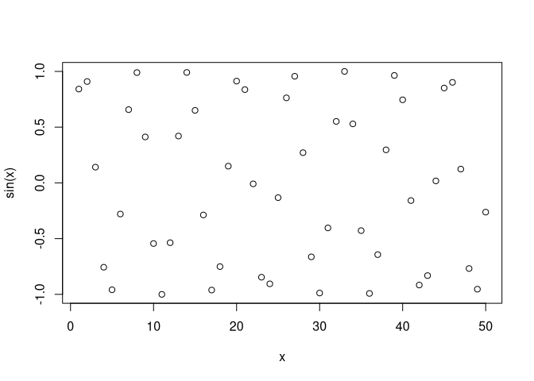
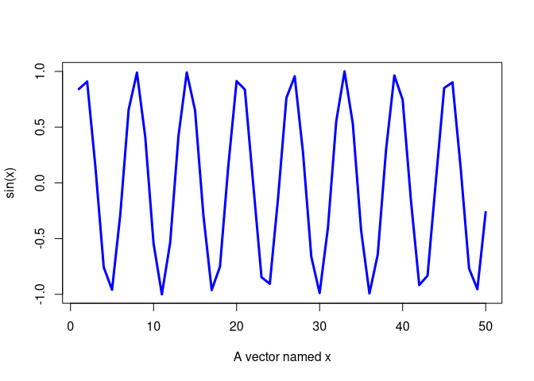

Lab 4 Walkthrough
================
Jack Reddan
10/8/2021

# Simple calculations

``` r
5+3
```

    ## [1] 8

``` r
5-3
```

    ## [1] 2

``` r
5*3
```

    ## [1] 15

``` r
5/3
```

    ## [1] 1.666667

# Saving your answers - object assignment

``` r
x <- 3*4
x
```

    ## [1] 12

``` r
this_is_a_really_long_name <- 2.5
this_is_a_really_long_name
```

    ## [1] 2.5

``` r
r_rocks <- 2^3
#rrocks
#Error: object 'rrocks' not found
#R_rocks
#Error: object 'R_rocks' not found
r_rocks
```

    ## [1] 8

# Calling functions

``` r
seq(1, 10)
```

    ##  [1]  1  2  3  4  5  6  7  8  9 10

``` r
seq(1, 10, by = 2)
```

    ## [1] 1 3 5 7 9

``` r
example(seq)
```

    ## 
    ## seq> seq(0, 1, length.out = 11)
    ##  [1] 0.0 0.1 0.2 0.3 0.4 0.5 0.6 0.7 0.8 0.9 1.0
    ## 
    ## seq> seq(stats::rnorm(20)) # effectively 'along'
    ##  [1]  1  2  3  4  5  6  7  8  9 10 11 12 13 14 15 16 17 18 19 20
    ## 
    ## seq> seq(1, 9, by = 2)     # matches 'end'
    ## [1] 1 3 5 7 9
    ## 
    ## seq> seq(1, 9, by = pi)    # stays below 'end'
    ## [1] 1.000000 4.141593 7.283185
    ## 
    ## seq> seq(1, 6, by = 3)
    ## [1] 1 4
    ## 
    ## seq> seq(1.575, 5.125, by = 0.05)
    ##  [1] 1.575 1.625 1.675 1.725 1.775 1.825 1.875 1.925 1.975 2.025 2.075 2.125
    ## [13] 2.175 2.225 2.275 2.325 2.375 2.425 2.475 2.525 2.575 2.625 2.675 2.725
    ## [25] 2.775 2.825 2.875 2.925 2.975 3.025 3.075 3.125 3.175 3.225 3.275 3.325
    ## [37] 3.375 3.425 3.475 3.525 3.575 3.625 3.675 3.725 3.775 3.825 3.875 3.925
    ## [49] 3.975 4.025 4.075 4.125 4.175 4.225 4.275 4.325 4.375 4.425 4.475 4.525
    ## [61] 4.575 4.625 4.675 4.725 4.775 4.825 4.875 4.925 4.975 5.025 5.075 5.125
    ## 
    ## seq> seq(17) # same as 1:17, or even better seq_len(17)
    ##  [1]  1  2  3  4  5  6  7  8  9 10 11 12 13 14 15 16 17

``` r
date()
```

    ## [1] "Sun Dec  5 23:27:39 2021"

# Getting help in R

``` r
help(log)
?log
help.search("cross tabulate")
??"cross tabulate"
example(log)
```

    ## 
    ## log> log(exp(3))
    ## [1] 3
    ## 
    ## log> log10(1e7) # = 7
    ## [1] 7
    ## 
    ## log> x <- 10^-(1+2*1:9)
    ## 
    ## log> cbind(x, log(1+x), log1p(x), exp(x)-1, expm1(x))
    ##           x                                                    
    ##  [1,] 1e-03 9.995003e-04 9.995003e-04 1.000500e-03 1.000500e-03
    ##  [2,] 1e-05 9.999950e-06 9.999950e-06 1.000005e-05 1.000005e-05
    ##  [3,] 1e-07 1.000000e-07 1.000000e-07 1.000000e-07 1.000000e-07
    ##  [4,] 1e-09 1.000000e-09 1.000000e-09 1.000000e-09 1.000000e-09
    ##  [5,] 1e-11 1.000000e-11 1.000000e-11 1.000000e-11 1.000000e-11
    ##  [6,] 1e-13 9.992007e-14 1.000000e-13 9.992007e-14 1.000000e-13
    ##  [7,] 1e-15 1.110223e-15 1.000000e-15 1.110223e-15 1.000000e-15
    ##  [8,] 1e-17 0.000000e+00 1.000000e-17 0.000000e+00 1.000000e-17
    ##  [9,] 1e-19 0.000000e+00 1.000000e-19 0.000000e+00 1.000000e-19

# Vectors, vectorizations, and indexing

``` r
length(3.1)
```

    ## [1] 1

``` r
x <- c(56, 95.3, 0.4)
x
```

    ## [1] 56.0 95.3  0.4

``` r
y <- c(3.2, 1.1, 0.2)
y
```

    ## [1] 3.2 1.1 0.2

## Vectorization

``` r
x+y
```

    ## [1] 59.2 96.4  0.6

``` r
x-y
```

    ## [1] 52.8 94.2  0.2

``` r
x/y
```

    ## [1] 17.50000 86.63636  2.00000

``` r
sqrt(x)
```

    ## [1] 7.4833148 9.7621719 0.6324555

``` r
round(sqrt(x), 3)
```

    ## [1] 7.483 9.762 0.632

``` r
log(x)/2 + 1
```

    ## [1] 3.0126758 3.2785149 0.5418546

## Vector indexing

``` r
x <- c(56, 95.3, 0.4)
x[2]
```

    ## [1] 95.3

``` r
x[1]
```

    ## [1] 56

``` r
x[4]
```

    ## [1] NA

``` r
x[3] <- 0.5
x
```

    ## [1] 56.0 95.3  0.5

# Reproducibility and sessionInfo()

``` r
sessionInfo()
```

    ## R version 4.1.2 (2021-11-01)
    ## Platform: x86_64-pc-linux-gnu (64-bit)
    ## Running under: Arch Linux
    ## 
    ## Matrix products: default
    ## BLAS:   /usr/lib/libblas.so.3.10.0
    ## LAPACK: /usr/lib/liblapack.so.3.10.0
    ## 
    ## locale:
    ##  [1] LC_CTYPE=en_US.UTF-8       LC_NUMERIC=C              
    ##  [3] LC_TIME=en_US.UTF-8        LC_COLLATE=en_US.UTF-8    
    ##  [5] LC_MONETARY=en_US.UTF-8    LC_MESSAGES=en_US.UTF-8   
    ##  [7] LC_PAPER=en_US.UTF-8       LC_NAME=C                 
    ##  [9] LC_ADDRESS=C               LC_TELEPHONE=C            
    ## [11] LC_MEASUREMENT=en_US.UTF-8 LC_IDENTIFICATION=C       
    ## 
    ## attached base packages:
    ## [1] stats     graphics  grDevices utils     datasets  methods   base     
    ## 
    ## loaded via a namespace (and not attached):
    ##  [1] compiler_4.1.2  magrittr_2.0.1  fastmap_1.1.0   tools_4.1.2    
    ##  [5] htmltools_0.5.2 yaml_2.2.1      stringi_1.7.6   rmarkdown_2.11 
    ##  [9] knitr_1.36      stringr_1.4.0   xfun_0.28       digest_0.6.28  
    ## [13] rlang_0.4.12    evaluate_0.14

# In lab

``` r
x <- 1:50
plot(x, sin(x))
```

<!-- -->

``` r
?plot
```

    ## Help on topic 'plot' was found in the following packages:
    ## 
    ##   Package               Library
    ##   graphics              /usr/lib/R/library
    ##   base                  /usr/lib64/R/library
    ## 
    ## 
    ## Using the first match ...

``` r
plot(x, sin(x), 
     type = "l", 
     col = "blue",
     lwd = 3,
     xlab = "A vector named x")
```

<!-- -->
