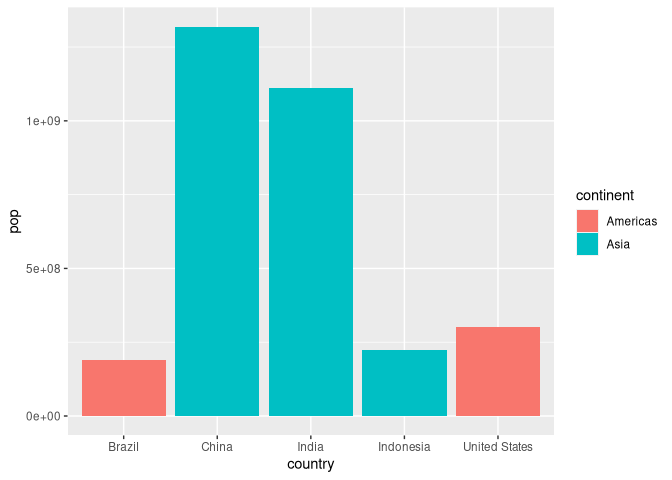

Lab 05
================
Jack Reddan (A59010543)
10/14/2021

# Lab 05: Data Visualization

## Install packages

``` r
# install.packages("ggplot2")
# install.packages("gapminder")
# install.packages("patchwork")
```

## Library loading

``` r
library(ggplot2)
library(gapminder)
library(dplyr)
#library(plotly)
library(patchwork)
```

## Data exploration

Examine the *cars* dataset with the “head” function.

``` r
head(cars)
```

    ##   speed dist
    ## 1     4    2
    ## 2     4   10
    ## 3     7    4
    ## 4     7   22
    ## 5     8   16
    ## 6     9   10

## Plotting the data

Graph stopping distance (ft) as a function of speed (mph) from the
‘cars’ dataset using ggplot2.

``` r
ggplot(data = cars) +
  aes(x = speed, y = dist) +
  geom_point() +
  geom_smooth(formula = y ~ x, 
              method = "lm") +
  labs(title = "Stopping Distance of Old Cars",
       x = "Speed (MPH)",
       y = "Stopping Distance (ft)")
```

<!-- -->

Compare the ggplot2 graph to the graph generated from the plotting which
comes from base R.

``` r
# Base graphics translation
plot(x = cars$speed, 
     y = cars$dist, 
     pch = 16,
     main = "Stopping Distance of Old Cars\n[base graphics]",
     xlab = "Speed (MPH)",
     ylab = "Stopping Distance (ft)")
abline(lm(cars$dist ~ cars$speed), 
       col = "blue",
       lwd = 2)
```

<!-- -->

## Using the gene expression dataset

Reading in the gene expression tab-delimited data table as a dataframe
and checking the table structure.

``` r
# Loading in the genes data
url <- "https://bioboot.github.io/bimm143_S20/class-material/up_down_expression.txt"
genes <- read.delim(url)
head(genes)
```

    ##         Gene Condition1 Condition2      State
    ## 1      A4GNT -3.6808610 -3.4401355 unchanging
    ## 2       AAAS  4.5479580  4.3864126 unchanging
    ## 3      AASDH  3.7190695  3.4787276 unchanging
    ## 4       AATF  5.0784720  5.0151916 unchanging
    ## 5       AATK  0.4711421  0.5598642 unchanging
    ## 6 AB015752.4 -3.6808610 -3.5921390 unchanging

Exploring the data frame dimensions.

``` r
# How many genes are in the dataframe
nrow(genes)
```

    ## [1] 5196

``` r
# What and how many types of data were collected on each gene.
colnames(genes)
```

    ## [1] "Gene"       "Condition1" "Condition2" "State"

``` r
ncol(genes)
```

    ## [1] 4

``` r
# Summary of State values for each gene
table(genes$State)
```

    ## 
    ##       down unchanging         up 
    ##         72       4997        127

``` r
# Calculate the percentage of genes which were labeled "up" for their state
round(table(genes$State)["up"]/nrow(genes)*100, 2)
```

    ##   up 
    ## 2.44

Plotting the gene states for both treatment conditions and coloring each
data point by its state value.

``` r
p <- ggplot(data = genes) +
  aes(x = Condition1, y = Condition2, 
      col = State) +
  geom_point()
p
```

<!-- -->

Adding a unique color scheme to the plot.

``` r
p <- p +
  scale_color_manual(values = c("red", "gray", "blue"))
p  
```

<!-- -->

Adding a title and axis labels to the plot.

``` r
p <- p +
  labs(title = "Gene Expression Changes Upon Drug Treatment",
       x = "Control (no drug)",
       y = "Drug Treatment")
p
```

<!-- -->

## Using the gapminder dataset

Filter the gapminder dataframe for data associated with the year 2007.

``` r
# gapminder dataset
gapminder_2007 <- gapminder %>% filter(year==2007)
```

Plot the gapminder data for life expectancy (lifeExp) across available
years.

``` r
# Use the geom_violin and geom_jitter layers to accurately view the distribution 
# of data points
p <- ggplot(data = gapminder) +
  aes(x = year, y = lifeExp) +
  geom_violin(aes(group = year), draw_quantiles = c(0.5)) +
  geom_jitter(aes(col = continent), alpha = 0.4, width = 0.3)
p
```

<!-- -->

<!-- Turn the plot interactive with the plotly library -->
<!-- ```{r} -->
<!-- ggplotly(p) -->
<!-- ``` -->

Plot the 2007-subset of gapminder data for life expectancy (lifeExp)
across the countrys’ associated GDP per capita.

``` r
p <- ggplot(data = gapminder_2007) +
  aes(x = gdpPercap, y = lifeExp, col = continent, size = pop) +
  geom_point(alpha=0.4)
p
```

<!-- -->

Using a continuous variable for color.

``` r
# Gross example with population as color
q <- ggplot(data = gapminder_2007) +
  aes(x = gdpPercap, y = lifeExp, col = pop) +
  geom_point()
q
```

<!-- -->

Scaling the size of the data points to better represent the differences
in population sizes.

``` r
# Adjusting point size
p <- ggplot(data = gapminder_2007) +
  aes(x = gdpPercap, y = lifeExp, size = pop) +
  geom_point(alpha=0.4)
p
```

<!-- -->

``` r
p <- p + scale_size_area()
p
```

<!-- -->

Filter the gapminder dataframe for data associated with the year 1957.

``` r
# Exploring 1957 gapfinder data
gapminder_1957 <- gapminder %>% filter(year==1957)
```

Plot the 1957-subset of gapminder data for life expectancy (lifeExp)
across the countrys’ associated GDP per capita.

``` r
p <- ggplot(data = gapminder_1957) +
  aes(x = gdpPercap, y = lifeExp, col = continent, size = pop) +
  geom_point(alpha=0.7) +
  scale_size_area(max_size = 15)
p
```

<!-- -->

Filter the gapminder dataframe for data associated with the years 1957
and 2007.

``` r
gapminder_1957_2007 <- gapminder %>% filter(year==1957 | year == 2007)
```

Plot the gapminder_1957_2007 data for life expectancy (lifeExp) across
the countrys’ associated GDP per capita and facet wrap by the year.

``` r
p <- ggplot(data = gapminder_1957_2007) +
  aes(x = gdpPercap, y = lifeExp, col = continent, size = pop) +
  geom_point(alpha=0.7) +
  scale_size_area(max_size = 15) +
  facet_wrap(~year)
p
```

<!-- -->

## Boxplots in ggplot

Filter the gapminder data for values from the year 2007 and select the
top 5 countries with the highest population

``` r
# Top 5 population in the gapminder data for the year 2007
gapminder_2007_top5 <- gapminder %>% 
  filter(year == 2007) %>%
  arrange(desc(pop)) %>%
  top_n(5, pop)

# Check the tibble
gapminder_2007_top5
```

    ## # A tibble: 5 x 6
    ##   country       continent  year lifeExp        pop gdpPercap
    ##   <fct>         <fct>     <int>   <dbl>      <int>     <dbl>
    ## 1 China         Asia       2007    73.0 1318683096     4959.
    ## 2 India         Asia       2007    64.7 1110396331     2452.
    ## 3 United States Americas   2007    78.2  301139947    42952.
    ## 4 Indonesia     Asia       2007    70.6  223547000     3541.
    ## 5 Brazil        Americas   2007    72.4  190010647     9066.

Plot the population for each of the top five countries with the highest
populations, and color by the country’s continent.

``` r
ggplot(data = gapminder_2007_top5) +
  aes(x = country, y = pop, fill = continent) +
  geom_col()
```

<!-- -->

Change the color mapping to the life expectancy of the country.

``` r
ggplot(data = gapminder_2007_top5) +
  aes(x = country, y = pop, fill = lifeExp) +
  geom_col()
```

<!-- -->

Change the order of the countries from highest to lowest and color by
country.

``` r
ggplot(data = gapminder_2007_top5) +
  aes(x = reorder(country, -pop), y = pop, fill = country) +
  geom_col()
```

<!-- -->

## Using the the USArrests dataset

Check the structure of the dataframe.

``` r
head(USArrests)
```

    ##            Murder Assault UrbanPop Rape
    ## Alabama      13.2     236       58 21.2
    ## Alaska       10.0     263       48 44.5
    ## Arizona       8.1     294       80 31.0
    ## Arkansas      8.8     190       50 19.5
    ## California    9.0     276       91 40.6
    ## Colorado      7.9     204       78 38.7

Plot the murder arrests (per 100,000) for each state in the US, and flip
the orientation of the plot 90 degrees.

``` r
ggplot(data = USArrests) +
  aes(x = reorder(rownames(USArrests), Murder), y = Murder) +
  coord_flip() +
  geom_col()
```

<!-- -->

Change the boxplot to a collection of points and line segments for
easier interpretation.

``` r
ggplot(data = USArrests) +
  aes(x = reorder(rownames(USArrests), Murder), y = Murder) +
  geom_point() +
  geom_segment(x = rownames(USArrests),
               xend = rownames(USArrests),
               y = 0,
               yend = USArrests$Murder) +
  coord_flip()
```

<!-- -->

## Combining plots

Assign example plots to variables.

``` r
p1 <- ggplot(mtcars) + geom_point(aes(mpg, disp))
p2 <- ggplot(mtcars) + geom_boxplot(aes(gear, disp, group = gear))
p3 <- ggplot(mtcars) + geom_smooth(aes(disp, qsec))
p4 <- ggplot(mtcars) + geom_bar(aes(carb))
```

Combine the example plots with the *patchwork* library.

``` r
(p1 | p2 | p3) /
      p4
```

    ## `geom_smooth()` using method = 'loess' and formula 'y ~ x'

<!-- -->

## Session information

``` r
sessionInfo()
```

    ## R version 4.1.1 (2021-08-10)
    ## Platform: x86_64-pc-linux-gnu (64-bit)
    ## Running under: Arch Linux
    ## 
    ## Matrix products: default
    ## BLAS:   /usr/lib/libblas.so.3.10.0
    ## LAPACK: /usr/lib/liblapack.so.3.10.0
    ## 
    ## locale:
    ##  [1] LC_CTYPE=en_US.UTF-8       LC_NUMERIC=C              
    ##  [3] LC_TIME=en_US.UTF-8        LC_COLLATE=en_US.UTF-8    
    ##  [5] LC_MONETARY=en_US.UTF-8    LC_MESSAGES=en_US.UTF-8   
    ##  [7] LC_PAPER=en_US.UTF-8       LC_NAME=C                 
    ##  [9] LC_ADDRESS=C               LC_TELEPHONE=C            
    ## [11] LC_MEASUREMENT=en_US.UTF-8 LC_IDENTIFICATION=C       
    ## 
    ## attached base packages:
    ## [1] stats     graphics  grDevices utils     datasets  methods   base     
    ## 
    ## other attached packages:
    ## [1] patchwork_1.1.1 dplyr_1.0.7     gapminder_0.3.0 ggplot2_3.3.5  
    ## 
    ## loaded via a namespace (and not attached):
    ##  [1] highr_0.9         pillar_1.6.1      compiler_4.1.1    tools_4.1.1      
    ##  [5] digest_0.6.27     lattice_0.20-44   nlme_3.1-152      evaluate_0.14    
    ##  [9] lifecycle_1.0.0   tibble_3.1.2      gtable_0.3.0      mgcv_1.8-36      
    ## [13] pkgconfig_2.0.3   rlang_0.4.11      Matrix_1.3-4      rstudioapi_0.13  
    ## [17] cli_3.0.1         DBI_1.1.1         yaml_2.2.1        xfun_0.24        
    ## [21] withr_2.4.2       stringr_1.4.0     knitr_1.33        generics_0.1.0   
    ## [25] vctrs_0.3.8       grid_4.1.1        tidyselect_1.1.1  glue_1.4.2       
    ## [29] R6_2.5.0          fansi_0.5.0       rmarkdown_2.11    farver_2.1.0     
    ## [33] purrr_0.3.4       magrittr_2.0.1    splines_4.1.1     scales_1.1.1     
    ## [37] ellipsis_0.3.2    htmltools_0.5.1.1 assertthat_0.2.1  colorspace_2.0-2 
    ## [41] labeling_0.4.2    utf8_1.2.1        stringi_1.7.2     munsell_0.5.0    
    ## [45] crayon_1.4.1
