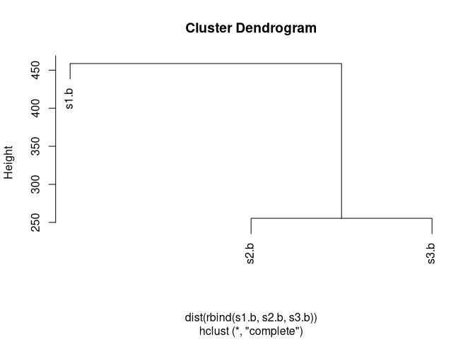
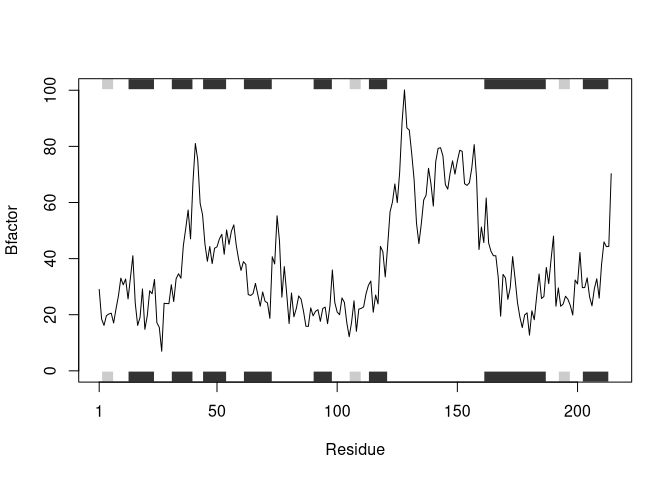
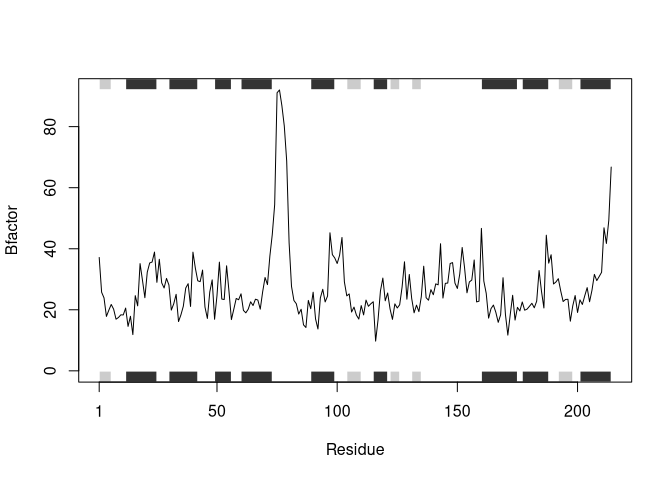
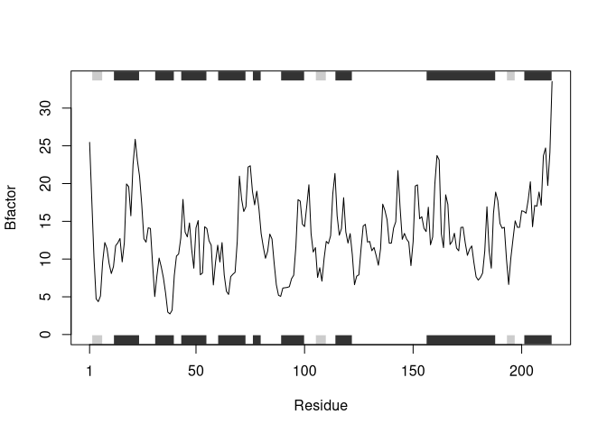

HW Class 6: Write a Function
================
Jack Reddan
10/17/2021

# Section 1: Improving analysis code by writing functions

## A

Improve the below code:

``` r
df <- data.frame(a=1:10, b=seq(200, 400, length = 10), c=11:20, d=NA)

df$a <- (df$a - min(df$a)) / (max(df$a) - min(df$a))

df$b <- (df$b - min(df$b)) / (max(df$b) - min(df$b))

df$c <- (df$c - min(df$c)) / (max(df$c) - min(df$c))

df$d <- (df$d - min(df$d)) / (max(df$d) - min(df$d))
```

A function can be written to apply over the data frame.

``` r
# Argument 'x' should be a numeric vector where all values are not equal
# (e.g. length(unique(x)) != 1)
norm_diff_to_min <- function(x){
  
  # Rewrite 'x' as the difference of each component to the minimum value, and
  # normalize to the maximum difference
  x <- (x - min(x)) / (max(x) - min(x))
  
  # Return the new vector 'x'
  return(x)
}

df2 <- as.data.frame(apply(df, 2, norm_diff_to_min))
```

The two data frames, df ad df2, are identical.

``` r
identical(df, df2)
```

    ## [1] TRUE

## B

``` r
library(bio3d)
```

``` r
s1 <- read.pdb("4AKE") # kinase with drug
s2 <- read.pdb("1AKE") # kinase no drug
s3 <- read.pdb("1E4Y") # kinase with drug
s1.chainA <- trim.pdb(s1, chain="A", elety="CA")
s2.chainA <- trim.pdb(s2, chain="A", elety="CA")
s3.chainA <- trim.pdb(s3, chain="A", elety="CA")
s1.b <- s1.chainA$atom$b
s2.b <- s2.chainA$atom$b
s3.b <- s3.chainA$atom$b
plotb3(s1.b, sse=s1.chainA, typ="l", ylab="Bfactor")
plotb3(s2.b, sse=s2.chainA, typ="l", ylab="Bfactor")
plotb3(s3.b, sse=s3.chainA, typ="l", ylab="Bfactor")
```

### Question 1:

#### What type of object is returned from the read.pdb() function?

``` r
s1 <- read.pdb("4AKE")
```

    ##   Note: Accessing on-line PDB file

    ## Warning in get.pdb(file, path = tempdir(), verbose = FALSE): /tmp/
    ## RtmpXl7y33/4AKE.pdb exists. Skipping download

``` r
str(s1)
```

    ## List of 8
    ##  $ atom  :'data.frame':  3459 obs. of  16 variables:
    ##   ..$ type  : chr [1:3459] "ATOM" "ATOM" "ATOM" "ATOM" ...
    ##   ..$ eleno : int [1:3459] 1 2 3 4 5 6 7 8 9 10 ...
    ##   ..$ elety : chr [1:3459] "N" "CA" "C" "O" ...
    ##   ..$ alt   : chr [1:3459] NA NA NA NA ...
    ##   ..$ resid : chr [1:3459] "MET" "MET" "MET" "MET" ...
    ##   ..$ chain : chr [1:3459] "A" "A" "A" "A" ...
    ##   ..$ resno : int [1:3459] 1 1 1 1 1 1 1 1 2 2 ...
    ##   ..$ insert: chr [1:3459] NA NA NA NA ...
    ##   ..$ x     : num [1:3459] -10.93 -9.9 -9.17 -9.8 -10.59 ...
    ##   ..$ y     : num [1:3459] -24.9 -24.4 -23.3 -22.3 -24 ...
    ##   ..$ z     : num [1:3459] -9.52 -10.48 -9.81 -9.35 -11.77 ...
    ##   ..$ o     : num [1:3459] 1 1 1 1 1 1 1 1 1 1 ...
    ##   ..$ b     : num [1:3459] 41.5 29 27.9 26.4 34.2 ...
    ##   ..$ segid : chr [1:3459] NA NA NA NA ...
    ##   ..$ elesy : chr [1:3459] "N" "C" "C" "O" ...
    ##   ..$ charge: chr [1:3459] NA NA NA NA ...
    ##  $ xyz   : 'xyz' num [1, 1:10377] -10.93 -24.89 -9.52 -9.9 -24.42 ...
    ##  $ seqres: Named chr [1:428] "MET" "ARG" "ILE" "ILE" ...
    ##   ..- attr(*, "names")= chr [1:428] "A" "A" "A" "A" ...
    ##  $ helix :List of 4
    ##   ..$ start: Named num [1:19] 13 31 44 61 75 90 113 161 202 13 ...
    ##   .. ..- attr(*, "names")= chr [1:19] "" "" "" "" ...
    ##   ..$ end  : Named num [1:19] 24 40 54 73 77 98 121 187 213 24 ...
    ##   .. ..- attr(*, "names")= chr [1:19] "" "" "" "" ...
    ##   ..$ chain: chr [1:19] "A" "A" "A" "A" ...
    ##   ..$ type : chr [1:19] "5" "1" "1" "1" ...
    ##  $ sheet :List of 4
    ##   ..$ start: Named num [1:14] 192 105 2 81 27 123 131 192 105 2 ...
    ##   .. ..- attr(*, "names")= chr [1:14] "" "" "" "" ...
    ##   ..$ end  : Named num [1:14] 197 110 7 84 29 126 134 197 110 7 ...
    ##   .. ..- attr(*, "names")= chr [1:14] "" "" "" "" ...
    ##   ..$ chain: chr [1:14] "A" "A" "A" "A" ...
    ##   ..$ sense: chr [1:14] "0" "1" "1" "1" ...
    ##  $ calpha: logi [1:3459] FALSE TRUE FALSE FALSE FALSE FALSE ...
    ##  $ remark:List of 1
    ##   ..$ biomat:List of 4
    ##   .. ..$ num   : int 1
    ##   .. ..$ chain :List of 1
    ##   .. .. ..$ : chr [1:2] "A" "B"
    ##   .. ..$ mat   :List of 1
    ##   .. .. ..$ :List of 1
    ##   .. .. .. ..$ A B: num [1:3, 1:4] 1 0 0 0 1 0 0 0 1 0 ...
    ##   .. ..$ method: chr "AUTHOR"
    ##  $ call  : language read.pdb(file = "4AKE")
    ##  - attr(*, "class")= chr [1:2] "pdb" "sse"

Returns a list.

### Question 2:

#### What does the trim.pdb() function do?

``` r
help("trim.pdb")
```

It trims the original PDB object to contain a subset of the original
atoms.

### Question 3:

#### What input parameter would turn off the marginal black and grey rectangles in the plots and what do they represent in this case?

``` r
help("plotb3")
```

The *sse* parameter is what sets the marginal grey and black rectangles,
which represents the major secondary structure elements (SSEs) of the
protein.

### Question 4:

#### What would be a better plot to compare across the different proteins?

A scatterplot of RMSD data from aligned protein sequences. Alignment
would allow for significant residue-residue comparisons.

### Question 5:

#### Which proteins are more similar to each other in their B-factor trends. How could you quantify this?

Use hierarchical clustering with the calculated distances between
protein structures to identify which are more similar.

``` r
hc <- hclust(dist(rbind(s1.b, s2.b, s3.b)))
plot(hc)
```

<!-- -->

The kinases with drugs (4AKE and 1E4Y) are more similar to each other
than to the kinase without drugs (1AKE).

### Question 6:

#### How would you generalize the original code above to work with any set of input protein structures?

``` r
structure_analysis <- function(protein_vector, 
                               trim_chain = "A", trim_elety = "CA", 
                               plotb3_typ = "l", plotb3_ylab = "Bfactor") {
  
  for(protein in protein_vector) {
    structure <- read.pdb(protein)
    structure.chainA <- trim.pdb(structure, 
                                 chain=trim_chain, 
                                 elety=trim_elety)
    plotb3(structure.chainA$atom$b, 
           sse=structure.chainA, 
           typ=plotb3_typ, 
           ylab=plotb3_ylab)
  }
}

structure_analysis(c("4AKE", "1AKE", "1E4Y"))
```

    ##   Note: Accessing on-line PDB file

    ## Warning in get.pdb(file, path = tempdir(), verbose = FALSE): /tmp/
    ## RtmpXl7y33/4AKE.pdb exists. Skipping download

    ##   Note: Accessing on-line PDB file

    ## Warning in get.pdb(file, path = tempdir(), verbose = FALSE): /tmp/
    ## RtmpXl7y33/1AKE.pdb exists. Skipping download

<!-- -->

    ##    PDB has ALT records, taking A only, rm.alt=TRUE

    ##   Note: Accessing on-line PDB file

    ## Warning in get.pdb(file, path = tempdir(), verbose = FALSE): /tmp/
    ## RtmpXl7y33/1E4Y.pdb exists. Skipping download

<!-- --><!-- -->
