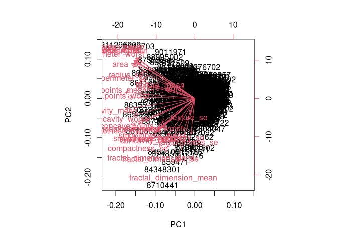
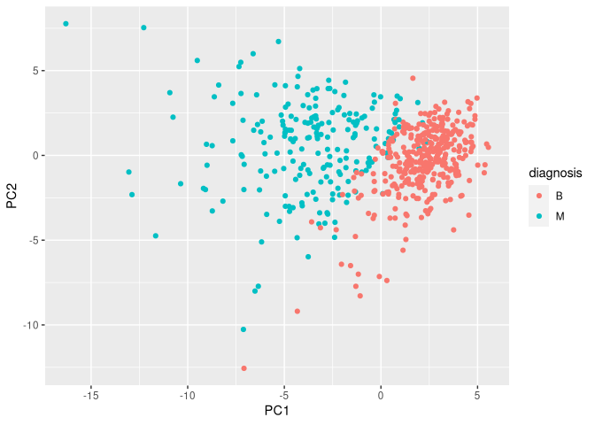
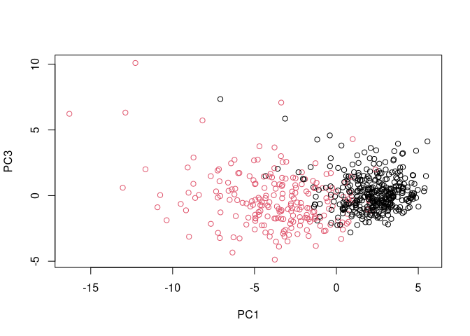
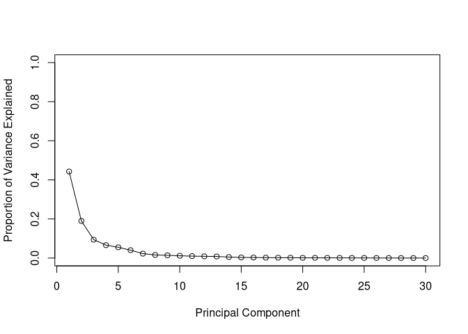
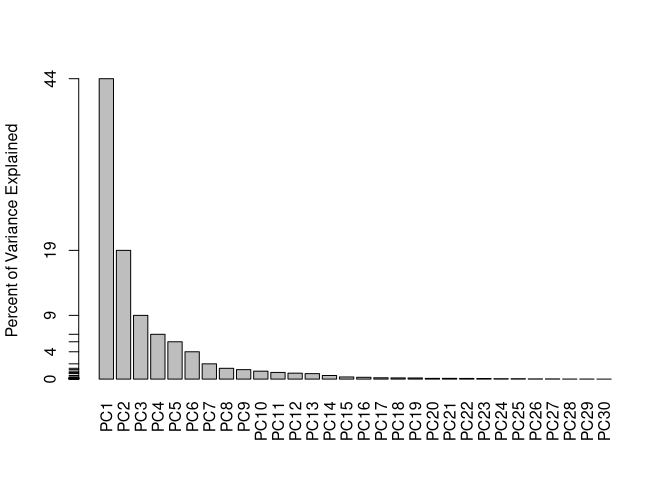
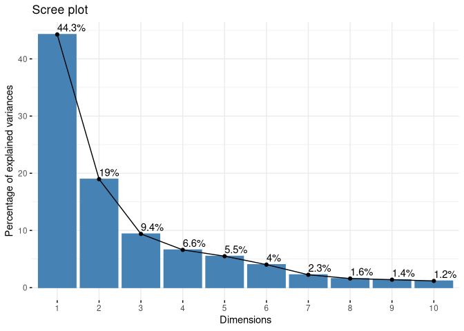
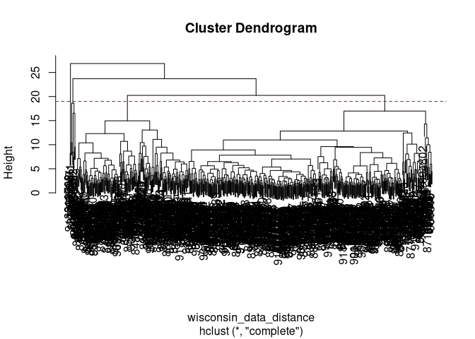
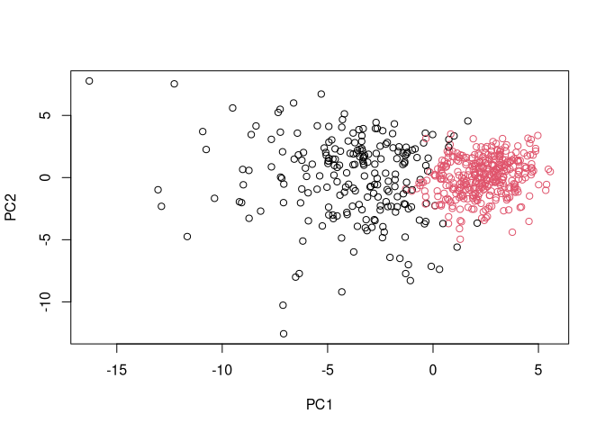
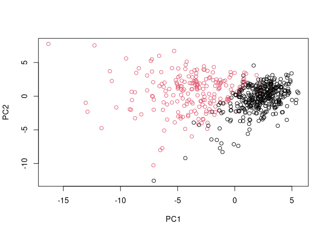
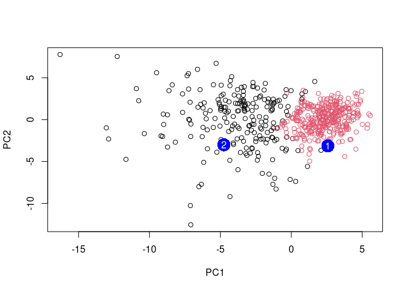

Mini Project
================
Jack Reddan (PID: A59010543)
10/27/2021

> Load libraries

``` r
library(ggplot2)
library(factoextra)
```

    ## Welcome! Want to learn more? See two factoextra-related books at https://goo.gl/ve3WBa

``` r
library(rgl)
```

# Exploratroy data analysis

## Organizing the data

First I read in the data from ’WisconsinCancer.csv” with the first
column as the row names.

``` r
fna_data <- "WisconsinCancer.csv"
wisconsin_df <- read.csv(fna_data, row.names = 1)
```

Then I look at the data to asses the structure of the data.

``` r
str(wisconsin_df)
```

    ## 'data.frame':    569 obs. of  32 variables:
    ##  $ diagnosis              : chr  "M" "M" "M" "M" ...
    ##  $ radius_mean            : num  18 20.6 19.7 11.4 20.3 ...
    ##  $ texture_mean           : num  10.4 17.8 21.2 20.4 14.3 ...
    ##  $ perimeter_mean         : num  122.8 132.9 130 77.6 135.1 ...
    ##  $ area_mean              : num  1001 1326 1203 386 1297 ...
    ##  $ smoothness_mean        : num  0.1184 0.0847 0.1096 0.1425 0.1003 ...
    ##  $ compactness_mean       : num  0.2776 0.0786 0.1599 0.2839 0.1328 ...
    ##  $ concavity_mean         : num  0.3001 0.0869 0.1974 0.2414 0.198 ...
    ##  $ concave.points_mean    : num  0.1471 0.0702 0.1279 0.1052 0.1043 ...
    ##  $ symmetry_mean          : num  0.242 0.181 0.207 0.26 0.181 ...
    ##  $ fractal_dimension_mean : num  0.0787 0.0567 0.06 0.0974 0.0588 ...
    ##  $ radius_se              : num  1.095 0.543 0.746 0.496 0.757 ...
    ##  $ texture_se             : num  0.905 0.734 0.787 1.156 0.781 ...
    ##  $ perimeter_se           : num  8.59 3.4 4.58 3.44 5.44 ...
    ##  $ area_se                : num  153.4 74.1 94 27.2 94.4 ...
    ##  $ smoothness_se          : num  0.0064 0.00522 0.00615 0.00911 0.01149 ...
    ##  $ compactness_se         : num  0.049 0.0131 0.0401 0.0746 0.0246 ...
    ##  $ concavity_se           : num  0.0537 0.0186 0.0383 0.0566 0.0569 ...
    ##  $ concave.points_se      : num  0.0159 0.0134 0.0206 0.0187 0.0188 ...
    ##  $ symmetry_se            : num  0.03 0.0139 0.0225 0.0596 0.0176 ...
    ##  $ fractal_dimension_se   : num  0.00619 0.00353 0.00457 0.00921 0.00511 ...
    ##  $ radius_worst           : num  25.4 25 23.6 14.9 22.5 ...
    ##  $ texture_worst          : num  17.3 23.4 25.5 26.5 16.7 ...
    ##  $ perimeter_worst        : num  184.6 158.8 152.5 98.9 152.2 ...
    ##  $ area_worst             : num  2019 1956 1709 568 1575 ...
    ##  $ smoothness_worst       : num  0.162 0.124 0.144 0.21 0.137 ...
    ##  $ compactness_worst      : num  0.666 0.187 0.424 0.866 0.205 ...
    ##  $ concavity_worst        : num  0.712 0.242 0.45 0.687 0.4 ...
    ##  $ concave.points_worst   : num  0.265 0.186 0.243 0.258 0.163 ...
    ##  $ symmetry_worst         : num  0.46 0.275 0.361 0.664 0.236 ...
    ##  $ fractal_dimension_worst: num  0.1189 0.089 0.0876 0.173 0.0768 ...
    ##  $ X                      : logi  NA NA NA NA NA NA ...

The first row contains the diagnoses which are the outputs we are trying
to derive from the data. This will be removed to generate the naive
dataframe. Additionally, these results are saved as the vector
‘diagnosis’.

``` r
# The data seems to have a extraneous ',' at the end of the column names
# Take out the artifact column 'X' from the read-in.
naive_wisconsin_df <- wisconsin_df[,c(-1, -ncol(wisconsin_df))]
diagnosis <- factor(wisconsin_df[,1])
```

## Explore the data

##### \[Q01\]: How many observations are in the dataset?

``` r
nrow(wisconsin_df)
```

    ## [1] 569

There are 569 rows/observations.

##### \[Q02\]: How many of the observations have a malignant diagnoses?

``` r
table(diagnosis)
```

    ## diagnosis
    ##   B   M 
    ## 357 212

212 of the observations have a “M” or malignant diagnoses.

##### \[Q03\]: How many variables/features in the data are suffixed with `_mean`?

``` r
length(grep("_mean", colnames(naive_wisconsin_df)))
```

    ## [1] 10

There are 10 variables/features (columns) which are suffixed with
`_mean`.

# Principal Component Analysis

## Performing PCA

Check the means and Standard deviations of the variables.

``` r
colMeans(naive_wisconsin_df)
```

    ##             radius_mean            texture_mean          perimeter_mean 
    ##            1.412729e+01            1.928965e+01            9.196903e+01 
    ##               area_mean         smoothness_mean        compactness_mean 
    ##            6.548891e+02            9.636028e-02            1.043410e-01 
    ##          concavity_mean     concave.points_mean           symmetry_mean 
    ##            8.879932e-02            4.891915e-02            1.811619e-01 
    ##  fractal_dimension_mean               radius_se              texture_se 
    ##            6.279761e-02            4.051721e-01            1.216853e+00 
    ##            perimeter_se                 area_se           smoothness_se 
    ##            2.866059e+00            4.033708e+01            7.040979e-03 
    ##          compactness_se            concavity_se       concave.points_se 
    ##            2.547814e-02            3.189372e-02            1.179614e-02 
    ##             symmetry_se    fractal_dimension_se            radius_worst 
    ##            2.054230e-02            3.794904e-03            1.626919e+01 
    ##           texture_worst         perimeter_worst              area_worst 
    ##            2.567722e+01            1.072612e+02            8.805831e+02 
    ##        smoothness_worst       compactness_worst         concavity_worst 
    ##            1.323686e-01            2.542650e-01            2.721885e-01 
    ##    concave.points_worst          symmetry_worst fractal_dimension_worst 
    ##            1.146062e-01            2.900756e-01            8.394582e-02

``` r
apply(naive_wisconsin_df, 2, sd)
```

    ##             radius_mean            texture_mean          perimeter_mean 
    ##            3.524049e+00            4.301036e+00            2.429898e+01 
    ##               area_mean         smoothness_mean        compactness_mean 
    ##            3.519141e+02            1.406413e-02            5.281276e-02 
    ##          concavity_mean     concave.points_mean           symmetry_mean 
    ##            7.971981e-02            3.880284e-02            2.741428e-02 
    ##  fractal_dimension_mean               radius_se              texture_se 
    ##            7.060363e-03            2.773127e-01            5.516484e-01 
    ##            perimeter_se                 area_se           smoothness_se 
    ##            2.021855e+00            4.549101e+01            3.002518e-03 
    ##          compactness_se            concavity_se       concave.points_se 
    ##            1.790818e-02            3.018606e-02            6.170285e-03 
    ##             symmetry_se    fractal_dimension_se            radius_worst 
    ##            8.266372e-03            2.646071e-03            4.833242e+00 
    ##           texture_worst         perimeter_worst              area_worst 
    ##            6.146258e+00            3.360254e+01            5.693570e+02 
    ##        smoothness_worst       compactness_worst         concavity_worst 
    ##            2.283243e-02            1.573365e-01            2.086243e-01 
    ##    concave.points_worst          symmetry_worst fractal_dimension_worst 
    ##            6.573234e-02            6.186747e-02            1.806127e-02

Run the ‘prcomp()’ on the Wisconsin dataframe with scaling to account
for different variables having varying scales of values.

``` r
wisconsin_pca <- prcomp(naive_wisconsin_df, scale = TRUE)
```

``` r
summary(wisconsin_pca)
```

    ## Importance of components:
    ##                           PC1    PC2     PC3     PC4     PC5     PC6     PC7
    ## Standard deviation     3.6444 2.3857 1.67867 1.40735 1.28403 1.09880 0.82172
    ## Proportion of Variance 0.4427 0.1897 0.09393 0.06602 0.05496 0.04025 0.02251
    ## Cumulative Proportion  0.4427 0.6324 0.72636 0.79239 0.84734 0.88759 0.91010
    ##                            PC8    PC9    PC10   PC11    PC12    PC13    PC14
    ## Standard deviation     0.69037 0.6457 0.59219 0.5421 0.51104 0.49128 0.39624
    ## Proportion of Variance 0.01589 0.0139 0.01169 0.0098 0.00871 0.00805 0.00523
    ## Cumulative Proportion  0.92598 0.9399 0.95157 0.9614 0.97007 0.97812 0.98335
    ##                           PC15    PC16    PC17    PC18    PC19    PC20   PC21
    ## Standard deviation     0.30681 0.28260 0.24372 0.22939 0.22244 0.17652 0.1731
    ## Proportion of Variance 0.00314 0.00266 0.00198 0.00175 0.00165 0.00104 0.0010
    ## Cumulative Proportion  0.98649 0.98915 0.99113 0.99288 0.99453 0.99557 0.9966
    ##                           PC22    PC23   PC24    PC25    PC26    PC27    PC28
    ## Standard deviation     0.16565 0.15602 0.1344 0.12442 0.09043 0.08307 0.03987
    ## Proportion of Variance 0.00091 0.00081 0.0006 0.00052 0.00027 0.00023 0.00005
    ## Cumulative Proportion  0.99749 0.99830 0.9989 0.99942 0.99969 0.99992 0.99997
    ##                           PC29    PC30
    ## Standard deviation     0.02736 0.01153
    ## Proportion of Variance 0.00002 0.00000
    ## Cumulative Proportion  1.00000 1.00000

##### \[Q04\]: From your results, what proportion of the original variance is captured by the first principal component (PC1)?

``` r
summary(wisconsin_pca)$importance[2,1]
```

    ## [1] 0.44272

0.44272 is the proportion of the variance captured by PC 1.

##### \[Q05\]: How many principal components (PCs) are required to describe at least 70% of the original variance in the data?

``` r
PC <- which(summary(wisconsin_pca)$importance[3,] >= 0.7)[1]
PC
```

    ## PC3 
    ##   3

``` r
summary(wisconsin_pca)$importance[3,PC]
```

    ## [1] 0.72636

Three PCs \[PC1 - PC3\], explains 72.636% of the original variance.

##### \[Q06\]: How many principal components (PCs) are required to describe at least 90% of the original variance in the data?

``` r
PC <- which(summary(wisconsin_pca)$importance[3,] >= 0.9)[1]
PC
```

    ## PC7 
    ##   7

``` r
summary(wisconsin_pca)$importance[3,PC]
```

    ## [1] 0.9101

Seven PCs \[PC1 - PC7\], explains 91.010%.

## Interpreting PCA Results

Biplot for the Wisconsin cancer data set principal component analysis.

``` r
biplot(wisconsin_pca)
```

<!-- -->

##### \[Q07\]: What stands out to you about this plot? Is it easy or difficult to understand? Why?

While it shows a lot of data regarding the influence of each variable on
the the visualized PCs, it is a bit overwhelming and difficult to
extract any useful information from it.

Distribution of data points on PCs 1 and 2.

``` r
plot(x = wisconsin_pca$x[,1], y = wisconsin_pca$x[,2], 
     col = diagnosis, 
     xlab = "PC1", ylab = "PC2")
```

<!-- -->

##### \[Q08\]: Generate a similar plot for principal components 1 and 3. What do you notice about these plots?

``` r
plot(x = wisconsin_pca$x[,1], y = wisconsin_pca$x[,3], 
     col = diagnosis, 
     xlab = "PC1", 
     ylab = "PC3")
```

<!-- -->

Since this plot uses PC 3 instead of PC 2, which explains less of the
total variance than PC 2 does, the two groups in the data set, Benign
and Malignant, appear less distinct.

### Using ggplot

``` r
wisconsin_pca_df <- as.data.frame(wisconsin_pca$x)
wisconsin_pca_df$diagnosis <- diagnosis 
```

``` r
ggplot(data = wisconsin_pca_df) +
  aes(x = PC1, y = PC2,
      col = diagnosis) +
  geom_point()
```

<!-- -->

## Variance Explained

``` r
wisconsin_pca_variance <- wisconsin_pca$sdev^2
head(wisconsin_pca_variance)
```

    ## [1] 13.281608  5.691355  2.817949  1.980640  1.648731  1.207357

``` r
wisconsin_pca_variance_prop <- wisconsin_pca_variance / sum(wisconsin_pca_variance)
```

Scree Plots

``` r
plot(wisconsin_pca_variance_prop, 
     xlab = "Principal Component",
     ylab = "Proportion of Variance Explained",
     ylim = c(0, 1),
     type = "o")
```

<!-- -->

``` r
barplot(wisconsin_pca_variance_prop,
        ylab = "Percent of Variance Explained",
        names.arg = paste0("PC", 1:length(wisconsin_pca_variance_prop)),
        las = 2,
        axes = FALSE)
axis(2, 
     at=wisconsin_pca_variance_prop,
     labels = round(wisconsin_pca_variance_prop, 2)*100)
```

<!-- -->

### Using the ‘factoextra’ package

``` r
fviz_eig(wisconsin_pca, 
         addlabels = TRUE)
```

<!-- -->

## Communicatin PCA Results

##### \[Q09\] For the first principal component, what is the component of the loading vector (i.e. `wisc.pr$rotation[,1]`) for the feature `concave.points_mean`?

``` r
wisconsin_pca$rotation[grep("concave.points_mean", row.names(wisconsin_pca$rotation)),1]
```

    ## [1] -0.2608538

##### \[Q10\] What is the minimum number of principal components required to explain 80% of the variance of the data?

``` r
PC <- which(summary(wisconsin_pca)$importance[3,] >= 0.8)[1]
PC
```

    ## PC5 
    ##   5

``` r
summary(wisconsin_pca)$importance[3,PC]
```

    ## [1] 0.84734

It takes a minimum of 5 PCs to explain 80% (84.734%) of the data.

# Hierarchical Clustering

``` r
wisconsin_data_scaled <- scale(naive_wisconsin_df)
wisconsin_data_distance <- dist(wisconsin_data_scaled)
```

``` r
wisconsin_data_hclust <- hclust(wisconsin_data_distance, method = "complete")
```

##### \[Q11\]: Using the `plot()` and `abline()` functions, what is the height at which the clustering model has 4 clusters?

``` r
plot(wisconsin_data_hclust)
abline(a= 19, b = 0,
       col = "red",
       lty = 2)
```

<!-- -->

A height of 19 results in a clustering model with 4 clusters.

## Selecting numbers of clusters

``` r
wisconsin_hclust_clusters_k4 <- cutree(wisconsin_data_hclust, k = 4)
```

``` r
table(wisconsin_hclust_clusters_k4, diagnosis)
```

    ##                             diagnosis
    ## wisconsin_hclust_clusters_k4   B   M
    ##                            1  12 165
    ##                            2   2   5
    ##                            3 343  40
    ##                            4   0   2

##### \[Q12\]: Can you find a better cluster vs diagnoses match by cutting into a different number of clusters between 2 and 10?

``` r
for(i in 2:10){
  wisconsin_hclust_clusters <- cutree(wisconsin_data_hclust, k = i)
  cat(paste0(i, "\n", sep = ""))
  print(table(wisconsin_hclust_clusters, diagnosis))
}
```

    ## 2
    ##                          diagnosis
    ## wisconsin_hclust_clusters   B   M
    ##                         1 357 210
    ##                         2   0   2
    ## 3
    ##                          diagnosis
    ## wisconsin_hclust_clusters   B   M
    ##                         1 355 205
    ##                         2   2   5
    ##                         3   0   2
    ## 4
    ##                          diagnosis
    ## wisconsin_hclust_clusters   B   M
    ##                         1  12 165
    ##                         2   2   5
    ##                         3 343  40
    ##                         4   0   2
    ## 5
    ##                          diagnosis
    ## wisconsin_hclust_clusters   B   M
    ##                         1  12 165
    ##                         2   0   5
    ##                         3 343  40
    ##                         4   2   0
    ##                         5   0   2
    ## 6
    ##                          diagnosis
    ## wisconsin_hclust_clusters   B   M
    ##                         1  12 165
    ##                         2   0   5
    ##                         3 331  39
    ##                         4   2   0
    ##                         5  12   1
    ##                         6   0   2
    ## 7
    ##                          diagnosis
    ## wisconsin_hclust_clusters   B   M
    ##                         1  12 165
    ##                         2   0   3
    ##                         3 331  39
    ##                         4   2   0
    ##                         5  12   1
    ##                         6   0   2
    ##                         7   0   2
    ## 8
    ##                          diagnosis
    ## wisconsin_hclust_clusters   B   M
    ##                         1  12  86
    ##                         2   0  79
    ##                         3   0   3
    ##                         4 331  39
    ##                         5   2   0
    ##                         6  12   1
    ##                         7   0   2
    ##                         8   0   2
    ## 9
    ##                          diagnosis
    ## wisconsin_hclust_clusters   B   M
    ##                         1  12  86
    ##                         2   0  79
    ##                         3   0   3
    ##                         4 331  39
    ##                         5   2   0
    ##                         6  12   0
    ##                         7   0   2
    ##                         8   0   2
    ##                         9   0   1
    ## 10
    ##                          diagnosis
    ## wisconsin_hclust_clusters   B   M
    ##                        1   12  86
    ##                        2    0  59
    ##                        3    0   3
    ##                        4  331  39
    ##                        5    0  20
    ##                        6    2   0
    ##                        7   12   0
    ##                        8    0   2
    ##                        9    0   2
    ##                        10   0   1

## Using different methods

##### \[Q13\]: Which method gives your favorite results for the same data.dist dataset? Explain your reasoning.

``` r
wisconsin_hclust_clusters_single <- cutree(hclust(wisconsin_data_distance, 
                                                  method = "single"), 
                                           k = 2)
wisconsin_hclust_clusters_average <- cutree(hclust(wisconsin_data_distance, 
                                                   method = "average"), 
                                            k = 2)
wisconsin_hclust_clusters_wardD2 <- cutree(hclust(wisconsin_data_distance, 
                                                  method = "ward.D2"), 
                                           k = 2)
wisconsin_hclust_clusters_complete <- cutree(hclust(wisconsin_data_distance, 
                                                  method = "complete"), 
                                           k = 2)

table(wisconsin_hclust_clusters_single, diagnosis)
```

    ##                                 diagnosis
    ## wisconsin_hclust_clusters_single   B   M
    ##                                1 357 210
    ##                                2   0   2

``` r
table(wisconsin_hclust_clusters_average, diagnosis)
```

    ##                                  diagnosis
    ## wisconsin_hclust_clusters_average   B   M
    ##                                 1 357 209
    ##                                 2   0   3

``` r
table(wisconsin_hclust_clusters_wardD2, diagnosis)
```

    ##                                 diagnosis
    ## wisconsin_hclust_clusters_wardD2   B   M
    ##                                1  20 164
    ##                                2 337  48

``` r
table(wisconsin_hclust_clusters_complete, diagnosis)
```

    ##                                   diagnosis
    ## wisconsin_hclust_clusters_complete   B   M
    ##                                  1 357 210
    ##                                  2   0   2

Ward.D2 is my favorite since it is effective at splitting the data
points into two groups which can differentiate between benign and
malignant observations, unlike ‘single’, ‘average’, or ‘complete’ which
essentially lump all of these observations together.

# K-means clustering

``` r
wisconsin_kmeans <- kmeans(wisconsin_data_scaled, centers = 2, nstart = 20)
```

##### \[Q14\]: How well does k-means separate the two diagnoses? How does it compare to your hclust results?

``` r
table(wisconsin_kmeans$cluster, diagnosis)
```

    ##    diagnosis
    ##       B   M
    ##   1 343  37
    ##   2  14 175

``` r
table(wisconsin_hclust_clusters_k4, diagnosis)
```

    ##                             diagnosis
    ## wisconsin_hclust_clusters_k4   B   M
    ##                            1  12 165
    ##                            2   2   5
    ##                            3 343  40
    ##                            4   0   2

For K-means, the resolution of two ‘distinct’ groups is achieved at k=2
while a similar resolution for hierarchical clustering is achieved at
k=4. Additionally, taking groups 1, 2 and 4 as Malignant and 3 as
Benign, the false positive and false negative rate for hclust at k=4 are
both higher than k-means at k=2.

Compare the cluster assignments between hclust and k-means.

``` r
table(wisconsin_hclust_clusters_k4, wisconsin_kmeans$cluster)
```

    ##                             
    ## wisconsin_hclust_clusters_k4   1   2
    ##                            1  17 160
    ##                            2   0   7
    ##                            3 363  20
    ##                            4   0   2

# Combining methods

## Clustering the PCA results

``` r
wisconsin_pr_hclust <- hclust(dist(wisconsin_pca$x[,1:7]), method = "ward.D2")
```

``` r
groups <- cutree(wisconsin_pr_hclust, k = 2)
table(groups)
```

    ## groups
    ##   1   2 
    ## 216 353

``` r
table(groups, diagnosis)
```

    ##       diagnosis
    ## groups   B   M
    ##      1  28 188
    ##      2 329  24

Plot against PCs 1 and 2 while coloring by groups and then by diagnosis.

``` r
plot(wisconsin_pca$x[,1:2], col=groups)
```

<!-- -->

``` r
plot(wisconsin_pca$x[,1:2], col=diagnosis)
```

<!-- -->

The colors are flipped, so we can recolor by flipping the factor levels.

``` r
re_group <- as.factor(groups)
levels(re_group)
```

    ## [1] "1" "2"

``` r
re_group <- relevel(re_group, 2)
levels(re_group)
```

    ## [1] "2" "1"

``` r
plot(wisconsin_pca$x[,1:2], col=re_group)
```

<!-- -->

Three dimensional plotting on PCs 1 through 3 while coloring by groups.

``` r
# plot3d(wisconsin_pca$x[,1:3], 
#        xlab = "PC 1",
#        ylab = "PC 2",
#        zlab = "PC 3",
#        cex = 1.5,
#        size = 1,
#        type = "s",
#        col = groups)
# rglwidget(width = 400, height = 400)
```

##### \[Q15\]: How well does the newly created model with four clusters separate out the two diagnoses?

``` r
table(groups, diagnosis)
```

    ##       diagnosis
    ## groups   B   M
    ##      1  28 188
    ##      2 329  24

``` r
(188 + 329)/(length(diagnosis))
```

    ## [1] 0.9086116

In terms of accuracy, the model is approximately 91% accurate.

##### \[Q16\]: How well do the k-means and hierarchical clustering models you created in previous sections (i.e. before PCA) do in terms of separating the diagnoses? Again, use the table() function to compare the output of each model (wisc.km$cluster and wisc.hclust.clusters) with the vector containing the actual diagnoses.

``` r
table(wisconsin_kmeans$cluster, diagnosis)
```

    ##    diagnosis
    ##       B   M
    ##   1 343  37
    ##   2  14 175

``` r
(175 + 343)/length(diagnosis)
```

    ## [1] 0.9103691

``` r
table(wisconsin_hclust_clusters_k4, diagnosis)
```

    ##                             diagnosis
    ## wisconsin_hclust_clusters_k4   B   M
    ##                            1  12 165
    ##                            2   2   5
    ##                            3 343  40
    ##                            4   0   2

``` r
(165 + 5 + 2 + 343)/length(diagnosis)
```

    ## [1] 0.9050967

The original kmeans before PCA had an accuracy of \~91% and the original
hclust model had an accuracy of \~90%. Indicating that with PCA the
hclust method became marginally more accurate.

# Sensitivity and Specifity

**Sensitivity**  
hclust-pca:

``` r
165/(165 + 47)
```

    ## [1] 0.7783019

hclust-no_pca:

``` r
2/(2+210)
```

    ## [1] 0.009433962

kmeans-no_pca:

``` r
175/(175+37)
```

    ## [1] 0.8254717

**Specificity**  
hclust-pca:

``` r
351/(351+47)
```

    ## [1] 0.8819095

hclust-no_pca:

``` r
357/(357+210)
```

    ## [1] 0.6296296

kmeans-no_pca:

``` r
343/(343+37)
```

    ## [1] 0.9026316

##### \[Q17\]: Which of your analysis procedures resulted in a clustering model with the best specificity? How about sensitivity?

K-means, much like with accuracy, showed the highest specificity and
sensitivity of all three models.

# Prediction

``` r
url <- "https://tinyurl.com/new-samples-CSV"
new <- read.csv(url)
npc <- predict(wisconsin_pca, newdata=new)
npc
```

    ##            PC1       PC2        PC3        PC4       PC5        PC6        PC7
    ## [1,]  2.576616 -3.135913  1.3990492 -0.7631950  2.781648 -0.8150185 -0.3959098
    ## [2,] -4.754928 -3.009033 -0.1660946 -0.6052952 -1.140698 -1.2189945  0.8193031
    ##             PC8       PC9       PC10      PC11      PC12      PC13     PC14
    ## [1,] -0.2307350 0.1029569 -0.9272861 0.3411457  0.375921 0.1610764 1.187882
    ## [2,] -0.3307423 0.5281896 -0.4855301 0.7173233 -1.185917 0.5893856 0.303029
    ##           PC15       PC16        PC17        PC18        PC19       PC20
    ## [1,] 0.3216974 -0.1743616 -0.07875393 -0.11207028 -0.08802955 -0.2495216
    ## [2,] 0.1299153  0.1448061 -0.40509706  0.06565549  0.25591230 -0.4289500
    ##            PC21       PC22       PC23       PC24        PC25         PC26
    ## [1,]  0.1228233 0.09358453 0.08347651  0.1223396  0.02124121  0.078884581
    ## [2,] -0.1224776 0.01732146 0.06316631 -0.2338618 -0.20755948 -0.009833238
    ##              PC27        PC28         PC29         PC30
    ## [1,]  0.220199544 -0.02946023 -0.015620933  0.005269029
    ## [2,] -0.001134152  0.09638361  0.002795349 -0.019015820

``` r
plot(wisconsin_pca$x[,1:2], col=groups)
points(npc[,1], npc[,2], col="blue", pch=16, cex=3)
text(npc[,1], npc[,2], c(1,2), col="white")
```

<!-- -->

##### \[Q18\]: Which of these new patients should we prioritize for follow up based on your results?

``` r
table(groups, diagnosis)
```

    ##       diagnosis
    ## groups   B   M
    ##      1  28 188
    ##      2 329  24

Since observations which cluster as group 1 are more likely to be
malignant than benign and vice-versa for observations which cluster as
group 2, I would prioritize patient ‘2’ for a follow up, given they
cluster with group 1 on the PCA plot.

# Session Information

``` r
sessionInfo()
```

    ## R version 4.1.2 (2021-11-01)
    ## Platform: x86_64-pc-linux-gnu (64-bit)
    ## Running under: Arch Linux
    ## 
    ## Matrix products: default
    ## BLAS:   /usr/lib/libblas.so.3.10.0
    ## LAPACK: /usr/lib/liblapack.so.3.10.0
    ## 
    ## locale:
    ##  [1] LC_CTYPE=en_US.UTF-8       LC_NUMERIC=C              
    ##  [3] LC_TIME=en_US.UTF-8        LC_COLLATE=en_US.UTF-8    
    ##  [5] LC_MONETARY=en_US.UTF-8    LC_MESSAGES=en_US.UTF-8   
    ##  [7] LC_PAPER=en_US.UTF-8       LC_NAME=C                 
    ##  [9] LC_ADDRESS=C               LC_TELEPHONE=C            
    ## [11] LC_MEASUREMENT=en_US.UTF-8 LC_IDENTIFICATION=C       
    ## 
    ## attached base packages:
    ## [1] stats     graphics  grDevices utils     datasets  methods   base     
    ## 
    ## other attached packages:
    ## [1] rgl_0.107.14     factoextra_1.0.7 ggplot2_3.3.5   
    ## 
    ## loaded via a namespace (and not attached):
    ##  [1] tidyselect_1.1.1  xfun_0.28         purrr_0.3.4       carData_3.0-4    
    ##  [5] colorspace_2.0-2  vctrs_0.3.8       generics_0.1.1    htmltools_0.5.2  
    ##  [9] yaml_2.2.1        utf8_1.2.2        rlang_0.4.12      pillar_1.6.4     
    ## [13] ggpubr_0.4.0      glue_1.5.0        withr_2.4.2       DBI_1.1.1        
    ## [17] lifecycle_1.0.1   stringr_1.4.0     munsell_0.5.0     ggsignif_0.6.3   
    ## [21] gtable_0.3.0      htmlwidgets_1.5.4 evaluate_0.14     labeling_0.4.2   
    ## [25] knitr_1.36        fastmap_1.1.0     extrafont_0.17    fansi_0.5.0      
    ## [29] Rttf2pt1_1.3.9    highr_0.9         broom_0.7.10      Rcpp_1.0.7       
    ## [33] scales_1.1.1      backports_1.3.0   jsonlite_1.7.2    abind_1.4-5      
    ## [37] farver_2.1.0      digest_0.6.28     stringi_1.7.6     rstatix_0.7.0    
    ## [41] dplyr_1.0.7       ggrepel_0.9.1     grid_4.1.2        tools_4.1.2      
    ## [45] magrittr_2.0.1    tibble_3.1.6      car_3.0-12        crayon_1.4.2     
    ## [49] extrafontdb_1.0   tidyr_1.1.4       pkgconfig_2.0.3   ellipsis_0.3.2   
    ## [53] assertthat_0.2.1  rmarkdown_2.11    R6_2.5.1          compiler_4.1.2
