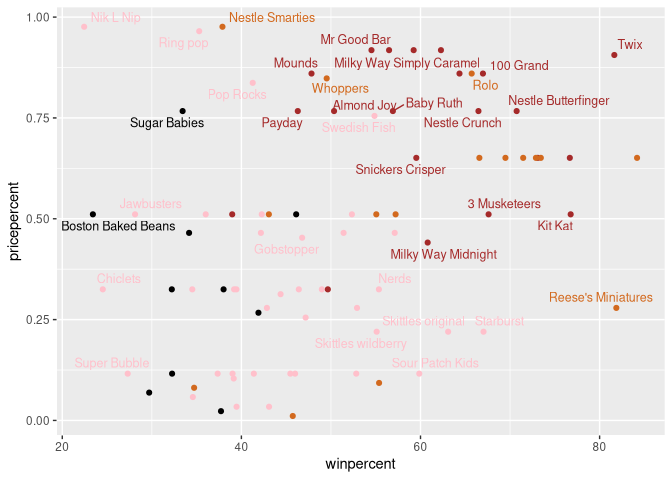

Halloween Mini-Project
================
Jack Reddan (PID: A59010543)
10/29/2021

# Library loading

``` r
library(skimr)
library(dplyr)
```

    ## 
    ## Attaching package: 'dplyr'

    ## The following objects are masked from 'package:stats':
    ## 
    ##     filter, lag

    ## The following objects are masked from 'package:base':
    ## 
    ##     intersect, setdiff, setequal, union

``` r
library(ggplot2)
library(ggrepel)
library(corrplot)
```

    ## corrplot 0.90 loaded

# Importing candy data

``` r
candy_file <- "candy-data.csv"
candy <- read.csv(candy_file, row.names = 1)
head(candy)
```

    ##              chocolate fruity caramel peanutyalmondy nougat crispedricewafer
    ## 100 Grand            1      0       1              0      0                1
    ## 3 Musketeers         1      0       0              0      1                0
    ## One dime             0      0       0              0      0                0
    ## One quarter          0      0       0              0      0                0
    ## Air Heads            0      1       0              0      0                0
    ## Almond Joy           1      0       0              1      0                0
    ##              hard bar pluribus sugarpercent pricepercent winpercent
    ## 100 Grand       0   1        0        0.732        0.860   66.97173
    ## 3 Musketeers    0   1        0        0.604        0.511   67.60294
    ## One dime        0   0        0        0.011        0.116   32.26109
    ## One quarter     0   0        0        0.011        0.511   46.11650
    ## Air Heads       0   0        0        0.906        0.511   52.34146
    ## Almond Joy      0   1        0        0.465        0.767   50.34755

``` r
nrow(candy)
```

    ## [1] 85

``` r
sum(candy$fruity)
```

    ## [1] 38

> value?

``` r
candy["100 Grand",]$winpercent
```

    ## [1] 66.97173

> \[Q4\]: Waht is the `winpercent` value of “Kit Kat”?

``` r
candy["Kit Kat",]$winpercent
```

    ## [1] 76.7686

> \[Q5\] What is the `winpercent` value for “Tootsie Roll Snack Bars”

``` r
candy["Tootsie Roll Snack Bars",]$winpercent
```

    ## [1] 49.6535

``` r
skim(candy)
```

|                                                  |       |
|:-------------------------------------------------|:------|
| Name                                             | candy |
| Number of rows                                   | 85    |
| Number of columns                                | 12    |
| \_\_\_\_\_\_\_\_\_\_\_\_\_\_\_\_\_\_\_\_\_\_\_   |       |
| Column type frequency:                           |       |
| numeric                                          | 12    |
| \_\_\_\_\_\_\_\_\_\_\_\_\_\_\_\_\_\_\_\_\_\_\_\_ |       |
| Group variables                                  | None  |

Data summary

**Variable type: numeric**

| skim_variable    | n_missing | complete_rate |  mean |    sd |    p0 |   p25 |   p50 |   p75 |  p100 | hist  |
|:-----------------|----------:|--------------:|------:|------:|------:|------:|------:|------:|------:|:------|
| chocolate        |         0 |             1 |  0.44 |  0.50 |  0.00 |  0.00 |  0.00 |  1.00 |  1.00 | ▇▁▁▁▆ |
| fruity           |         0 |             1 |  0.45 |  0.50 |  0.00 |  0.00 |  0.00 |  1.00 |  1.00 | ▇▁▁▁▆ |
| caramel          |         0 |             1 |  0.16 |  0.37 |  0.00 |  0.00 |  0.00 |  0.00 |  1.00 | ▇▁▁▁▂ |
| peanutyalmondy   |         0 |             1 |  0.16 |  0.37 |  0.00 |  0.00 |  0.00 |  0.00 |  1.00 | ▇▁▁▁▂ |
| nougat           |         0 |             1 |  0.08 |  0.28 |  0.00 |  0.00 |  0.00 |  0.00 |  1.00 | ▇▁▁▁▁ |
| crispedricewafer |         0 |             1 |  0.08 |  0.28 |  0.00 |  0.00 |  0.00 |  0.00 |  1.00 | ▇▁▁▁▁ |
| hard             |         0 |             1 |  0.18 |  0.38 |  0.00 |  0.00 |  0.00 |  0.00 |  1.00 | ▇▁▁▁▂ |
| bar              |         0 |             1 |  0.25 |  0.43 |  0.00 |  0.00 |  0.00 |  0.00 |  1.00 | ▇▁▁▁▂ |
| pluribus         |         0 |             1 |  0.52 |  0.50 |  0.00 |  0.00 |  1.00 |  1.00 |  1.00 | ▇▁▁▁▇ |
| sugarpercent     |         0 |             1 |  0.48 |  0.28 |  0.01 |  0.22 |  0.47 |  0.73 |  0.99 | ▇▇▇▇▆ |
| pricepercent     |         0 |             1 |  0.47 |  0.29 |  0.01 |  0.26 |  0.47 |  0.65 |  0.98 | ▇▇▇▇▆ |
| winpercent       |         0 |             1 | 50.32 | 14.71 | 22.45 | 39.14 | 47.83 | 59.86 | 84.18 | ▃▇▆▅▂ |

> majority of the other columns in the dataset?

Yes, the ‘winpercent’ column, the mean is two orders of magnitude larger
than the others.

> column?

1 and 0 represent TRUE and FALSE for whether the category could be used
to describe the candy of interest.

``` r
hist(x = candy$winpercent)
```

<!-- -->

``` r
hist(x = candy$winpercent)
abline(v = mean(candy$winpercent), col = 'red')
abline(v = median(candy$winpercent), col = 'blue')
```

<!-- -->

No, the data has a higher density below the mean, since the median is
shifted below the mean. Therefore, the distribution of the data is not
symmetrical.

*See plot above* The median/center of the distribution is below 50%.

``` r
fruity_logi <- as.logical(candy$fruity)
choco_logi <- as.logical(candy$chocolate)

fruity_win <- candy$winpercent[fruity_logi]
names(fruity_win) <- rownames(candy)[fruity_logi]

choco_win <- candy$winpercent[choco_logi]
names(choco_win) <- candy$winpercent[choco_logi]

mean(choco_win)
```

    ## [1] 60.92153

``` r
mean(fruity_win)
```

    ## [1] 44.11974

``` r
choco_vs_furity_stat <- t.test(choco_win, fruity_win)
choco_vs_furity_stat$p.value
```

    ## [1] 2.871378e-08

# Overall Candy Rankings

``` r
candy %>% arrange(winpercent) %>% head(5)
```

    ##                    chocolate fruity caramel peanutyalmondy nougat
    ## Nik L Nip                  0      1       0              0      0
    ## Boston Baked Beans         0      0       0              1      0
    ## Chiclets                   0      1       0              0      0
    ## Super Bubble               0      1       0              0      0
    ## Jawbusters                 0      1       0              0      0
    ##                    crispedricewafer hard bar pluribus sugarpercent pricepercent
    ## Nik L Nip                         0    0   0        1        0.197        0.976
    ## Boston Baked Beans                0    0   0        1        0.313        0.511
    ## Chiclets                          0    0   0        1        0.046        0.325
    ## Super Bubble                      0    0   0        0        0.162        0.116
    ## Jawbusters                        0    1   0        1        0.093        0.511
    ##                    winpercent
    ## Nik L Nip            22.44534
    ## Boston Baked Beans   23.41782
    ## Chiclets             24.52499
    ## Super Bubble         27.30386
    ## Jawbusters           28.12744

``` r
candy %>% arrange(desc(winpercent)) %>% head(5)
```

    ##                           chocolate fruity caramel peanutyalmondy nougat
    ## ReeseÕs Peanut Butter cup         1      0       0              1      0
    ## ReeseÕs Miniatures                1      0       0              1      0
    ## Twix                              1      0       1              0      0
    ## Kit Kat                           1      0       0              0      0
    ## Snickers                          1      0       1              1      1
    ##                           crispedricewafer hard bar pluribus sugarpercent
    ## ReeseÕs Peanut Butter cup                0    0   0        0        0.720
    ## ReeseÕs Miniatures                       0    0   0        0        0.034
    ## Twix                                     1    0   1        0        0.546
    ## Kit Kat                                  1    0   1        0        0.313
    ## Snickers                                 0    0   1        0        0.546
    ##                           pricepercent winpercent
    ## ReeseÕs Peanut Butter cup        0.651   84.18029
    ## ReeseÕs Miniatures               0.279   81.86626
    ## Twix                             0.906   81.64291
    ## Kit Kat                          0.511   76.76860
    ## Snickers                         0.651   76.67378

``` r
ggplot(data = candy) +
  aes(x = winpercent, y = rownames(candy)) +
  geom_col()
```

<!-- -->

> by `winpercent`?

``` r
ggplot(data = candy) +
  aes(x = winpercent, y = reorder(rownames(candy), winpercent)) +
  geom_col()
```

<!-- -->

``` r
my_cols=rep("black", nrow(candy))
my_cols[as.logical(candy$chocolate)] = "chocolate"
my_cols[as.logical(candy$bar)] = "brown"
my_cols[as.logical(candy$fruity)] = "pink"
```

``` r
ggplot(data = candy) +
  aes(x = winpercent, y = reorder(rownames(candy), winpercent)) +
  geom_col(fill = my_cols)
```

<!-- -->

Boston Baked Beans

Starbursts

# Taking a look at pricepercent

``` r
ggplot(candy) + 
  aes(winpercent, pricepercent, label = rownames(candy)) +
  geom_point(col = my_cols) +
  geom_text_repel(col=my_cols, size=3.3, max.overlaps = 5)
```

    ## Warning: ggrepel: 52 unlabeled data points (too many overlaps). Consider
    ## increasing max.overlaps

<!-- -->

> least money - i.e. offers the most bang for your buck?

Reese’s Miniatures.

> these which is the least popular?

``` r
candy %>% 
  arrange(desc(pricepercent)) %>% 
  head(5) %>% 
  arrange(winpercent) %>% 
  head(1)
```

    ##           chocolate fruity caramel peanutyalmondy nougat crispedricewafer hard
    ## Nik L Nip         0      1       0              0      0                0    0
    ##           bar pluribus sugarpercent pricepercent winpercent
    ## Nik L Nip   0        1        0.197        0.976   22.44534

Nik L Nip.

``` r
ggplot(data = candy) +
  aes(x = pricepercent, y = reorder(rownames(candy), pricepercent)) +
  geom_col()
```

<!-- -->

``` r
ggplot(candy) +
  aes(pricepercent, reorder(rownames(candy), pricepercent)) +
  geom_segment(aes(yend = reorder(rownames(candy), pricepercent), xend = 0), 
               col="gray40") +
    geom_point()
```

<!-- -->

# Exploring the Correlation Structure

``` r
candy_cor <- cor(candy)
corrplot(candy_cor)
```

<!-- -->

> \[Q22\]: Examining this plot what two variables are anti-correlated
> (i.e. have minus values)?

Chocolate and fruity.

Winpercent and chocolate.

# Principal Component Analysis

``` r
candy_pca <- prcomp(candy, scale = TRUE)
summary(candy_pca)
```

    ## Importance of components:
    ##                           PC1    PC2    PC3     PC4    PC5     PC6     PC7
    ## Standard deviation     2.0788 1.1378 1.1092 1.07533 0.9518 0.81923 0.81530
    ## Proportion of Variance 0.3601 0.1079 0.1025 0.09636 0.0755 0.05593 0.05539
    ## Cumulative Proportion  0.3601 0.4680 0.5705 0.66688 0.7424 0.79830 0.85369
    ##                            PC8     PC9    PC10    PC11    PC12
    ## Standard deviation     0.74530 0.67824 0.62349 0.43974 0.39760
    ## Proportion of Variance 0.04629 0.03833 0.03239 0.01611 0.01317
    ## Cumulative Proportion  0.89998 0.93832 0.97071 0.98683 1.00000

``` r
plot(candy_pca$x[,1:2],
     xlab = "PC 1",
     ylab = "PC 2")
```

<!-- -->

``` r
plot(candy_pca$x[,1:2],
     col = my_cols,
     pch = 16,
     xlab = "PC 1",
     ylab = "PC 2")
```

<!-- -->

``` r
candy_df <- cbind(candy, candy_pca$x[,1:3])
```

``` r
p <- ggplot(candy_df) + 
  aes(x=PC1, y=PC2, 
      size=winpercent/100,
      text=rownames(candy_df),
      label=rownames(candy_df)) + 
  geom_point(col=my_cols) +
  labs(x = "PC 1", y = "PC 2")

p
```

<!-- -->

``` r
p + 
  geom_text_repel(size=3.3, col=my_cols, max.overlaps = 7)  + 
  theme(legend.position = "none") + 
  labs(title="Halloween Candy PCA Space", 
       subtitle="Colored by type: chocolate bar (dark brown), chocolate other (light brown), fruity (red), other (black)",
       caption="Data from 538")
```

    ## Warning: ggrepel: 42 unlabeled data points (too many overlaps). Consider
    ## increasing max.overlaps

<!-- -->
