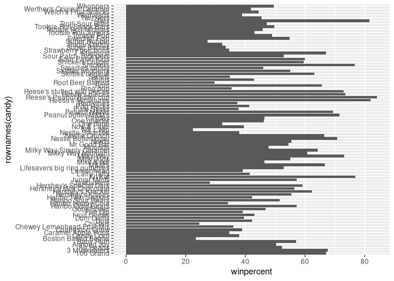
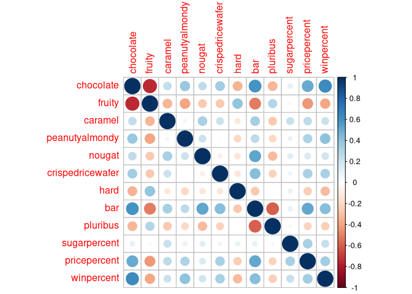

Halloween Mini-Project
================
Jack Reddan (PID: A59010543)
10/29/2021

# Library loading

``` r
library(skimr)
library(dplyr)
```

    ## 
    ## Attaching package: 'dplyr'

    ## The following objects are masked from 'package:stats':
    ## 
    ##     filter, lag

    ## The following objects are masked from 'package:base':
    ## 
    ##     intersect, setdiff, setequal, union

``` r
library(ggplot2)
library(ggrepel)
library(corrplot)
```

    ## corrplot 0.92 loaded

``` r
library(plotly)
```

    ## 
    ## Attaching package: 'plotly'

    ## The following object is masked from 'package:ggplot2':
    ## 
    ##     last_plot

    ## The following object is masked from 'package:stats':
    ## 
    ##     filter

    ## The following object is masked from 'package:graphics':
    ## 
    ##     layout

# Importing candy data

``` r
candy_file <- "candy-data.csv"
candy <- read.csv(candy_file, row.names = 1)
head(candy)
```

    ##              chocolate fruity caramel peanutyalmondy nougat crispedricewafer
    ## 100 Grand            1      0       1              0      0                1
    ## 3 Musketeers         1      0       0              0      1                0
    ## One dime             0      0       0              0      0                0
    ## One quarter          0      0       0              0      0                0
    ## Air Heads            0      1       0              0      0                0
    ## Almond Joy           1      0       0              1      0                0
    ##              hard bar pluribus sugarpercent pricepercent winpercent
    ## 100 Grand       0   1        0        0.732        0.860   66.97173
    ## 3 Musketeers    0   1        0        0.604        0.511   67.60294
    ## One dime        0   0        0        0.011        0.116   32.26109
    ## One quarter     0   0        0        0.011        0.511   46.11650
    ## Air Heads       0   0        0        0.906        0.511   52.34146
    ## Almond Joy      0   1        0        0.465        0.767   50.34755

##### \[Q1\]:

How many different candy types are in this dataset?

``` r
nrow(candy)
```

    ## [1] 85

##### \[Q2\]:

How many fruity candy types are in the dataset?

``` r
sum(candy$fruity)
```

    ## [1] 38

##### \[Q3\]:

What is your favorite candy in the dataset and what is it’s `winpercent`
value?

``` r
candy["100 Grand",]$winpercent
```

    ## [1] 66.97173

##### \[Q4\]:

What is the `winpercent` value of “Kit Kat”?

``` r
candy["Kit Kat",]$winpercent
```

    ## [1] 76.7686

##### \[Q5\]:

What is the `winpercent` value for “Tootsie Roll Snack Bars”

``` r
candy["Tootsie Roll Snack Bars",]$winpercent
```

    ## [1] 49.6535

``` r
#skim(candy)
```

##### \[Q6\]:

Is there any variable/column that looks to be on a different scale to
the majority of the other columns in the dataset?

Yes, the ‘winpercent’ column, the mean is two orders of magnitude larger
than the others.

##### \[Q7\]:

What do you think a zero and one represent for the `candy$chocolate`
column?

1 and 0 represent TRUE and FALSE for whether the category could be used
to describe the candy of interest.

##### \[Q8\]:

Plot a histogram of `winpercent` values.

``` r
hist(x = candy$winpercent)
```

<!-- -->

##### \[Q9\]:

Is the distribution of winpercent values symmetrical?

``` r
hist(x = candy$winpercent)
abline(v = mean(candy$winpercent), col = 'red')
abline(v = median(candy$winpercent), col = 'blue')
```

<!-- -->

No, the data has a higher mean than median, indicating more density at
the higher end of the distribution. Therefore, the distribution of the
data is not symmetrical.

##### \[Q10\]:

Is the center of the distribution above or below 50%?

*See plot above* The median/center of the distribution is below 50%.

##### \[Q11\]:

On average is chocolate candy higher or lower ranked than fruit candy?

``` r
fruity_logi <- as.logical(candy$fruity)
choco_logi <- as.logical(candy$chocolate)

fruity_win <- candy$winpercent[fruity_logi]
names(fruity_win) <- rownames(candy)[fruity_logi]

choco_win <- candy$winpercent[choco_logi]
names(choco_win) <- candy$winpercent[choco_logi]

mean(choco_win)
```

    ## [1] 60.92153

``` r
mean(fruity_win)
```

    ## [1] 44.11974

On average, chocolate candy is ranked higher, 60.92%, compared to fruity
candy (44.12%).

##### \[Q12\]:

Is this difference statistically significant?

``` r
choco_vs_furity_stat <- t.test(choco_win, fruity_win)
choco_vs_furity_stat$p.value
```

    ## [1] 2.871378e-08

Yes, the difference is significant with a p-value of 2.87x10^-8.

# Overall Candy Rankings

##### \[Q13\]:

What are the five least liked candy types in this set?

``` r
candy %>% arrange(winpercent) %>% head(5)
```

    ##                    chocolate fruity caramel peanutyalmondy nougat
    ## Nik L Nip                  0      1       0              0      0
    ## Boston Baked Beans         0      0       0              1      0
    ## Chiclets                   0      1       0              0      0
    ## Super Bubble               0      1       0              0      0
    ## Jawbusters                 0      1       0              0      0
    ##                    crispedricewafer hard bar pluribus sugarpercent pricepercent
    ## Nik L Nip                         0    0   0        1        0.197        0.976
    ## Boston Baked Beans                0    0   0        1        0.313        0.511
    ## Chiclets                          0    0   0        1        0.046        0.325
    ## Super Bubble                      0    0   0        0        0.162        0.116
    ## Jawbusters                        0    1   0        1        0.093        0.511
    ##                    winpercent
    ## Nik L Nip            22.44534
    ## Boston Baked Beans   23.41782
    ## Chiclets             24.52499
    ## Super Bubble         27.30386
    ## Jawbusters           28.12744

##### \[Q14\]:

What are the top 5 all time favorite candy types out of this set?

``` r
candy %>% arrange(desc(winpercent)) %>% head(5)
```

    ##                           chocolate fruity caramel peanutyalmondy nougat
    ## Reese's Peanut Butter cup         1      0       0              1      0
    ## Reese's Miniatures                1      0       0              1      0
    ## Twix                              1      0       1              0      0
    ## Kit Kat                           1      0       0              0      0
    ## Snickers                          1      0       1              1      1
    ##                           crispedricewafer hard bar pluribus sugarpercent
    ## Reese's Peanut Butter cup                0    0   0        0        0.720
    ## Reese's Miniatures                       0    0   0        0        0.034
    ## Twix                                     1    0   1        0        0.546
    ## Kit Kat                                  1    0   1        0        0.313
    ## Snickers                                 0    0   1        0        0.546
    ##                           pricepercent winpercent
    ## Reese's Peanut Butter cup        0.651   84.18029
    ## Reese's Miniatures               0.279   81.86626
    ## Twix                             0.906   81.64291
    ## Kit Kat                          0.511   76.76860
    ## Snickers                         0.651   76.67378

##### \[Q15\]:

Make a first barplot of candy ranking based on winpercent values.

``` r
ggplot(data = candy) +
  aes(x = winpercent, y = rownames(candy)) +
  geom_col()
```

<!-- -->

##### \[Q16\]:

This is quite ugly, use the `reorder()` function to get the bars sorted
by `winpercent`?

``` r
ggplot(data = candy) +
  aes(x = winpercent, y = reorder(rownames(candy), winpercent)) +
  geom_col()
```

<!-- -->

``` r
my_cols=rep("black", nrow(candy))
my_cols[as.logical(candy$chocolate)] = "chocolate"
my_cols[as.logical(candy$bar)] = "brown"
my_cols[as.logical(candy$fruity)] = "pink"
```

``` r
ggplot(data = candy) +
  aes(x = winpercent, y = reorder(rownames(candy), winpercent)) +
  geom_col(fill = my_cols)
```

<!-- -->

##### \[Q17\]:

What is the worst ranked chocolate candy?

Boston Baked Beans.

##### \[Q18\]:

What is the best ranked fruity candy?

Starbursts.

# Taking a look at pricepercent

``` r
ggplot(candy) + 
  aes(winpercent, pricepercent, label = rownames(candy)) +
  geom_point(col = my_cols) +
  geom_text_repel(col=my_cols, size=3.3, max.overlaps = 5)
```

    ## Warning: ggrepel: 52 unlabeled data points (too many overlaps). Consider
    ## increasing max.overlaps

<!-- -->

##### \[Q19\]:

Which candy type is the highest ranked in terms of winpercent for the
least money - i.e. offers the most bang for your buck?

Reese’s Miniatures.

##### \[Q20\]:

What are the top 5 most expensive candy types in the dataset and of
these which is the least popular?

``` r
candy %>% 
  arrange(desc(pricepercent)) %>% 
  head(5)
```

    ##                          chocolate fruity caramel peanutyalmondy nougat
    ## Nik L Nip                        0      1       0              0      0
    ## Nestle Smarties                  1      0       0              0      0
    ## Ring pop                         0      1       0              0      0
    ## Hershey's Krackel                1      0       0              0      0
    ## Hershey's Milk Chocolate         1      0       0              0      0
    ##                          crispedricewafer hard bar pluribus sugarpercent
    ## Nik L Nip                               0    0   0        1        0.197
    ## Nestle Smarties                         0    0   0        1        0.267
    ## Ring pop                                0    1   0        0        0.732
    ## Hershey's Krackel                       1    0   1        0        0.430
    ## Hershey's Milk Chocolate                0    0   1        0        0.430
    ##                          pricepercent winpercent
    ## Nik L Nip                       0.976   22.44534
    ## Nestle Smarties                 0.976   37.88719
    ## Ring pop                        0.965   35.29076
    ## Hershey's Krackel               0.918   62.28448
    ## Hershey's Milk Chocolate        0.918   56.49050

``` r
candy %>% 
  arrange(desc(pricepercent)) %>% 
  head(5) %>% 
  arrange(winpercent) %>% 
  head(1)
```

    ##           chocolate fruity caramel peanutyalmondy nougat crispedricewafer hard
    ## Nik L Nip         0      1       0              0      0                0    0
    ##           bar pluribus sugarpercent pricepercent winpercent
    ## Nik L Nip   0        1        0.197        0.976   22.44534

Nik L Nip is the most expensive of the least favorite candy options.

##### \[Q21\]:

Make a barplot again with geom_col() this time using pricepercent.

``` r
ggplot(data = candy) +
  aes(x = pricepercent, y = reorder(rownames(candy), pricepercent)) +
  geom_col()
```

<!-- -->

``` r
ggplot(candy) +
  aes(pricepercent, reorder(rownames(candy), pricepercent)) +
  geom_segment(aes(yend = reorder(rownames(candy), pricepercent), xend = 0), 
               col="gray40") +
    geom_point()
```

<!-- -->

# Exploring the Correlation Structure

``` r
candy_cor <- cor(candy)
corrplot(candy_cor)
```

<!-- -->

##### \[Q22\]:

Examining this plot what two variables are anti-correlated (i.e. have
minus values)?

Chocolate and fruity.

##### \[Q23\]:

Similarly, what two variables are most positively correlated?

Winpercent and chocolate.

# Principal Component Analysis

``` r
candy_pca <- prcomp(candy, scale = TRUE)
summary(candy_pca)
```

    ## Importance of components:
    ##                           PC1    PC2    PC3     PC4    PC5     PC6     PC7
    ## Standard deviation     2.0788 1.1378 1.1092 1.07533 0.9518 0.81923 0.81530
    ## Proportion of Variance 0.3601 0.1079 0.1025 0.09636 0.0755 0.05593 0.05539
    ## Cumulative Proportion  0.3601 0.4680 0.5705 0.66688 0.7424 0.79830 0.85369
    ##                            PC8     PC9    PC10    PC11    PC12
    ## Standard deviation     0.74530 0.67824 0.62349 0.43974 0.39760
    ## Proportion of Variance 0.04629 0.03833 0.03239 0.01611 0.01317
    ## Cumulative Proportion  0.89998 0.93832 0.97071 0.98683 1.00000

``` r
plot(candy_pca$x[,1:2],
     xlab = "PC 1",
     ylab = "PC 2")
```

<!-- -->

``` r
plot(candy_pca$x[,1:2],
     col = my_cols,
     pch = 16,
     xlab = "PC 1",
     ylab = "PC 2")
```

<!-- -->

``` r
candy_df <- cbind(candy, candy_pca$x[,1:3])
```

``` r
p <- ggplot(candy_df) + 
  aes(x=PC1, y=PC2, 
      size=winpercent/100,
      text=rownames(candy_df),
      label=rownames(candy_df)) + 
  geom_point(col=my_cols) +
  labs(x = "PC 1", y = "PC 2")

p
```

<!-- -->

``` r
p <- p + 
  geom_text_repel(size=3.3, col=my_cols, max.overlaps = 7)  + 
  theme(legend.position = "none") + 
  labs(title="Halloween Candy PCA Space", 
       subtitle="Colored by type: chocolate bar (dark brown), chocolate other (light brown), fruity (red), other (black)",
       caption="Data from 538")

p
```

    ## Warning: ggrepel: 41 unlabeled data points (too many overlaps). Consider
    ## increasing max.overlaps

<!-- -->

<!--``{r}-->
<!--ggplotly(p)-->
<!--```-->

``` r
op <- par(mar=c(8,4,2,2))
barplot(candy_pca$rotation[,1], las=2, ylab="PC1 Contribution")
```

<!-- -->

``` r
par(op)
```

##### \[Q24\]:

What original variables are picked up strongly by PC1 in the positive
direction? Do these make sense to you?

Fruity, hard and pluribus. Yes, these variables are found together
often, and can easily differentiate between types of candy.

# Session Information

``` r
sessionInfo()
```

    ## R version 4.1.2 (2021-11-01)
    ## Platform: x86_64-pc-linux-gnu (64-bit)
    ## Running under: Arch Linux
    ## 
    ## Matrix products: default
    ## BLAS:   /usr/lib/libblas.so.3.10.0
    ## LAPACK: /usr/lib/liblapack.so.3.10.0
    ## 
    ## locale:
    ##  [1] LC_CTYPE=en_US.UTF-8       LC_NUMERIC=C              
    ##  [3] LC_TIME=en_US.UTF-8        LC_COLLATE=en_US.UTF-8    
    ##  [5] LC_MONETARY=en_US.UTF-8    LC_MESSAGES=en_US.UTF-8   
    ##  [7] LC_PAPER=en_US.UTF-8       LC_NAME=C                 
    ##  [9] LC_ADDRESS=C               LC_TELEPHONE=C            
    ## [11] LC_MEASUREMENT=en_US.UTF-8 LC_IDENTIFICATION=C       
    ## 
    ## attached base packages:
    ## [1] stats     graphics  grDevices utils     datasets  methods   base     
    ## 
    ## other attached packages:
    ## [1] plotly_4.10.0 corrplot_0.92 ggrepel_0.9.1 ggplot2_3.3.5 dplyr_1.0.7  
    ## [6] skimr_2.1.3  
    ## 
    ## loaded via a namespace (and not attached):
    ##  [1] Rcpp_1.0.7        highr_0.9         pillar_1.6.4      compiler_4.1.2   
    ##  [5] base64enc_0.1-3   tools_4.1.2       digest_0.6.28     viridisLite_0.4.0
    ##  [9] jsonlite_1.7.2    evaluate_0.14     lifecycle_1.0.1   tibble_3.1.6     
    ## [13] gtable_0.3.0      pkgconfig_2.0.3   rlang_0.4.12      DBI_1.1.1        
    ## [17] yaml_2.2.1        xfun_0.28         fastmap_1.1.0     httr_1.4.2       
    ## [21] repr_1.1.3        withr_2.4.2       stringr_1.4.0     knitr_1.36       
    ## [25] htmlwidgets_1.5.4 generics_0.1.1    vctrs_0.3.8       grid_4.1.2       
    ## [29] tidyselect_1.1.1  data.table_1.14.2 glue_1.5.0        R6_2.5.1         
    ## [33] fansi_0.5.0       rmarkdown_2.11    farver_2.1.0      tidyr_1.1.4      
    ## [37] purrr_0.3.4       magrittr_2.0.1    scales_1.1.1      ellipsis_0.3.2   
    ## [41] htmltools_0.5.2   assertthat_0.2.1  colorspace_2.0-2  labeling_0.4.2   
    ## [45] utf8_1.2.2        stringi_1.7.6     lazyeval_0.2.2    munsell_0.5.0    
    ## [49] crayon_1.4.2
