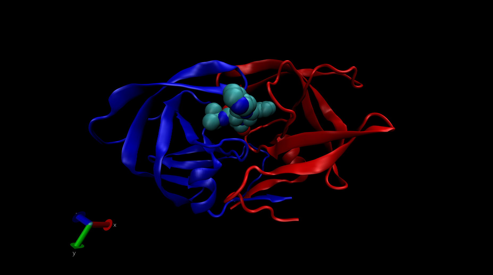

# Introduction to the RCSB Protein Data Bank (PDB)

## PDB Statistics

```{r}
pdb_stats <- read.csv("pdb_statistics.csv")

pdb_stats
```

### [Q01]: What percentage of structures in the PDB are solved by X-Ray and Electron Microscopy?

```{r}
# x_ray_percent <- round(((sum(pdb_stats$X.ray) / sum(pdb_stats$Total)) * 100), 2)
# paste0("X-Ray: ", x_ray_percent, "%", sep = "")
# 
# EM_percent <- round(((sum(pdb_stats$EM) / sum(pdb_stats$Total)) * 100), 2)
# paste0("XElectron Microscopy: ", EM_percent, "%", sep = "")

round((colSums(pdb_stats[,2:(ncol(pdb_stats)-1)])/sum(pdb_stats$Total)*100), 2)
```

### [Q02]: What percentage of structures in the PDB are protein?

```{r}
protein_percent <-round(
  (sum(pdb_stats$Total[grep("Protein", pdb_stats$Molecular.Type)])/sum(pdb_stats$Total)*100), 
  2)
paste0("Proteins: ", protein_percent, "%", sep = "")
```

### [Q03]: Type HIV in the PDB website search box on the home page and determine how many HIV-1 protease structures are in the current PDB?

2343 structures.

## The PDB Format

# Visualizing the HIV-1 Protease

## Getting to Know VMD

## Using Atom Selection

### [Q04]: Water molecules normally have 3 atoms. Why do we see just one atom per water molecule in this structure?

The hydrogen atom is extremely small and is not depicted because the oxygen atom sufficiently identifies the location and spatial occupation of the water molecule.

### [Q05]: There is a conserved water molecule in the binding site. Can you identify this water molecule? What residue number does this water molecule have (see note below)?

HOH 308:O



## Sequence Viewer Extension

### [Q06]: As you have hopefully observed HIV protease is a homodimer (i.e. it is composed of two identical chains). With the aid of the graphic display and the sequence viewer extension can you identify secondary structure elements that are likely to only form in the dimer rather than the monomer?

# Intorduction to Bio3D in R

```{r}
library(bio3d)
```

## Reading PDB File Data into R

```{r}
pdb_1hsg <- read.pdb("1hsg")
pdb_1hel <- read.pdb("1hel")

pdb_1hsg

pdb_1hel
```

### [Q07]: How many amino acid residues are there in this pdb object?

```{r}
length(pdb_1hsg$seqres)
```

### [Q08]: Name one of the two non-protein residues?

```{r}
unique(pdb_1hsg$atom$resid)
```
  
An example of a non-protein residue is 'HOH' for water.  
  
### [Q09]: How many protein chains are in this structure?  
  
```{r}
length(unique(pdb_1hsg$atom$chain))
```
  
# Comparative Structure Analysis of Adenylate Kinase  
  
## Setup  

```{r}
# install.packages("bio3d")
# install.packages("ggplot2")
# install.packages("ggrepel")
# install.packages("devtools")
# install.packages("BiocManager")
# 
# BiocManager::install("msa")
# devtools::install_bitbucket("Grantlab/bio3d-view")
```
  
### [Q10]: Which of the packages above is found only on BioConductor and not CRAN?  
  
The MSA package is only availible on BioConductor, not CRAN, since the base R
function `install.packages()` does not work. Instead, to install the package
you need to use the BioConductor package manager `BiocManager::install()`.  
  
### [Q11]: Which of the above packages is not found on BioConductor or CRAN?  
  
The 'Grantlab/bio3d-view' is not found on either BioCoductor or CRAN, instead
it has a BitBucket repo, which is accessed using the `devtools` package.  
  
### [Q12]: True or False? Functions from the devtools package can be used to install packages from GitHub and BitBucket?  
  
`TRUE`  
  
## Search and Retrieve ADK Structures 
  
```{r}
library(bio3d)
library(msa)
```

```{r}
aa <- get.seq("1ake_A")
```
  
```{r}
aa
```
  
### [Q13]: How many amino acids are in this sequence, i.e. how long is this sequence?
   
```{r}
length(aa$ali)
```

```{r}
b <- blast.pdb(aa)
```
  
```{r}
blast_hits <- plot.blast(b)
```
  
```{r}
head(blast_hits$pdb.id)
```
  
```{r}
pdb_files <- get.pdb(blast_hits$pdb.id, path="pdbs", split=TRUE, gzip=TRUE)
```
  
## Align and Superimpose Structures  
  
```{r}
pdbs <- pdbaln(pdb_files, fit = TRUE)
```
  
```{r}
ids <- basename.pdb(pdbs$id)
plot(pdbs, labels=ids)
```
  
## Principal Component Analysis  
  
```{r}
pc.xray <- pca(pdbs)
plot(pc.xray)
```
  
# Optional Further Visualization  
  
```{r}
pc1 <- mktrj(pc.xray, pc=1, file="pc_1.pdb")
```

  
Conduct Normal Mode Analysis to predict variability in the protein's conformation.

```{r}
m <- nma(pdb_1hel)
plot(m)
```

```{r}
mktrj(m ,file = "1hel_nma.pdb")
```
