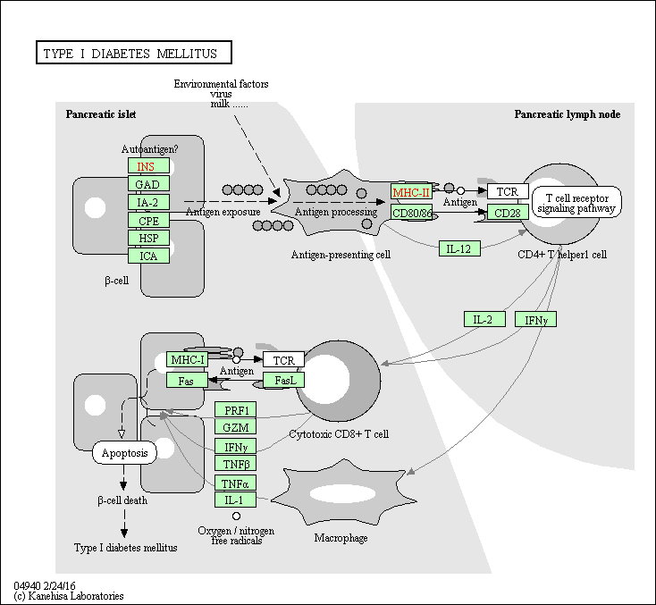

Lab 12
================
Jack Reddan (PID: A59010543)

# Bioconductor and DESeq2 Setup

``` r
library(BiocManager)
library(DESeq2)
library(dplyr)
library(ggplot2)
library("AnnotationDbi")
library("org.Hs.eg.db")
library("EnhancedVolcano")
library(pathview)
library(gage)
library(gageData)
```

# Import **countData** and **colData**

``` r
# Read in the scaled counts data as counts and the metadata data as metadata
counts <- read.csv("airway_scaledcounts.csv", row.names = 1)
metadata <- read.csv("airway_metadata.csv")
```

``` r
head(counts)
```

    ##                 SRR1039508 SRR1039509 SRR1039512 SRR1039513 SRR1039516
    ## ENSG00000000003        723        486        904        445       1170
    ## ENSG00000000005          0          0          0          0          0
    ## ENSG00000000419        467        523        616        371        582
    ## ENSG00000000457        347        258        364        237        318
    ## ENSG00000000460         96         81         73         66        118
    ## ENSG00000000938          0          0          1          0          2
    ##                 SRR1039517 SRR1039520 SRR1039521
    ## ENSG00000000003       1097        806        604
    ## ENSG00000000005          0          0          0
    ## ENSG00000000419        781        417        509
    ## ENSG00000000457        447        330        324
    ## ENSG00000000460         94        102         74
    ## ENSG00000000938          0          0          0

``` r
head(metadata)
```

    ##           id     dex celltype     geo_id
    ## 1 SRR1039508 control   N61311 GSM1275862
    ## 2 SRR1039509 treated   N61311 GSM1275863
    ## 3 SRR1039512 control  N052611 GSM1275866
    ## 4 SRR1039513 treated  N052611 GSM1275867
    ## 5 SRR1039516 control  N080611 GSM1275870
    ## 6 SRR1039517 treated  N080611 GSM1275871

Check if metadata and count data match:

``` r
all(metadata$id == colnames(counts))
```

    ## [1] TRUE

#### \[Q1\]: How many genes are in this data set?

``` r
nrow(counts)
```

    ## [1] 38694

#### \[Q2\]: How many ‘control’ cell lines do we have?

``` r
table(metadata$dex)
```

    ## 
    ## control treated 
    ##       4       4

# Toy Differential Gene Expression

``` r
control_md <- metadata[metadata$dex == "control",]
control_counts <- counts[,control_md$id]
control_mean <- rowSums(control_counts)/4
head(control_mean)
```

    ## ENSG00000000003 ENSG00000000005 ENSG00000000419 ENSG00000000457 ENSG00000000460 
    ##          900.75            0.00          520.50          339.75           97.25 
    ## ENSG00000000938 
    ##            0.75

Same as above, but using dplyr.

``` r
control_md <- metadata %>% filter(dex=="control")
control_counts <- counts %>% dplyr::select(control_md$id) 
control_mean <- rowSums(control_counts)/4
head(control_mean)
```

    ## ENSG00000000003 ENSG00000000005 ENSG00000000419 ENSG00000000457 ENSG00000000460 
    ##          900.75            0.00          520.50          339.75           97.25 
    ## ENSG00000000938 
    ##            0.75

#### \[Q3\]: How would you make the above code in either approach more robust?

Change rowSums to rowMeans to avoid hard-coding number of samples.

``` r
control_md <- metadata %>% filter(dex=="control")
control_counts <- counts %>% dplyr::select(control_md$id) 
control_mean <- rowMeans(control_counts)
head(control_mean)
```

    ## ENSG00000000003 ENSG00000000005 ENSG00000000419 ENSG00000000457 ENSG00000000460 
    ##          900.75            0.00          520.50          339.75           97.25 
    ## ENSG00000000938 
    ##            0.75

#### \[Q4\]: Follow the same procedure for the `treated` samples.

``` r
treated_md <- metadata %>% filter(dex=="treated")
treated_counts <- counts %>% dplyr::select(treated_md$id) 
treated_mean <- rowMeans(treated_counts)
head(treated_mean)
```

    ## ENSG00000000003 ENSG00000000005 ENSG00000000419 ENSG00000000457 ENSG00000000460 
    ##          658.00            0.00          546.00          316.50           78.75 
    ## ENSG00000000938 
    ##            0.00

``` r
mean_counts <- data.frame("control" = control_mean, "treated" = treated_mean)
colSums(mean_counts)
```

    ##  control  treated 
    ## 23005324 22196524

#### \[Q5a\]: Create a scatter plot showing the mean of the treated samples against the mean of the control samples.

``` r
plot(x = mean_counts$control, y = mean_counts$treated,
     xlab = "Control", ylab = "Treated")
```

<!-- -->

#### \[Q5b\]: You could also use the ggplot2 package to make this figure. What geom\_?() function would you use for this plot?

You would use `geom_point()`.

``` r
ggplot(mean_counts) +
  aes(x = control, y = treated) +
  geom_point(alpha = 0.4) +
  labs(x = "Control", y = "Treated")
```

<!-- -->

#### \[Q6\]: Try plotting both axes on a log scale. What is the argument to plot() that allows you to do this?

The argument is `log`.

``` r
plot(x = mean_counts$control, y = mean_counts$treated,
     xlab = "log(Control)", ylab = "log(Treated)", log = "yx")
```

<!-- -->

``` r
mean_counts$log2fc <- log2(mean_counts$treated/mean_counts$control)
head(mean_counts)
```

    ##                 control treated      log2fc
    ## ENSG00000000003  900.75  658.00 -0.45303916
    ## ENSG00000000005    0.00    0.00         NaN
    ## ENSG00000000419  520.50  546.00  0.06900279
    ## ENSG00000000457  339.75  316.50 -0.10226805
    ## ENSG00000000460   97.25   78.75 -0.30441833
    ## ENSG00000000938    0.75    0.00        -Inf

Remove the rows with zero values present.

``` r
zeros_rows <- which(mean_counts[,c(1,2)] == 0, arr.ind = TRUE)
remove_rows <- unique(zeros_rows[,1])
nonzero_counts <- mean_counts[-remove_rows,]
head(nonzero_counts)
```

    ##                 control treated      log2fc
    ## ENSG00000000003  900.75  658.00 -0.45303916
    ## ENSG00000000419  520.50  546.00  0.06900279
    ## ENSG00000000457  339.75  316.50 -0.10226805
    ## ENSG00000000460   97.25   78.75 -0.30441833
    ## ENSG00000000971 5219.00 6687.50  0.35769358
    ## ENSG00000001036 2327.00 1785.75 -0.38194109

#### \[Q7\]: What is the purpose of the arr.ind argument in the which() function call above? Why would we then take the first column of the output and need to call the unique() function?

The purpose of `arr.ind` is to return the array indices of for `TRUE`
values, rows and columns. The first column contains the rows which were
`TRUE` for a given column, specified in the second column of this
output. Therefore, unique will pull out all rows which have a zero in
either or both columns.

``` r
up_indx <- nonzero_counts$log2fc > 2
down_indx <- nonzero_counts$log2fc < -2
```

#### \[Q8\]: Using the `up_indx` vector, can you determine how many up regulated genes we have at the greater than 2 fc level?

``` r
sum(up_indx)
```

    ## [1] 250

#### \[Q9\]: Using the `down_indx` vector, can you determine how many down regulated genes we have at the greater than 2 fc level?

``` r
sum(down_indx)
```

    ## [1] 367

#### \[Q10\]: Do you trust these results? Why or why not?

I do not trust these results since there is no accountability for genes
with a high variance in gene expression data. Means do not represent the
data well enough to rely on solely, statistics would be needed to
identify whether the fold change is significant or is observed by
chance.

# DESeq2 Analysis

``` r
citation("DESeq2")
```

    ## 
    ##   Love, M.I., Huber, W., Anders, S. Moderated estimation of fold change
    ##   and dispersion for RNA-seq data with DESeq2 Genome Biology 15(12):550
    ##   (2014)
    ## 
    ## A BibTeX entry for LaTeX users is
    ## 
    ##   @Article{,
    ##     title = {Moderated estimation of fold change and dispersion for RNA-seq data with DESeq2},
    ##     author = {Michael I. Love and Wolfgang Huber and Simon Anders},
    ##     year = {2014},
    ##     journal = {Genome Biology},
    ##     doi = {10.1186/s13059-014-0550-8},
    ##     volume = {15},
    ##     issue = {12},
    ##     pages = {550},
    ##   }

## Importing Data

``` r
Dds <- DESeqDataSetFromMatrix(countData = counts,
                              colData = metadata,
                              design = ~dex)
```

    ## converting counts to integer mode

    ## Warning in DESeqDataSet(se, design = design, ignoreRank): some variables in
    ## design formula are characters, converting to factors

``` r
Dds
```

    ## class: DESeqDataSet 
    ## dim: 38694 8 
    ## metadata(1): version
    ## assays(1): counts
    ## rownames(38694): ENSG00000000003 ENSG00000000005 ... ENSG00000283120
    ##   ENSG00000283123
    ## rowData names(0):
    ## colnames(8): SRR1039508 SRR1039509 ... SRR1039520 SRR1039521
    ## colData names(4): id dex celltype geo_id

## DESeq Analysis

``` r
# Must run DESeq first
# results(Dds)

Dds <- DESeq(Dds)
```

    ## estimating size factors

    ## estimating dispersions

    ## gene-wise dispersion estimates

    ## mean-dispersion relationship

    ## final dispersion estimates

    ## fitting model and testing

## Getting Results

``` r
res <- results(Dds)
res
```

    ## log2 fold change (MLE): dex treated vs control 
    ## Wald test p-value: dex treated vs control 
    ## DataFrame with 38694 rows and 6 columns
    ##                  baseMean log2FoldChange     lfcSE      stat    pvalue
    ##                 <numeric>      <numeric> <numeric> <numeric> <numeric>
    ## ENSG00000000003  747.1942     -0.3507030  0.168246 -2.084470 0.0371175
    ## ENSG00000000005    0.0000             NA        NA        NA        NA
    ## ENSG00000000419  520.1342      0.2061078  0.101059  2.039475 0.0414026
    ## ENSG00000000457  322.6648      0.0245269  0.145145  0.168982 0.8658106
    ## ENSG00000000460   87.6826     -0.1471420  0.257007 -0.572521 0.5669691
    ## ...                   ...            ...       ...       ...       ...
    ## ENSG00000283115  0.000000             NA        NA        NA        NA
    ## ENSG00000283116  0.000000             NA        NA        NA        NA
    ## ENSG00000283119  0.000000             NA        NA        NA        NA
    ## ENSG00000283120  0.974916      -0.668258   1.69456 -0.394354  0.693319
    ## ENSG00000283123  0.000000             NA        NA        NA        NA
    ##                      padj
    ##                 <numeric>
    ## ENSG00000000003  0.163035
    ## ENSG00000000005        NA
    ## ENSG00000000419  0.176032
    ## ENSG00000000457  0.961694
    ## ENSG00000000460  0.815849
    ## ...                   ...
    ## ENSG00000283115        NA
    ## ENSG00000283116        NA
    ## ENSG00000283119        NA
    ## ENSG00000283120        NA
    ## ENSG00000283123        NA

``` r
summary(res)
```

    ## 
    ## out of 25258 with nonzero total read count
    ## adjusted p-value < 0.1
    ## LFC > 0 (up)       : 1563, 6.2%
    ## LFC < 0 (down)     : 1188, 4.7%
    ## outliers [1]       : 142, 0.56%
    ## low counts [2]     : 9971, 39%
    ## (mean count < 10)
    ## [1] see 'cooksCutoff' argument of ?results
    ## [2] see 'independentFiltering' argument of ?results

Change the alpha cut-off to 0.05 rather than the default 0.1.

``` r
res_005 <- results(Dds, alpha = 0.05)
summary(res_005)
```

    ## 
    ## out of 25258 with nonzero total read count
    ## adjusted p-value < 0.05
    ## LFC > 0 (up)       : 1236, 4.9%
    ## LFC < 0 (down)     : 933, 3.7%
    ## outliers [1]       : 142, 0.56%
    ## low counts [2]     : 9033, 36%
    ## (mean count < 6)
    ## [1] see 'cooksCutoff' argument of ?results
    ## [2] see 'independentFiltering' argument of ?results

# Adding Annotation Data

Available annotation formats.

``` r
columns(org.Hs.eg.db)
```

    ##  [1] "ACCNUM"       "ALIAS"        "ENSEMBL"      "ENSEMBLPROT"  "ENSEMBLTRANS"
    ##  [6] "ENTREZID"     "ENZYME"       "EVIDENCE"     "EVIDENCEALL"  "GENENAME"    
    ## [11] "GENETYPE"     "GO"           "GOALL"        "IPI"          "MAP"         
    ## [16] "OMIM"         "ONTOLOGY"     "ONTOLOGYALL"  "PATH"         "PFAM"        
    ## [21] "PMID"         "PROSITE"      "REFSEQ"       "SYMBOL"       "UCSCKG"      
    ## [26] "UNIPROT"

``` r
res$symbol <- mapIds(org.Hs.eg.db,
                     keys = row.names(res),
                     keytype = "ENSEMBL",
                     column = "SYMBOL",
                     mutliVals = "first")
```

    ## 'select()' returned 1:many mapping between keys and columns

``` r
head(res)
```

    ## log2 fold change (MLE): dex treated vs control 
    ## Wald test p-value: dex treated vs control 
    ## DataFrame with 6 rows and 7 columns
    ##                   baseMean log2FoldChange     lfcSE      stat    pvalue
    ##                  <numeric>      <numeric> <numeric> <numeric> <numeric>
    ## ENSG00000000003 747.194195     -0.3507030  0.168246 -2.084470 0.0371175
    ## ENSG00000000005   0.000000             NA        NA        NA        NA
    ## ENSG00000000419 520.134160      0.2061078  0.101059  2.039475 0.0414026
    ## ENSG00000000457 322.664844      0.0245269  0.145145  0.168982 0.8658106
    ## ENSG00000000460  87.682625     -0.1471420  0.257007 -0.572521 0.5669691
    ## ENSG00000000938   0.319167     -1.7322890  3.493601 -0.495846 0.6200029
    ##                      padj      symbol
    ##                 <numeric> <character>
    ## ENSG00000000003  0.163035      TSPAN6
    ## ENSG00000000005        NA        TNMD
    ## ENSG00000000419  0.176032        DPM1
    ## ENSG00000000457  0.961694       SCYL3
    ## ENSG00000000460  0.815849    C1orf112
    ## ENSG00000000938        NA         FGR

#### \[Q11\]: Run the `mapIds()` function \[three\] more times to add the Entrez ID and UniProt accession and GENENAME as new columns called `res$entrez`, `res$uniprot` and `res$genename`.

``` r
res$entrez <- mapIds(org.Hs.eg.db,
                     keys = row.names(res),
                     keytype = "ENSEMBL",
                     column = "ENTREZID",
                     mutliVals = "first")
```

    ## 'select()' returned 1:many mapping between keys and columns

``` r
res$uniprot <- mapIds(org.Hs.eg.db,
                     keys = row.names(res),
                     keytype = "ENSEMBL",
                     column = "UNIPROT",
                     mutliVals = "first")
```

    ## 'select()' returned 1:many mapping between keys and columns

``` r
res$gene_name <- mapIds(org.Hs.eg.db,
                     keys = row.names(res),
                     keytype = "ENSEMBL",
                     column = "GENENAME",
                     mutliVals = "first")
```

    ## 'select()' returned 1:many mapping between keys and columns

``` r
head(res)
```

    ## log2 fold change (MLE): dex treated vs control 
    ## Wald test p-value: dex treated vs control 
    ## DataFrame with 6 rows and 10 columns
    ##                   baseMean log2FoldChange     lfcSE      stat    pvalue
    ##                  <numeric>      <numeric> <numeric> <numeric> <numeric>
    ## ENSG00000000003 747.194195     -0.3507030  0.168246 -2.084470 0.0371175
    ## ENSG00000000005   0.000000             NA        NA        NA        NA
    ## ENSG00000000419 520.134160      0.2061078  0.101059  2.039475 0.0414026
    ## ENSG00000000457 322.664844      0.0245269  0.145145  0.168982 0.8658106
    ## ENSG00000000460  87.682625     -0.1471420  0.257007 -0.572521 0.5669691
    ## ENSG00000000938   0.319167     -1.7322890  3.493601 -0.495846 0.6200029
    ##                      padj      symbol      entrez     uniprot
    ##                 <numeric> <character> <character> <character>
    ## ENSG00000000003  0.163035      TSPAN6        7105  A0A024RCI0
    ## ENSG00000000005        NA        TNMD       64102      Q9H2S6
    ## ENSG00000000419  0.176032        DPM1        8813      O60762
    ## ENSG00000000457  0.961694       SCYL3       57147      Q8IZE3
    ## ENSG00000000460  0.815849    C1orf112       55732  A0A024R922
    ## ENSG00000000938        NA         FGR        2268      P09769
    ##                              gene_name
    ##                            <character>
    ## ENSG00000000003          tetraspanin 6
    ## ENSG00000000005            tenomodulin
    ## ENSG00000000419 dolichyl-phosphate m..
    ## ENSG00000000457 SCY1 like pseudokina..
    ## ENSG00000000460 chromosome 1 open re..
    ## ENSG00000000938 FGR proto-oncogene, ..

Reorder the results so highly significant differential expression
observations are listed first.

``` r
p_val_order <- order(res$padj)
head(res[p_val_order,])
```

    ## log2 fold change (MLE): dex treated vs control 
    ## Wald test p-value: dex treated vs control 
    ## DataFrame with 6 rows and 10 columns
    ##                  baseMean log2FoldChange     lfcSE      stat      pvalue
    ##                 <numeric>      <numeric> <numeric> <numeric>   <numeric>
    ## ENSG00000152583   954.771        4.36836 0.2371268   18.4220 8.74490e-76
    ## ENSG00000179094   743.253        2.86389 0.1755693   16.3120 8.10784e-60
    ## ENSG00000116584  2277.913       -1.03470 0.0650984  -15.8944 6.92855e-57
    ## ENSG00000189221  2383.754        3.34154 0.2124058   15.7319 9.14433e-56
    ## ENSG00000120129  3440.704        2.96521 0.2036951   14.5571 5.26424e-48
    ## ENSG00000148175 13493.920        1.42717 0.1003890   14.2164 7.25128e-46
    ##                        padj      symbol      entrez     uniprot
    ##                   <numeric> <character> <character> <character>
    ## ENSG00000152583 1.32441e-71     SPARCL1        8404  A0A024RDE1
    ## ENSG00000179094 6.13966e-56        PER1        5187      O15534
    ## ENSG00000116584 3.49776e-53     ARHGEF2        9181      Q92974
    ## ENSG00000189221 3.46227e-52        MAOA        4128      P21397
    ## ENSG00000120129 1.59454e-44       DUSP1        1843      B4DU40
    ## ENSG00000148175 1.83034e-42        STOM        2040      F8VSL7
    ##                              gene_name
    ##                            <character>
    ## ENSG00000152583           SPARC like 1
    ## ENSG00000179094 period circadian reg..
    ## ENSG00000116584 Rho/Rac guanine nucl..
    ## ENSG00000189221    monoamine oxidase A
    ## ENSG00000120129 dual specificity pho..
    ## ENSG00000148175               stomatin

Write the DESeq2 results to disc.

``` r
write.csv(res[p_val_order,], "deseq_results.csv")
```

# Data Visualization

## Volcano Plots

``` r
plot(x = res$log2FoldChange, y = -log(res$padj),
     xlab = "Log2(FC)", ylab = "-Log(P-Value)")

abline(v=c(-2,2), col="lightgray", lty=2)
abline(h=-log(0.05), col="lightgray", lty=2)
```

<!-- -->

``` r
my_colors <- rep("gray", nrow(res))
my_colors[abs(res$log2FoldChange) > 2]  <- "orchid3" 

inds <- (res$padj < 0.01) & (abs(res$log2FoldChange) > 2 )
my_colors[ inds ] <- "orange3"

plot(x = res$log2FoldChange, y = -log(res$padj),
     xlab = "Log2(FC)", ylab = "-Log(P-Value)",
     col = my_colors)

abline(v=c(-2,2), col="lightgray", lty=2)
abline(h=-log(0.05), col="lightgray", lty=2)
```

<!-- -->

``` r
x <- as.data.frame(res)

EnhancedVolcano(x,
                lab = x$symbol,
                x = 'log2FoldChange',
                y = 'pvalue')
```

<!-- -->

# Pathway Analysis

``` r
data(kegg.sets.hs)

head(kegg.sets.hs, 2)
```

    ## $`hsa00232 Caffeine metabolism`
    ## [1] "10"   "1544" "1548" "1549" "1553" "7498" "9"   
    ## 
    ## $`hsa00983 Drug metabolism - other enzymes`
    ##  [1] "10"     "1066"   "10720"  "10941"  "151531" "1548"   "1549"   "1551"  
    ##  [9] "1553"   "1576"   "1577"   "1806"   "1807"   "1890"   "221223" "2990"  
    ## [17] "3251"   "3614"   "3615"   "3704"   "51733"  "54490"  "54575"  "54576" 
    ## [25] "54577"  "54578"  "54579"  "54600"  "54657"  "54658"  "54659"  "54963" 
    ## [33] "574537" "64816"  "7083"   "7084"   "7172"   "7363"   "7364"   "7365"  
    ## [41] "7366"   "7367"   "7371"   "7372"   "7378"   "7498"   "79799"  "83549" 
    ## [49] "8824"   "8833"   "9"      "978"

``` r
foldchanges = res$log2FoldChange
names(foldchanges) = res$entrez
head(foldchanges)
```

    ##        7105       64102        8813       57147       55732        2268 
    ## -0.35070302          NA  0.20610777  0.02452695 -0.14714205 -1.73228897

``` r
kegg_res = gage(foldchanges, gsets=kegg.sets.hs)

attributes(kegg_res)
```

    ## $names
    ## [1] "greater" "less"    "stats"

``` r
head(kegg_res$less, 3)
```

    ##                                       p.geomean stat.mean        p.val
    ## hsa05332 Graft-versus-host disease 0.0004250461 -3.473346 0.0004250461
    ## hsa04940 Type I diabetes mellitus  0.0017820293 -3.002352 0.0017820293
    ## hsa05310 Asthma                    0.0020045888 -3.009050 0.0020045888
    ##                                         q.val set.size         exp1
    ## hsa05332 Graft-versus-host disease 0.09053483       40 0.0004250461
    ## hsa04940 Type I diabetes mellitus  0.14232581       42 0.0017820293
    ## hsa05310 Asthma                    0.14232581       29 0.0020045888

``` r
pathview(gene.data=foldchanges, pathway.id="hsa05310")
```

    ## 'select()' returned 1:1 mapping between keys and columns

    ## Info: Working in directory /home/jack/UCSD_BioSci/Classes/AY2021/Fall21/BGGN_213/bggn_213-git_repo/class_15

    ## Info: Writing image file hsa05310.pathview.png

``` r
pathview(gene.data=foldchanges, pathway.id="hsa05310", kegg.native=FALSE)
```

    ## 'select()' returned 1:1 mapping between keys and columns

    ## Info: Working in directory /home/jack/UCSD_BioSci/Classes/AY2021/Fall21/BGGN_213/bggn_213-git_repo/class_15

    ## Info: Writing image file hsa05310.pathview.pdf

ASTHMA Pathview for RNA-Seq Data (hsa05310)


#### \[Q12\]: Can you do the same procedure as above to plot the pathview figures for the top 2 down-reguled pathways?

Yes.

``` r
pathview(gene.data=foldchanges, pathway.id=substr(rownames(kegg_res$less)[1], start = 0, stop = 8))
```

    ## 'select()' returned 1:1 mapping between keys and columns

    ## Info: Working in directory /home/jack/UCSD_BioSci/Classes/AY2021/Fall21/BGGN_213/bggn_213-git_repo/class_15

    ## Info: Writing image file hsa05332.pathview.png

``` r
pathview(gene.data=foldchanges, pathway.id=substr(rownames(kegg_res$less)[2], start = 0, stop = 8))
```

    ## 'select()' returned 1:1 mapping between keys and columns

    ## Info: Working in directory /home/jack/UCSD_BioSci/Classes/AY2021/Fall21/BGGN_213/bggn_213-git_repo/class_15

    ## Info: Writing image file hsa04940.pathview.png

GRAFT VS HOST DISEASE Pathview (hsa05332)


TYPE 1 DIABETES MELLITUS



# Plotting Counts for Genes of Interest

``` r
indx <- grep("CRISPLD2", res$symbol)
res[indx,]
```

    ## log2 fold change (MLE): dex treated vs control 
    ## Wald test p-value: dex treated vs control 
    ## DataFrame with 1 row and 10 columns
    ##                  baseMean log2FoldChange     lfcSE      stat      pvalue
    ##                 <numeric>      <numeric> <numeric> <numeric>   <numeric>
    ## ENSG00000103196   3096.16        2.62603  0.267444   9.81899 9.32747e-23
    ##                        padj      symbol      entrez     uniprot
    ##                   <numeric> <character> <character> <character>
    ## ENSG00000103196 3.36344e-20    CRISPLD2       83716  A0A140VK80
    ##                              gene_name
    ##                            <character>
    ## ENSG00000103196 cysteine rich secret..

``` r
rownames(res[indx,])
```

    ## [1] "ENSG00000103196"

``` r
plotCounts(dds = Dds,
           gene = rownames(res[indx,]),
           intgroup = "dex")
```

<!-- -->

``` r
pc <- plotCounts(dds = Dds,
           gene = rownames(res[indx,]),
           intgroup = "dex",
           returnData = TRUE)
head(pc)
```

    ##                count     dex
    ## SRR1039508  774.5002 control
    ## SRR1039509 6258.7915 treated
    ## SRR1039512 1100.2741 control
    ## SRR1039513 6093.0324 treated
    ## SRR1039516  736.9483 control
    ## SRR1039517 2742.1908 treated

``` r
boxplot(count ~ dex,
        data = pc)
```

<!-- -->

``` r
ggplot(data = pc) +
  aes(x = dex, y = count, fill = dex) +
  geom_boxplot() +
  scale_y_log10() +
  labs(title = "CRISPLD2")
```

<!-- -->

# Session Information

``` r
sessionInfo()
```

    ## R version 4.1.2 (2021-11-01)
    ## Platform: x86_64-pc-linux-gnu (64-bit)
    ## Running under: Arch Linux
    ## 
    ## Matrix products: default
    ## BLAS:   /usr/lib/libblas.so.3.10.0
    ## LAPACK: /usr/lib/liblapack.so.3.10.0
    ## 
    ## locale:
    ##  [1] LC_CTYPE=en_US.UTF-8       LC_NUMERIC=C              
    ##  [3] LC_TIME=en_US.UTF-8        LC_COLLATE=en_US.UTF-8    
    ##  [5] LC_MONETARY=en_US.UTF-8    LC_MESSAGES=en_US.UTF-8   
    ##  [7] LC_PAPER=en_US.UTF-8       LC_NAME=C                 
    ##  [9] LC_ADDRESS=C               LC_TELEPHONE=C            
    ## [11] LC_MEASUREMENT=en_US.UTF-8 LC_IDENTIFICATION=C       
    ## 
    ## attached base packages:
    ## [1] parallel  stats4    stats     graphics  grDevices utils     datasets 
    ## [8] methods   base     
    ## 
    ## other attached packages:
    ##  [1] gageData_2.30.0             gage_2.42.0                
    ##  [3] pathview_1.32.0             EnhancedVolcano_1.13.2     
    ##  [5] ggrepel_0.9.1               org.Hs.eg.db_3.13.0        
    ##  [7] AnnotationDbi_1.54.1        ggplot2_3.3.5              
    ##  [9] dplyr_1.0.7                 DESeq2_1.32.0              
    ## [11] SummarizedExperiment_1.22.0 Biobase_2.52.0             
    ## [13] MatrixGenerics_1.4.3        matrixStats_0.61.0         
    ## [15] GenomicRanges_1.44.0        GenomeInfoDb_1.28.4        
    ## [17] IRanges_2.26.0              S4Vectors_0.30.2           
    ## [19] BiocGenerics_0.38.0         BiocManager_1.30.16        
    ## 
    ## loaded via a namespace (and not attached):
    ##  [1] httr_1.4.2             bit64_4.0.5            splines_4.1.2         
    ##  [4] assertthat_0.2.1       highr_0.9              blob_1.2.2            
    ##  [7] GenomeInfoDbData_1.2.6 yaml_2.2.1             pillar_1.6.4          
    ## [10] RSQLite_2.2.8          lattice_0.20-45        glue_1.5.0            
    ## [13] digest_0.6.28          RColorBrewer_1.1-2     XVector_0.32.0        
    ## [16] colorspace_2.0-2       htmltools_0.5.2        Matrix_1.3-4          
    ## [19] XML_3.99-0.8           pkgconfig_2.0.3        genefilter_1.74.1     
    ## [22] zlibbioc_1.38.0        GO.db_3.13.0           purrr_0.3.4           
    ## [25] xtable_1.8-4           scales_1.1.1           BiocParallel_1.26.2   
    ## [28] tibble_3.1.6           annotate_1.70.0        KEGGREST_1.32.0       
    ## [31] farver_2.1.0           generics_0.1.1         ellipsis_0.3.2        
    ## [34] withr_2.4.2            cachem_1.0.6           survival_3.2-13       
    ## [37] magrittr_2.0.1         crayon_1.4.2           KEGGgraph_1.52.0      
    ## [40] memoise_2.0.0          evaluate_0.14          fansi_0.5.0           
    ## [43] graph_1.70.0           tools_4.1.2            lifecycle_1.0.1       
    ## [46] stringr_1.4.0          locfit_1.5-9.4         munsell_0.5.0         
    ## [49] DelayedArray_0.18.0    Biostrings_2.60.2      compiler_4.1.2        
    ## [52] rlang_0.4.12           grid_4.1.2             RCurl_1.98-1.5        
    ## [55] labeling_0.4.2         bitops_1.0-7           rmarkdown_2.11        
    ## [58] gtable_0.3.0           DBI_1.1.1              R6_2.5.1              
    ## [61] knitr_1.36             fastmap_1.1.0          bit_4.0.4             
    ## [64] utf8_1.2.2             Rgraphviz_2.36.0       stringi_1.7.5         
    ## [67] Rcpp_1.0.7             vctrs_0.3.8            geneplotter_1.70.0    
    ## [70] png_0.1-7              tidyselect_1.1.1       xfun_0.28
