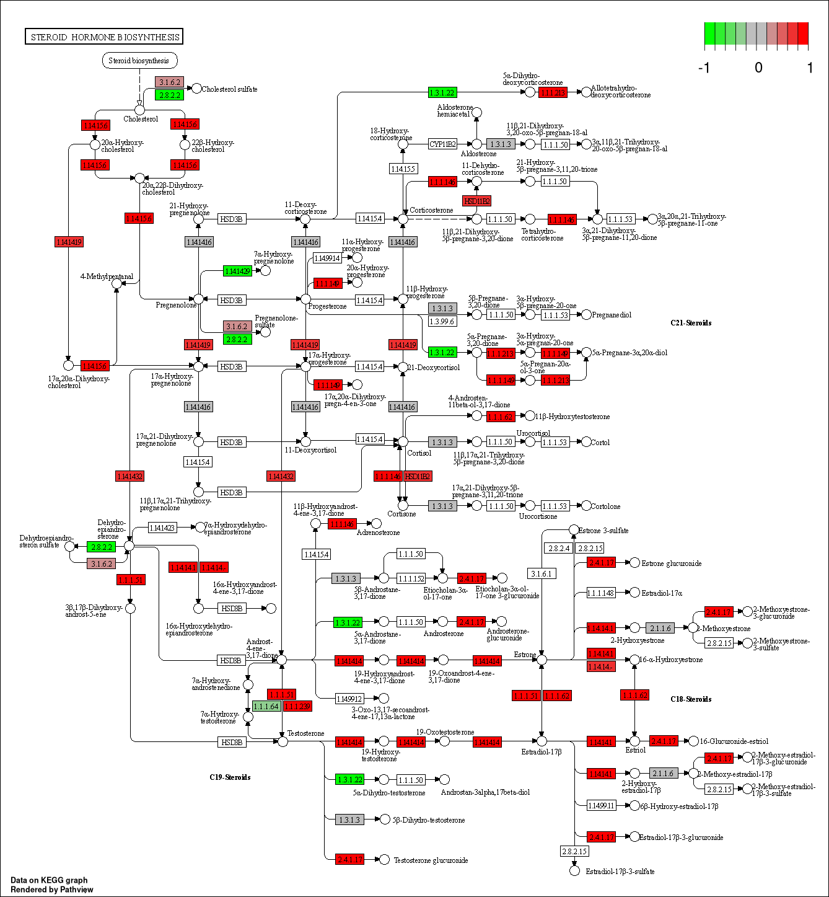
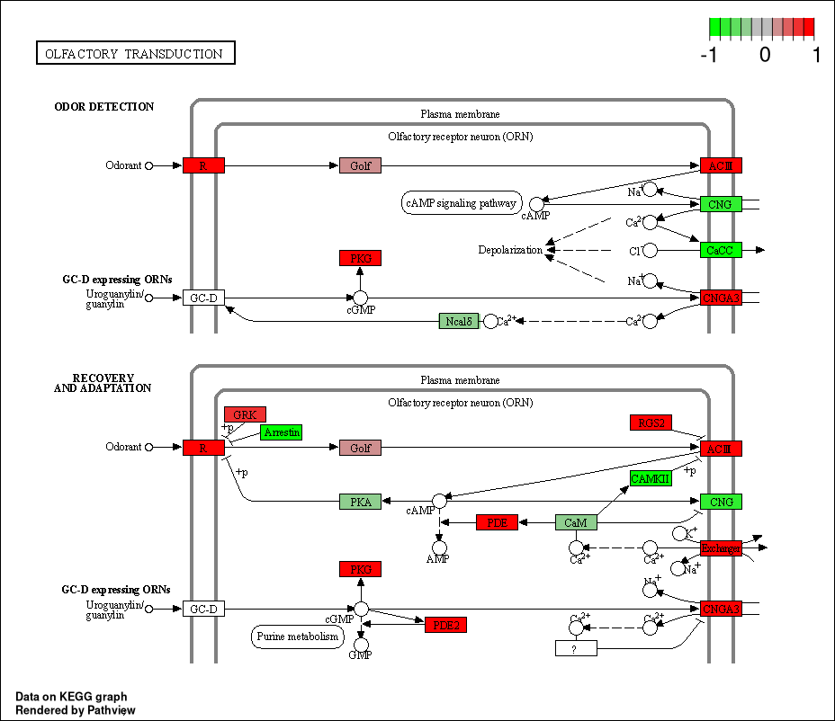
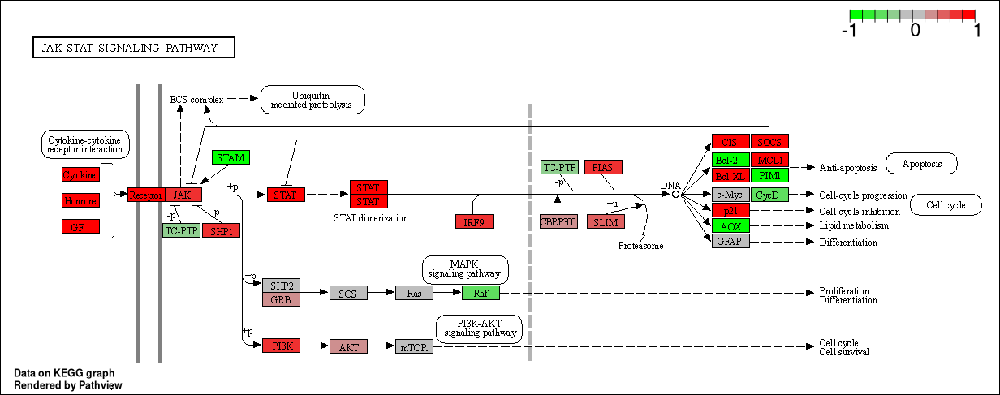
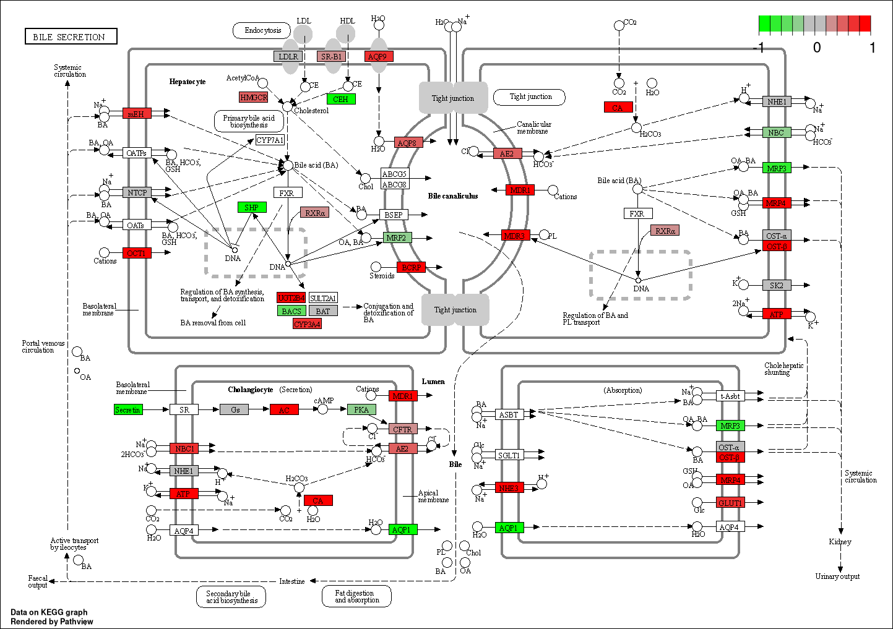
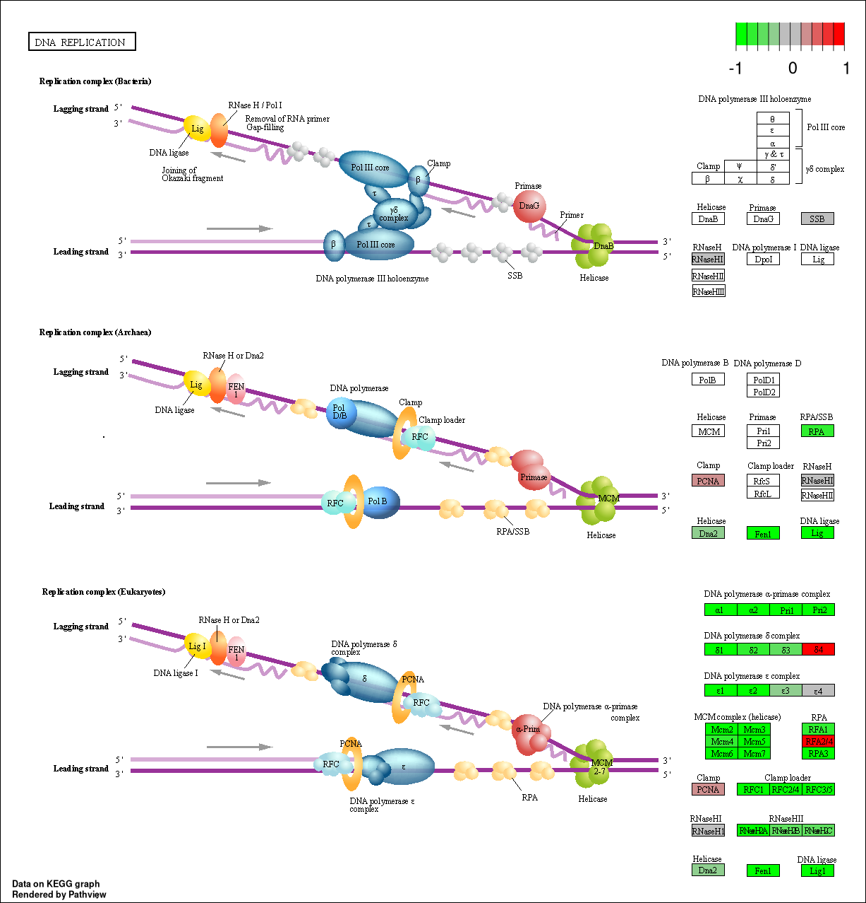
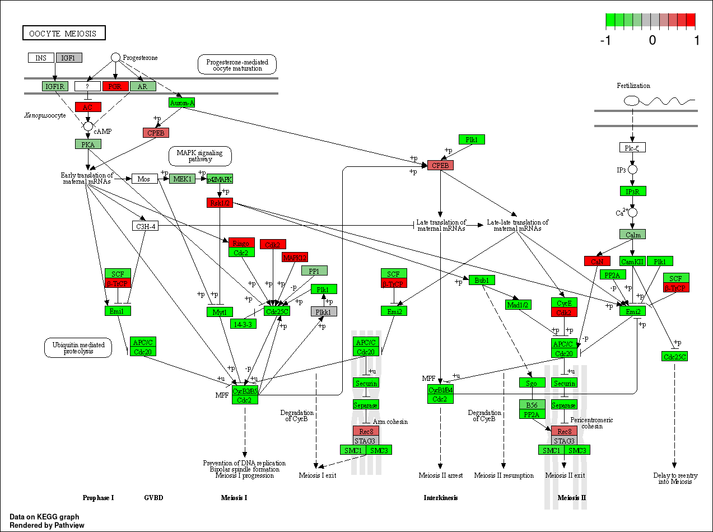

# Principal Component Analysis  
  
```{r}
metadata_file <- "GSE37704_metadata.csv"
counts_file <- "GSE37704_featurecounts.csv"

column_data <- read.csv(metadata_file, row.names = 1)
count_data <- read.csv(counts_file, row.names = 1)
```
  
```{r}
all(rownames(column_data) == colnames(count_data)[-1])
```  
  
#### [Q]: Complete the code below to remove the troublesome first column in `countData`  
  
```{r}
just_counts <- count_data[,-1]
```
  
#### [Q]: Complete the code below to filter `countData` to exclude genes (i.e. rows) where we have 0 read count across all samples (i.e. columns).  

By using `rowSums()`, 
rows which sum to 0 are removed since the row contains no useful data.
  
```{r}
nonzero_counts <- just_counts[rowSums(just_counts) != 0,]
```
  
```{r}
pca <- prcomp(t(nonzero_counts), scale = TRUE)
```
  
```{r}
plot(pca)
```
  
```{r}
condition_col <- column_data$condition
condition_col[grep("control", column_data$condition)] <- "black"
condition_col[grep("kd", column_data$condition)] <- "red"

plot(pca$x[,1:2],
     col = condition_col)
```

  
# Differential Expression Analysis  
  
```{r Load the DESeq2 Library, message=FALSE, warning=FALSE}
library(DESeq2)
```
  
## Running DESeq2
  
```{r Run the DESeq analysis, message=FALSE, warning=FALSE}
Dds = DESeqDataSetFromMatrix(countData=just_counts,
                             colData=column_data,
                             design=~condition)
Dds = DESeq(Dds)
```
  
```{r Inspect the DESeq Object, message=FALSE, warning=FALSE}
Dds
```
  
#### [Q]: Call the `summary()` function on your results to get a sense of how many genes are up or down-regulated at the default 0.1 p-value cutoff.  
  
```{r, Generate and inspect the DESeq Results, message=FALSE, warning=FALSE}
Dds_res <- results(Dds)

summary(Dds_res)
```
  
4349 genes are up-regulated and 4393 genes are down-regulated.  
  
## Volcano Plot
  
```{r Generate Volcano Plot, message=FALSE, warning=FALSE}
plot(Dds_res$log2FoldChange, -log(Dds_res$padj),
     xlab = "Log2(FC)",
     ylab = "-Log(P-Value)")
```
  
#### [Q]: Improve this plot by completing the below code, which adds color and axis labels.  
  
```{r Generate Volcano Plot with Color, message=FALSE, warning=FALSE}
# Make a color vector for all genes
my_colors <- rep("lightgray", nrow(Dds_res))

# Color red the genes with absolute fold change above 2
my_colors[abs(Dds_res$log2FoldChange) > 2] <- "tomato1"

# Color blue those with adjusted p-value less than 0.01
#  and absolute fold change more than 2
inds <- (Dds_res$padj < 0.01) & (abs(Dds_res$log2FoldChange) > 2 )
my_colors[inds] <- "blue3"

plot(Dds_res$log2FoldChange, -log(Dds_res$padj),
     col = my_colors,
     xlab = "Log2(FC)",
     ylab = "-Log(P-Value)")
```
  
## Adding Gene Annotations  
  
```{r Load the AnnotationsDBi and org.Hs.eg.db Libraries, warning=FALSE, message=FALSE}
library("AnnotationDbi")
library("org.Hs.eg.db")
```
  
#### [Q]: Use the `mapIDs()` function multiple times to add SYMBOL, ENTREZID and GENENAME annotation to our results by completing the code below.  
  
```{r Map gene ENSEMBL Gene IDs to Alternatives, message=FALSE, warning=FALSE}
Dds_res$symbol = mapIds(org.Hs.eg.db,
                    keys=rownames(Dds_res), 
                    keytype="ENSEMBL",
                    column="SYMBOL",
                    multiVals="first")

Dds_res$entrez = mapIds(org.Hs.eg.db,
                    keys=rownames(Dds_res),
                    keytype="ENSEMBL",
                    column="ENTREZID",
                    multiVals="first")

Dds_res$name =   mapIds(org.Hs.eg.db,
                    keys=rownames(Dds_res),
                    keytype="ENSEMBL",
                    column="GENENAME",
                    multiVals="first")
```
  
```{r Inspect New IDs, message=FALSE, warning=FALSE}
head(Dds_res, 10)
```
  
#### [Q]: Finally for this section let's reorder these results by adjusted p-value and save them to a CSV file in your current project directory.  
  
```{r Reorder Results according to P-Value, message=TRUE, warning=FALSE}
Dds_res = Dds_res[order(Dds_res$pvalue),]
write.csv(Dds_res, file = "deseq_results.csv")
```
  
# Pathway Analysis  
  
## KEGG Pathways  
  
```{r Load the Pathview, Gage and GageData library, message=FALSE, warning=FALSE}
library(pathview)
library(gage)
library(gageData)
```
  
```{r Import the KEGG Genesets and Indexes, message=FALSE, warning=FALSE}
data(kegg.sets.hs)
data(sigmet.idx.hs)

kegg.sets.hs <- kegg.sets.hs[sigmet.idx.hs]
```
  
```{r Inspect KEGG Pathways, message=FALSE, warning=FALSE}
head(kegg.sets.hs, 3)
```
  
```{r Assign ENTREZ IDs to Log2(FC) Values, message=FALSE, warning=FALSE}
foldchanges <- Dds_res$log2FoldChange
names(foldchanges) <- Dds_res$entrez
head(foldchanges)
```
  
```{r Run gage with the KEGG geneset, message=FALSE, warning=FALSE}
kegg_res = gage(foldchanges, gsets=kegg.sets.hs)
attributes(kegg_res)
```
  
```{r Inspect KEGG Down-regulated Results, message=FALSE, warning=FALSE}
head(kegg_res$less)
```
  
```{r Generate Pathview for Cell Cycle, message=FALSE, warning=FALSE}
pathview(gene.data = foldchanges, pathway.id = "hsa04110")
```
  
  
  
```{r Generate list of Up-regulated Pathway IDs, message=FALSE, warning=FALSE}
path_ids <- substr(rownames(kegg_res$greater)[1:5], start = 0, stop = 8)
```
  
```{r Generate Pathviews for Paths of Interest, message=FALSE, warning=FALSE}
pathview(gene.data = foldchanges, pathway.id = path_ids)
```
  
   
  
  
  
  
  
#### [Q]: Can you do the same procedure as above to plot the pathview figures for the top 5 down-reguled pathways?  
  
```{r Generate list of Down-regulated Pathway IDs, message=FALSE, warning=FALSE}
path_ids <- substr(rownames(kegg_res$less)[1:5], start = 0, stop = 8)
```
  
```{r Generate Pathviews for Paths of Interest Again, message=FALSE, warning=FALSE}
pathview(gene.data = foldchanges, pathway.id = path_ids)
```
  
  
  
  
  
  
  
# Gene Ontology  
  
```{r Import the GO Terms and Subsets, message=FALSE, warning=FALSE}
data(go.sets.hs)
data(go.subs.hs)

gobp_sets <- go.sets.hs[go.subs.hs$BP]
```
  
```{r Run gage on GO Terms, message=FALSE, warning=FALSE}
gobp_res <- gage(foldchanges, gsets = gobp_sets, same.dir = TRUE)
```
  
```{r inspect the GO gage Results, message=FALSE, warning=FALSE}
lapply(gobp_res, head, n = 10)
```
  
# Reactome Analysis
  
```{r Identify Significantly Differentially Expressed Genes, message=F, warning=F}
sig_genes <- Dds_res[Dds_res$padj <= 0.05 & !is.na(Dds_res$padj), "symbol"]
```
  
There are `r length(sig_genes)` significantly differentially expressed genes.  
  
```{r Write Significant Data to Disc, message=FALSE, warning=FALSE}
write.table(sig_genes, file="significant_DE_genes.txt", row.names=FALSE, col.names=FALSE, quote=FALSE)
```
  
#### [Q]: What pathway has the most significant "Entities p-value"? Do the most significant pathways listed match your previous KEGG results? What factors could cause differences between the two methods?  
  
The pathway with the most significant "Entities p-value" is the **Endosomal/Vacuolar Pathway**.
The most significant pathways seem to be related to the pathways identified with the KEGG database search. Where the adaptive immune system and cell signalling seem to be common themes.
Reasons for differences in results between the two methods could be that the databases from which these results are obtained are different.
Therefore, the genesets which are being used to compare to the expression data may be different and that would change the weight attributed to each category.
  
# Session Information  
  
```{r}
sessionInfo()
```

