RNA-Seq Anlysis Mini-Project
================
Jack Reddan (PID: A59010543)

# Principal Component Analysis

``` r
metadata_file <- "GSE37704_metadata.csv"
counts_file <- "GSE37704_featurecounts.csv"

column_data <- read.csv(metadata_file, row.names = 1)
count_data <- read.csv(counts_file, row.names = 1)
```

``` r
all(rownames(column_data) == colnames(count_data)[-1])
```

    ## [1] TRUE

#### \[Q\]: Complete the code below to remove the troublesome first column in `countData`

``` r
just_counts <- count_data[,-1]
```

#### \[Q\]: Complete the code below to filter `countData` to exclude genes (i.e. rows) where we have 0 read count across all samples (i.e. columns).

By using `rowSums()`, rows which sum to 0 are removed since the row
contains no useful data.

``` r
nonzero_counts <- just_counts[rowSums(just_counts) != 0,]
```

``` r
pca <- prcomp(t(nonzero_counts), scale = TRUE)
```

``` r
plot(pca)
```

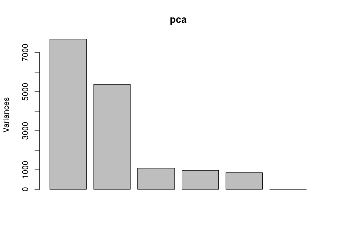<!-- -->

``` r
condition_col <- column_data$condition
condition_col[grep("control", column_data$condition)] <- "black"
condition_col[grep("kd", column_data$condition)] <- "red"

plot(pca$x[,1:2],
     col = condition_col)
```

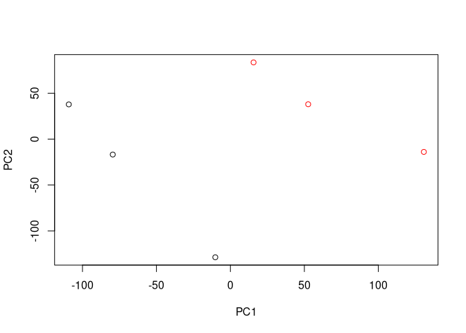<!-- -->

# Differential Expression Analysis

``` r
library(DESeq2)
```

## Running DESeq2

``` r
Dds = DESeqDataSetFromMatrix(countData=just_counts,
                             colData=column_data,
                             design=~condition)
Dds = DESeq(Dds)
```

``` r
Dds
```

    ## class: DESeqDataSet 
    ## dim: 19808 6 
    ## metadata(1): version
    ## assays(4): counts mu H cooks
    ## rownames(19808): ENSG00000186092 ENSG00000279928 ... ENSG00000277475
    ##   ENSG00000268674
    ## rowData names(22): baseMean baseVar ... deviance maxCooks
    ## colnames(6): SRR493366 SRR493367 ... SRR493370 SRR493371
    ## colData names(2): condition sizeFactor

#### \[Q\]: Call the `summary()` function on your results to get a sense of how many genes are up or down-regulated at the default 0.1 p-value cutoff.

``` r
Dds_res <- results(Dds)

summary(Dds_res)
```

    ## 
    ## out of 15975 with nonzero total read count
    ## adjusted p-value < 0.1
    ## LFC > 0 (up)       : 4349, 27%
    ## LFC < 0 (down)     : 4393, 27%
    ## outliers [1]       : 0, 0%
    ## low counts [2]     : 1221, 7.6%
    ## (mean count < 0)
    ## [1] see 'cooksCutoff' argument of ?results
    ## [2] see 'independentFiltering' argument of ?results

4349 genes are up-regulated and 4393 genes are down-regulated.

## Volcano Plot

``` r
plot(Dds_res$log2FoldChange, -log(Dds_res$padj),
     xlab = "Log2(FC)",
     ylab = "-Log(P-Value)")
```

<!-- -->

#### \[Q\]: Improve this plot by completing the below code, which adds color and axis labels.

``` r
# Make a color vector for all genes
my_colors <- rep("lightgray", nrow(Dds_res))

# Color red the genes with absolute fold change above 2
my_colors[abs(Dds_res$log2FoldChange) > 2] <- "tomato1"

# Color blue those with adjusted p-value less than 0.01
#  and absolute fold change more than 2
inds <- (Dds_res$padj < 0.01) & (abs(Dds_res$log2FoldChange) > 2 )
my_colors[inds] <- "blue3"

plot(Dds_res$log2FoldChange, -log(Dds_res$padj),
     col = my_colors,
     xlab = "Log2(FC)",
     ylab = "-Log(P-Value)")
```

<!-- -->

## Adding Gene Annotations

``` r
library("AnnotationDbi")
library("org.Hs.eg.db")
```

#### \[Q\]: Use the `mapIDs()` function multiple times to add SYMBOL, ENTREZID and GENENAME annotation to our results by completing the code below.

``` r
Dds_res$symbol = mapIds(org.Hs.eg.db,
                    keys=rownames(Dds_res), 
                    keytype="ENSEMBL",
                    column="SYMBOL",
                    multiVals="first")

Dds_res$entrez = mapIds(org.Hs.eg.db,
                    keys=rownames(Dds_res),
                    keytype="ENSEMBL",
                    column="ENTREZID",
                    multiVals="first")

Dds_res$name =   mapIds(org.Hs.eg.db,
                    keys=rownames(Dds_res),
                    keytype="ENSEMBL",
                    column="GENENAME",
                    multiVals="first")
```

``` r
head(Dds_res, 10)
```

    ## log2 fold change (MLE): condition hoxa1 kd vs control sirna 
    ## Wald test p-value: condition hoxa1 kd vs control sirna 
    ## DataFrame with 10 rows and 9 columns
    ##                  baseMean log2FoldChange     lfcSE       stat      pvalue
    ##                 <numeric>      <numeric> <numeric>  <numeric>   <numeric>
    ## ENSG00000186092    0.0000             NA        NA         NA          NA
    ## ENSG00000279928    0.0000             NA        NA         NA          NA
    ## ENSG00000279457   29.9136      0.1792571 0.3248216   0.551863 5.81042e-01
    ## ENSG00000278566    0.0000             NA        NA         NA          NA
    ## ENSG00000273547    0.0000             NA        NA         NA          NA
    ## ENSG00000187634  183.2296      0.4264571 0.1402658   3.040350 2.36304e-03
    ## ENSG00000188976 1651.1881     -0.6927205 0.0548465 -12.630158 1.43990e-36
    ## ENSG00000187961  209.6379      0.7297556 0.1318599   5.534326 3.12428e-08
    ## ENSG00000187583   47.2551      0.0405765 0.2718928   0.149237 8.81366e-01
    ## ENSG00000187642   11.9798      0.5428105 0.5215598   1.040744 2.97994e-01
    ##                        padj      symbol      entrez                   name
    ##                   <numeric> <character> <character>            <character>
    ## ENSG00000186092          NA       OR4F5       79501 olfactory receptor f..
    ## ENSG00000279928          NA          NA          NA                     NA
    ## ENSG00000279457 6.87080e-01      WASH9P   102723897 WAS protein family h..
    ## ENSG00000278566          NA          NA          NA                     NA
    ## ENSG00000273547          NA          NA          NA                     NA
    ## ENSG00000187634 5.16278e-03      SAMD11      148398 sterile alpha motif ..
    ## ENSG00000188976 1.76741e-35       NOC2L       26155 NOC2 like nucleolar ..
    ## ENSG00000187961 1.13536e-07      KLHL17      339451 kelch like family me..
    ## ENSG00000187583 9.18988e-01     PLEKHN1       84069 pleckstrin homology ..
    ## ENSG00000187642 4.03817e-01       PERM1       84808 PPARGC1 and ESRR ind..

#### \[Q\]: Finally for this section let’s reorder these results by adjusted p-value and save them to a CSV file in your current project directory.

``` r
Dds_res = Dds_res[order(Dds_res$pvalue),]
write.csv(Dds_res, file = "deseq_results.csv")
```

# Pathway Analysis

## KEGG Pathways

``` r
library(pathview)
library(gage)
library(gageData)
```

``` r
data(kegg.sets.hs)
data(sigmet.idx.hs)

kegg.sets.hs <- kegg.sets.hs[sigmet.idx.hs]
```

``` r
head(kegg.sets.hs, 3)
```

    ## $`hsa00232 Caffeine metabolism`
    ## [1] "10"   "1544" "1548" "1549" "1553" "7498" "9"   
    ## 
    ## $`hsa00983 Drug metabolism - other enzymes`
    ##  [1] "10"     "1066"   "10720"  "10941"  "151531" "1548"   "1549"   "1551"  
    ##  [9] "1553"   "1576"   "1577"   "1806"   "1807"   "1890"   "221223" "2990"  
    ## [17] "3251"   "3614"   "3615"   "3704"   "51733"  "54490"  "54575"  "54576" 
    ## [25] "54577"  "54578"  "54579"  "54600"  "54657"  "54658"  "54659"  "54963" 
    ## [33] "574537" "64816"  "7083"   "7084"   "7172"   "7363"   "7364"   "7365"  
    ## [41] "7366"   "7367"   "7371"   "7372"   "7378"   "7498"   "79799"  "83549" 
    ## [49] "8824"   "8833"   "9"      "978"   
    ## 
    ## $`hsa00230 Purine metabolism`
    ##   [1] "100"    "10201"  "10606"  "10621"  "10622"  "10623"  "107"    "10714" 
    ##   [9] "108"    "10846"  "109"    "111"    "11128"  "11164"  "112"    "113"   
    ##  [17] "114"    "115"    "122481" "122622" "124583" "132"    "158"    "159"   
    ##  [25] "1633"   "171568" "1716"   "196883" "203"    "204"    "205"    "221823"
    ##  [33] "2272"   "22978"  "23649"  "246721" "25885"  "2618"   "26289"  "270"   
    ##  [41] "271"    "27115"  "272"    "2766"   "2977"   "2982"   "2983"   "2984"  
    ##  [49] "2986"   "2987"   "29922"  "3000"   "30833"  "30834"  "318"    "3251"  
    ##  [57] "353"    "3614"   "3615"   "3704"   "377841" "471"    "4830"   "4831"  
    ##  [65] "4832"   "4833"   "4860"   "4881"   "4882"   "4907"   "50484"  "50940" 
    ##  [73] "51082"  "51251"  "51292"  "5136"   "5137"   "5138"   "5139"   "5140"  
    ##  [81] "5141"   "5142"   "5143"   "5144"   "5145"   "5146"   "5147"   "5148"  
    ##  [89] "5149"   "5150"   "5151"   "5152"   "5153"   "5158"   "5167"   "5169"  
    ##  [97] "51728"  "5198"   "5236"   "5313"   "5315"   "53343"  "54107"  "5422"  
    ## [105] "5424"   "5425"   "5426"   "5427"   "5430"   "5431"   "5432"   "5433"  
    ## [113] "5434"   "5435"   "5436"   "5437"   "5438"   "5439"   "5440"   "5441"  
    ## [121] "5471"   "548644" "55276"  "5557"   "5558"   "55703"  "55811"  "55821" 
    ## [129] "5631"   "5634"   "56655"  "56953"  "56985"  "57804"  "58497"  "6240"  
    ## [137] "6241"   "64425"  "646625" "654364" "661"    "7498"   "8382"   "84172" 
    ## [145] "84265"  "84284"  "84618"  "8622"   "8654"   "87178"  "8833"   "9060"  
    ## [153] "9061"   "93034"  "953"    "9533"   "954"    "955"    "956"    "957"   
    ## [161] "9583"   "9615"

``` r
foldchanges <- Dds_res$log2FoldChange
names(foldchanges) <- Dds_res$entrez
head(foldchanges)
```

    ##      1266     54855      1465     51232      2034      2317 
    ## -2.422719  3.201955 -2.313738 -2.059631 -1.888019 -1.649792

``` r
kegg_res = gage(foldchanges, gsets=kegg.sets.hs)
attributes(kegg_res)
```

    ## $names
    ## [1] "greater" "less"    "stats"

``` r
head(kegg_res$less)
```

    ##                                          p.geomean stat.mean        p.val
    ## hsa04110 Cell cycle                   7.077982e-06 -4.432593 7.077982e-06
    ## hsa03030 DNA replication              9.424076e-05 -3.951803 9.424076e-05
    ## hsa03013 RNA transport                1.121279e-03 -3.090949 1.121279e-03
    ## hsa04114 Oocyte meiosis               2.563806e-03 -2.827297 2.563806e-03
    ## hsa03440 Homologous recombination     3.066756e-03 -2.852899 3.066756e-03
    ## hsa00010 Glycolysis / Gluconeogenesis 4.360092e-03 -2.663825 4.360092e-03
    ##                                             q.val set.size         exp1
    ## hsa04110 Cell cycle                   0.001160789      124 7.077982e-06
    ## hsa03030 DNA replication              0.007727742       36 9.424076e-05
    ## hsa03013 RNA transport                0.061296597      150 1.121279e-03
    ## hsa04114 Oocyte meiosis               0.100589607      112 2.563806e-03
    ## hsa03440 Homologous recombination     0.100589607       28 3.066756e-03
    ## hsa00010 Glycolysis / Gluconeogenesis 0.119175854       65 4.360092e-03

``` r
pathview(gene.data = foldchanges, pathway.id = "hsa04110")
```

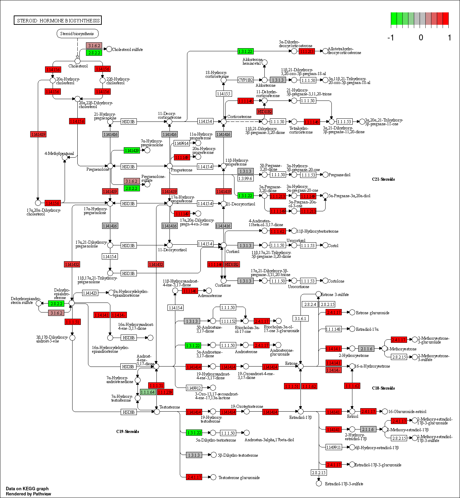

``` r
path_ids <- substr(rownames(kegg_res$greater)[1:5], start = 0, stop = 8)
```

``` r
pathview(gene.data = foldchanges, pathway.id = path_ids)
```

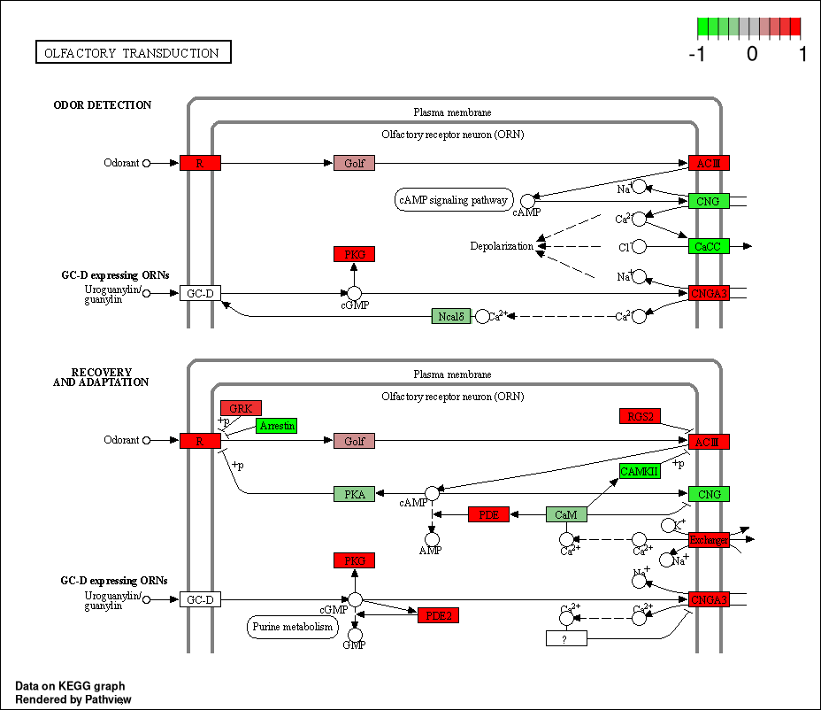  
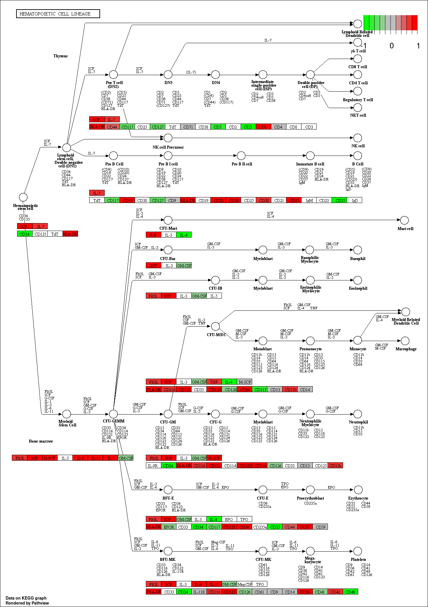  
  
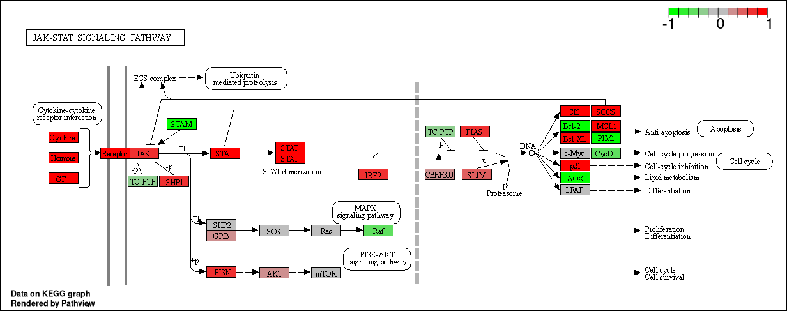  
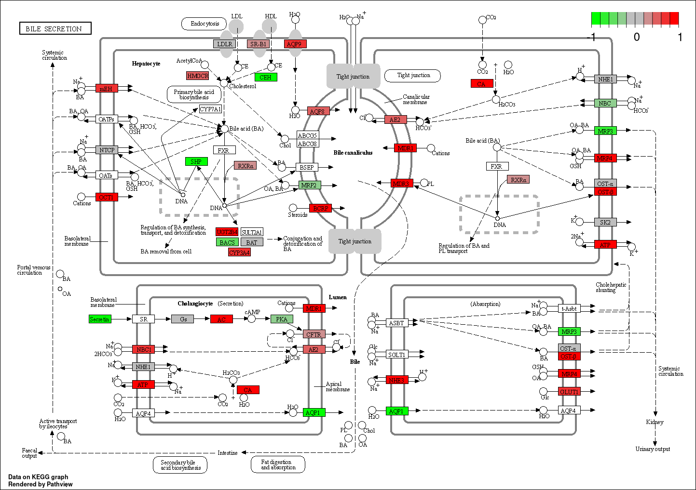

#### \[Q\]: Can you do the same procedure as above to plot the pathview figures for the top 5 down-reguled pathways?

``` r
path_ids <- substr(rownames(kegg_res$less)[1:5], start = 0, stop = 8)
```

``` r
pathview(gene.data = foldchanges, pathway.id = path_ids)
```

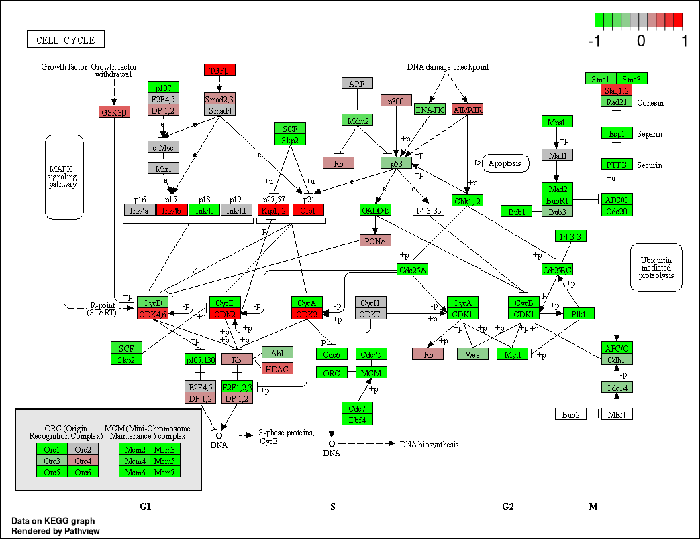  
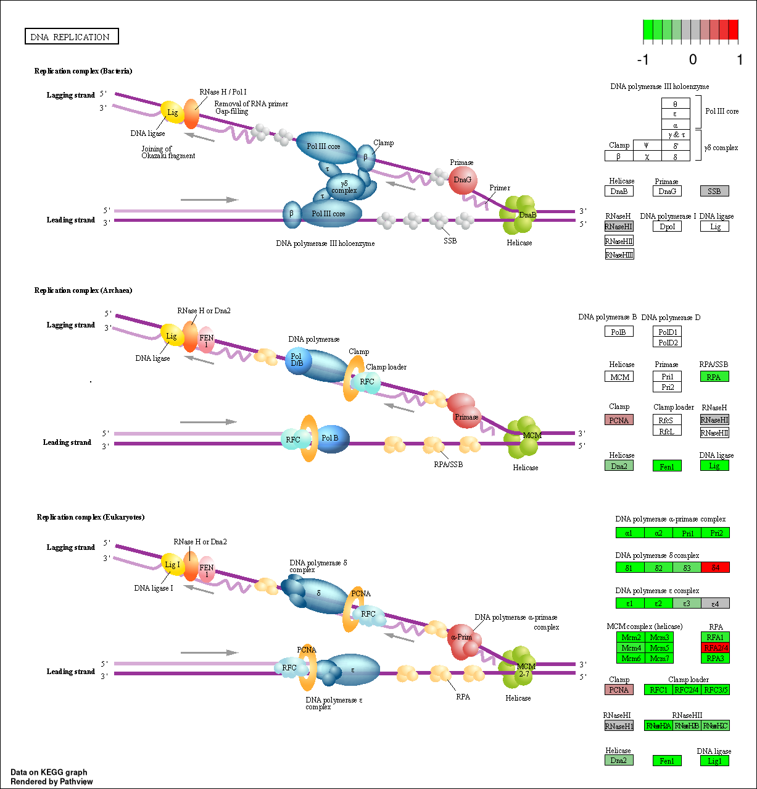  
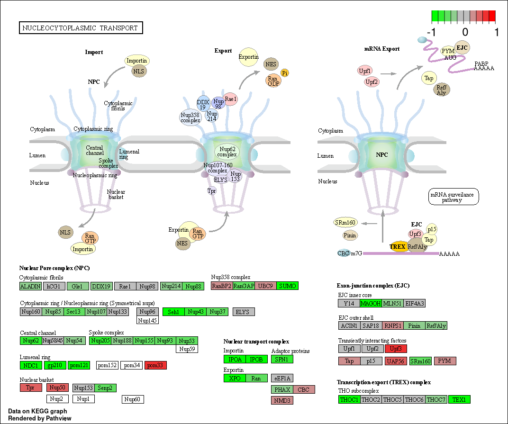  
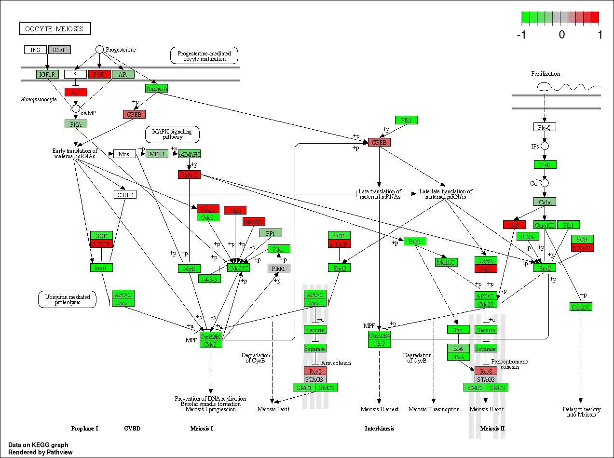  
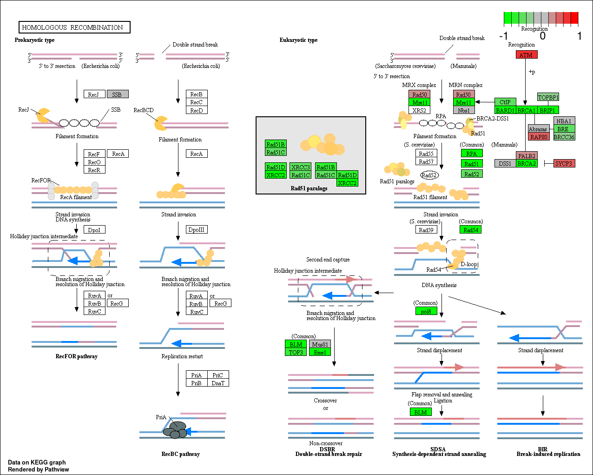

# Gene Ontology

``` r
data(go.sets.hs)
data(go.subs.hs)

gobp_sets <- go.sets.hs[go.subs.hs$BP]
```

``` r
gobp_res <- gage(foldchanges, gsets = gobp_sets, same.dir = TRUE)
```

``` r
lapply(gobp_res, head, n = 10)
```

    ## $greater
    ##                                               p.geomean stat.mean        p.val
    ## GO:0007156 homophilic cell adhesion        1.624062e-05  4.226117 1.624062e-05
    ## GO:0048729 tissue morphogenesis            5.407952e-05  3.888470 5.407952e-05
    ## GO:0002009 morphogenesis of an epithelium  5.727599e-05  3.878706 5.727599e-05
    ## GO:0030855 epithelial cell differentiation 2.053700e-04  3.554776 2.053700e-04
    ## GO:0060562 epithelial tube morphogenesis   2.927804e-04  3.458463 2.927804e-04
    ## GO:0048598 embryonic morphogenesis         2.959270e-04  3.446527 2.959270e-04
    ## GO:0035295 tube development                3.056075e-04  3.439737 3.056075e-04
    ## GO:0016337 cell-cell adhesion              3.320033e-04  3.417804 3.320033e-04
    ## GO:0072001 renal system development        3.790927e-04  3.390237 3.790927e-04
    ## GO:0035239 tube morphogenesis              4.246727e-04  3.353933 4.246727e-04
    ##                                                 q.val set.size         exp1
    ## GO:0007156 homophilic cell adhesion        0.07103646      138 1.624062e-05
    ## GO:0048729 tissue morphogenesis            0.08350839      483 5.407952e-05
    ## GO:0002009 morphogenesis of an epithelium  0.08350839      382 5.727599e-05
    ## GO:0030855 epithelial cell differentiation 0.14646752      299 2.053700e-04
    ## GO:0060562 epithelial tube morphogenesis   0.14646752      289 2.927804e-04
    ## GO:0048598 embryonic morphogenesis         0.14646752      498 2.959270e-04
    ## GO:0035295 tube development                0.14646752      437 3.056075e-04
    ## GO:0016337 cell-cell adhesion              0.14646752      407 3.320033e-04
    ## GO:0072001 renal system development        0.14646752      246 3.790927e-04
    ## GO:0035239 tube morphogenesis              0.14646752      303 4.246727e-04
    ## 
    ## $less
    ##                                                     p.geomean stat.mean
    ## GO:0048285 organelle fission                     6.626774e-16 -8.170439
    ## GO:0000280 nuclear division                      1.797050e-15 -8.051200
    ## GO:0007067 mitosis                               1.797050e-15 -8.051200
    ## GO:0000087 M phase of mitotic cell cycle         4.757263e-15 -7.915080
    ## GO:0007059 chromosome segregation                1.081862e-11 -6.974546
    ## GO:0051301 cell division                         8.718528e-11 -6.455491
    ## GO:0000236 mitotic prometaphase                  1.067661e-10 -6.775211
    ## GO:0000226 microtubule cytoskeleton organization 8.654934e-10 -6.122780
    ## GO:0007017 microtubule-based process             2.403044e-09 -5.915377
    ## GO:0006281 DNA repair                            2.344890e-08 -5.518516
    ##                                                         p.val        q.val
    ## GO:0048285 organelle fission                     6.626774e-16 2.620099e-12
    ## GO:0000280 nuclear division                      1.797050e-15 2.620099e-12
    ## GO:0007067 mitosis                               1.797050e-15 2.620099e-12
    ## GO:0000087 M phase of mitotic cell cycle         4.757263e-15 5.202068e-12
    ## GO:0007059 chromosome segregation                1.081862e-11 9.464127e-09
    ## GO:0051301 cell division                         8.718528e-11 6.355807e-08
    ## GO:0000236 mitotic prometaphase                  1.067661e-10 6.671353e-08
    ## GO:0000226 microtubule cytoskeleton organization 8.654934e-10 4.732085e-07
    ## GO:0007017 microtubule-based process             2.403044e-09 1.167879e-06
    ## GO:0006281 DNA repair                            2.344890e-08 1.025655e-05
    ##                                                  set.size         exp1
    ## GO:0048285 organelle fission                          386 6.626774e-16
    ## GO:0000280 nuclear division                           362 1.797050e-15
    ## GO:0007067 mitosis                                    362 1.797050e-15
    ## GO:0000087 M phase of mitotic cell cycle              373 4.757263e-15
    ## GO:0007059 chromosome segregation                     146 1.081862e-11
    ## GO:0051301 cell division                              479 8.718528e-11
    ## GO:0000236 mitotic prometaphase                        86 1.067661e-10
    ## GO:0000226 microtubule cytoskeleton organization      285 8.654934e-10
    ## GO:0007017 microtubule-based process                  431 2.403044e-09
    ## GO:0006281 DNA repair                                 395 2.344890e-08
    ## 
    ## $stats
    ##                                            stat.mean     exp1
    ## GO:0007156 homophilic cell adhesion         4.226117 4.226117
    ## GO:0048729 tissue morphogenesis             3.888470 3.888470
    ## GO:0002009 morphogenesis of an epithelium   3.878706 3.878706
    ## GO:0030855 epithelial cell differentiation  3.554776 3.554776
    ## GO:0060562 epithelial tube morphogenesis    3.458463 3.458463
    ## GO:0048598 embryonic morphogenesis          3.446527 3.446527
    ## GO:0035295 tube development                 3.439737 3.439737
    ## GO:0016337 cell-cell adhesion               3.417804 3.417804
    ## GO:0072001 renal system development         3.390237 3.390237
    ## GO:0035239 tube morphogenesis               3.353933 3.353933

# Reactome Analysis

``` r
sig_genes <- Dds_res[Dds_res$padj <= 0.05 & !is.na(Dds_res$padj), "symbol"]
```

There are 8146 significantly differentially expressed genes.

``` r
write.table(sig_genes, file="significant_DE_genes.txt", row.names=FALSE, col.names=FALSE, quote=FALSE)
```

#### \[Q\]: What pathway has the most significant “Entities p-value”? Do the most significant pathways listed match your previous KEGG results? What factors could cause differences between the two methods?

The pathway with the most significant “Entities p-value” is the
**Endosomal/Vacuolar Pathway**. The most significant pathways seem to be
related to the pathways identified with the KEGG database search. Where
the adaptive immune system and cell signalling seem to be common themes.
Reasons for differences in results between the two methods could be that
the databases from which these results are obtained are different.
Therefore, the genesets which are being used to compare to the
expression data may be different and that would change the weight
attributed to each category.

# Session Information

``` r
sessionInfo()
```

    ## R version 4.1.2 (2021-11-01)
    ## Platform: x86_64-pc-linux-gnu (64-bit)
    ## Running under: Arch Linux
    ## 
    ## Matrix products: default
    ## BLAS:   /usr/lib/libblas.so.3.10.0
    ## LAPACK: /usr/lib/liblapack.so.3.10.0
    ## 
    ## locale:
    ##  [1] LC_CTYPE=en_US.UTF-8       LC_NUMERIC=C              
    ##  [3] LC_TIME=en_US.UTF-8        LC_COLLATE=en_US.UTF-8    
    ##  [5] LC_MONETARY=en_US.UTF-8    LC_MESSAGES=en_US.UTF-8   
    ##  [7] LC_PAPER=en_US.UTF-8       LC_NAME=C                 
    ##  [9] LC_ADDRESS=C               LC_TELEPHONE=C            
    ## [11] LC_MEASUREMENT=en_US.UTF-8 LC_IDENTIFICATION=C       
    ## 
    ## attached base packages:
    ## [1] parallel  stats4    stats     graphics  grDevices utils     datasets 
    ## [8] methods   base     
    ## 
    ## other attached packages:
    ##  [1] gageData_2.30.0             gage_2.42.0                
    ##  [3] pathview_1.32.0             org.Hs.eg.db_3.13.0        
    ##  [5] AnnotationDbi_1.54.1        DESeq2_1.32.0              
    ##  [7] SummarizedExperiment_1.22.0 Biobase_2.52.0             
    ##  [9] MatrixGenerics_1.4.3        matrixStats_0.61.0         
    ## [11] GenomicRanges_1.44.0        GenomeInfoDb_1.28.4        
    ## [13] IRanges_2.26.0              S4Vectors_0.30.2           
    ## [15] BiocGenerics_0.38.0        
    ## 
    ## loaded via a namespace (and not attached):
    ##  [1] httr_1.4.2             bit64_4.0.5            splines_4.1.2         
    ##  [4] assertthat_0.2.1       highr_0.9              blob_1.2.2            
    ##  [7] GenomeInfoDbData_1.2.6 yaml_2.2.1             pillar_1.6.4          
    ## [10] RSQLite_2.2.8          lattice_0.20-45        glue_1.5.0            
    ## [13] digest_0.6.28          RColorBrewer_1.1-2     XVector_0.32.0        
    ## [16] colorspace_2.0-2       htmltools_0.5.2        Matrix_1.3-4          
    ## [19] XML_3.99-0.8           pkgconfig_2.0.3        genefilter_1.74.1     
    ## [22] zlibbioc_1.38.0        GO.db_3.13.0           purrr_0.3.4           
    ## [25] xtable_1.8-4           scales_1.1.1           BiocParallel_1.26.2   
    ## [28] tibble_3.1.6           annotate_1.70.0        KEGGREST_1.32.0       
    ## [31] generics_0.1.1         ggplot2_3.3.5          ellipsis_0.3.2        
    ## [34] cachem_1.0.6           survival_3.2-13        magrittr_2.0.1        
    ## [37] crayon_1.4.2           KEGGgraph_1.52.0       memoise_2.0.0         
    ## [40] evaluate_0.14          fansi_0.5.0            graph_1.70.0          
    ## [43] tools_4.1.2            lifecycle_1.0.1        stringr_1.4.0         
    ## [46] locfit_1.5-9.4         munsell_0.5.0          DelayedArray_0.18.0   
    ## [49] Biostrings_2.60.2      compiler_4.1.2         rlang_0.4.12          
    ## [52] grid_4.1.2             RCurl_1.98-1.5         bitops_1.0-7          
    ## [55] rmarkdown_2.11         gtable_0.3.0           DBI_1.1.1             
    ## [58] R6_2.5.1               knitr_1.36             dplyr_1.0.7           
    ## [61] fastmap_1.1.0          bit_4.0.4              utf8_1.2.2            
    ## [64] Rgraphviz_2.36.0       stringi_1.7.5          Rcpp_1.0.7            
    ## [67] vctrs_0.3.8            geneplotter_1.70.0     png_0.1-7             
    ## [70] tidyselect_1.1.1       xfun_0.28
