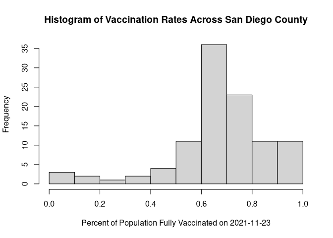

Vaccination Rate Mini Project
================
Jack Reddan (PID: A59010543)

# Getting Started

``` r
library(dplyr)
```

    ## 
    ## Attaching package: 'dplyr'

    ## The following objects are masked from 'package:stats':
    ## 
    ##     filter, lag

    ## The following objects are masked from 'package:base':
    ## 
    ##     intersect, setdiff, setequal, union

``` r
library(lubridate)
```

    ## 
    ## Attaching package: 'lubridate'

    ## The following objects are masked from 'package:base':
    ## 
    ##     date, intersect, setdiff, union

``` r
#library(zipcodeR)
library(ggplot2)
```

``` r
vax <- read.csv("covid19vaccinesbyzipcode_test.csv")
```

``` r
head(vax)
```

    ##   as_of_date zip_code_tabulation_area local_health_jurisdiction         county
    ## 1 2021-01-05                    92395            San Bernardino San Bernardino
    ## 2 2021-01-05                    93206                      Kern           Kern
    ## 3 2021-01-05                    91006               Los Angeles    Los Angeles
    ## 4 2021-01-05                    91901                 San Diego      San Diego
    ## 5 2021-01-05                    92230                 Riverside      Riverside
    ## 6 2021-01-05                    92662                    Orange         Orange
    ##   vaccine_equity_metric_quartile                 vem_source
    ## 1                              1 Healthy Places Index Score
    ## 2                              1 Healthy Places Index Score
    ## 3                              3 Healthy Places Index Score
    ## 4                              3 Healthy Places Index Score
    ## 5                              1 Healthy Places Index Score
    ## 6                              4 Healthy Places Index Score
    ##   age12_plus_population age5_plus_population persons_fully_vaccinated
    ## 1               35915.3                40888                       NA
    ## 2                1237.5                 1521                       NA
    ## 3               28742.7                31347                       19
    ## 4               15549.8                16905                       12
    ## 5                2320.2                 2526                       NA
    ## 6                2349.5                 2397                       NA
    ##   persons_partially_vaccinated percent_of_population_fully_vaccinated
    ## 1                           NA                                     NA
    ## 2                           NA                                     NA
    ## 3                          873                               0.000606
    ## 4                          271                               0.000710
    ## 5                           NA                                     NA
    ## 6                           NA                                     NA
    ##   percent_of_population_partially_vaccinated
    ## 1                                         NA
    ## 2                                         NA
    ## 3                                   0.027850
    ## 4                                   0.016031
    ## 5                                         NA
    ## 6                                         NA
    ##   percent_of_population_with_1_plus_dose
    ## 1                                     NA
    ## 2                                     NA
    ## 3                               0.028456
    ## 4                               0.016741
    ## 5                                     NA
    ## 6                                     NA
    ##                                                                redacted
    ## 1 Information redacted in accordance with CA state privacy requirements
    ## 2 Information redacted in accordance with CA state privacy requirements
    ## 3                                                                    No
    ## 4                                                                    No
    ## 5 Information redacted in accordance with CA state privacy requirements
    ## 6 Information redacted in accordance with CA state privacy requirements

#### \[Q01\]: What column details the total number of people fully vaccinated?

`persons_fully_vaccinated`

#### \[Q02\]: What column details the Zip code tabulation area?

`zip_code_tabulation_area`

#### \[Q03\]: What is the earliest date in this dataset?

``` r
vax %>% 
  arrange(as_of_date) %>%
  head(1)[1]
```

    ## [1] "2021-01-05"

#### \[Q04\]: What is the latest date in this dataset?

``` r
vax %>%
  arrange(desc(as_of_date)) %>%
  head(1)[1]
```

    ## [1] "2021-11-23"

``` r
skimr::skim(vax)
```

|                                                  |       |
|:-------------------------------------------------|:------|
| Name                                             | vax   |
| Number of rows                                   | 82908 |
| Number of columns                                | 14    |
| \_\_\_\_\_\_\_\_\_\_\_\_\_\_\_\_\_\_\_\_\_\_\_   |       |
| Column type frequency:                           |       |
| character                                        | 5     |
| numeric                                          | 9     |
| \_\_\_\_\_\_\_\_\_\_\_\_\_\_\_\_\_\_\_\_\_\_\_\_ |       |
| Group variables                                  | None  |

Data summary

**Variable type: character**

| skim_variable             | n_missing | complete_rate | min | max | empty | n_unique | whitespace |
|:--------------------------|----------:|--------------:|----:|----:|------:|---------:|-----------:|
| as_of_date                |         0 |             1 |  10 |  10 |     0 |       47 |          0 |
| local_health_jurisdiction |         0 |             1 |   0 |  15 |   235 |       62 |          0 |
| county                    |         0 |             1 |   0 |  15 |   235 |       59 |          0 |
| vem_source                |         0 |             1 |  15 |  26 |     0 |        3 |          0 |
| redacted                  |         0 |             1 |   2 |  69 |     0 |        2 |          0 |

**Variable type: numeric**

| skim_variable                              | n_missing | complete_rate |     mean |       sd |    p0 |      p25 |      p50 |      p75 |     p100 | hist  |
|:-------------------------------------------|----------:|--------------:|---------:|---------:|------:|---------:|---------:|---------:|---------:|:------|
| zip_code_tabulation_area                   |         0 |          1.00 | 93665.11 |  1817.39 | 90001 | 92257.75 | 93658.50 | 95380.50 |  97635.0 | ▃▅▅▇▁ |
| vaccine_equity_metric_quartile             |      4089 |          0.95 |     2.44 |     1.11 |     1 |     1.00 |     2.00 |     3.00 |      4.0 | ▇▇▁▇▇ |
| age12_plus_population                      |         0 |          1.00 | 18895.04 | 18993.94 |     0 |  1346.95 | 13685.10 | 31756.12 |  88556.7 | ▇▃▂▁▁ |
| age5_plus_population                       |         0 |          1.00 | 20875.24 | 21106.04 |     0 |  1460.50 | 15364.00 | 34877.00 | 101902.0 | ▇▃▂▁▁ |
| persons_fully_vaccinated                   |      8355 |          0.90 |  9585.35 | 11609.12 |    11 |   516.00 |  4210.00 | 16095.00 |  71219.0 | ▇▂▁▁▁ |
| persons_partially_vaccinated               |      8355 |          0.90 |  1894.87 |  2105.55 |    11 |   198.00 |  1269.00 |  2880.00 |  20159.0 | ▇▁▁▁▁ |
| percent_of_population_fully_vaccinated     |      8355 |          0.90 |     0.43 |     0.27 |     0 |     0.20 |     0.44 |     0.63 |      1.0 | ▇▆▇▆▂ |
| percent_of_population_partially_vaccinated |      8355 |          0.90 |     0.10 |     0.10 |     0 |     0.06 |     0.07 |     0.11 |      1.0 | ▇▁▁▁▁ |
| percent_of_population_with_1\_plus_dose    |      8355 |          0.90 |     0.51 |     0.26 |     0 |     0.31 |     0.53 |     0.71 |      1.0 | ▅▅▇▇▃ |

#### \[Q05\]: How many numeric columns are in this dataset?

9

#### \[Q06\]: Note that there are “missing values” in the dataset. How many `NA` values there in the `persons_fully_vaccinated` column?

8355

#### \[Q07\]: What percent of `persons_fully_vaccinated` values are missing (to 2 significant figures)?

``` r
round((1 - 0.899)*100, 2)
```

    ## [1] 10.1

#### \[Q08\]: Why might this data be missing?

# Working with Dates

``` r
today()
```

    ## [1] "2021-11-24"

``` r
vax$as_of_date <- ymd(vax$as_of_date)
```

``` r
today() - vax$as_of_date[1]
```

    ## Time difference of 323 days

``` r
vax$as_of_date[nrow(vax)] - vax$as_of_date[1]
```

    ## Time difference of 322 days

#### \[Q09\]: How many days have passed since the last update of the dataset?

``` r
last_update <- vax %>%
  arrange(desc(as_of_date)) %>%
  head(1)[1]

today() - last_update
```

    ## Time difference of 1 days

#### \[Q10\]: How many unique dates are in the dataset (i.e. how many different dates are detailed)

``` r
length(unique(vax$as_of_date))
```

    ## [1] 47

# Working with ZIP Codes

\<!–>`{r}<--> <!-->geocode_zip("92037")<--> <!-->`\<–>

\<!–>`{r}<--> <!-->zip_distan<--> <!-->`\<–>

# Focus on the San Diego Area

``` r
sd <- vax[vax$county == "San Diego",]
```

With `dplyr`:

``` r
sd <- vax %>%
  filter(county == "San Diego")
```

``` r
sd.10 <- vax %>%
  filter(county == "San Diego") %>%
  filter(age5_plus_population > 10000)
```

#### \[Q11\]: How many distinct zip codes are listed for San Diego County?

``` r
length(unique(sd$zip_code_tabulation_area))
```

    ## [1] 107

#### \[Q12\]: What San Diego County Zip code area has the largest 12 + Population in this dataset?

``` r
sd %>%
  arrange(desc(age12_plus_population)) %>%
  head(1)[2]
```

    ## [1] 92154

#### \[Q13\]: What is the overall average “Percent of Population Fully Vaccinated” value for all San Diego “County” as of “2021-11-09”?

``` r
sd.yest <- sd %>%
  filter(as_of_date == "2021-11-23") %>%
  filter(!is.na(percent_of_population_fully_vaccinated))

paste(round(mean(sd.yest$percent_of_population_fully_vaccinated)*100, 2), "%", sep = "")
```

    ## [1] "67.4%"

#### \[Q14\]: Using either ggplot or base R graphics make a summary figure that shows the distribution of Percent of Population Fully Vaccinated values as of “2021-11-09”?

``` r
hist(sd.yest$percent_of_population_fully_vaccinated,
     xlab = "Percent of Population Fully Vaccinated on 2021-11-23",
     ylab = "Frequency",
     main = "Histogram of Vaccination Rates Across San Diego County")
```

<!-- -->

# Focus on UCSD/La Jolla

``` r
ucsd <- sd %>%
  filter(zip_code_tabulation_area == "92037")

ucsd$age5_plus_population[1]
```

    ## [1] 36144

#### \[Q15\]: Using ggplot make a graph of the vaccination rate time course for the 92037 ZIP code area:

``` r
ggplot(data = ucsd) +
  aes(x = as_of_date, 
      y = percent_of_population_fully_vaccinated) + 
  geom_point() +
  geom_line(group = 1) +
  ylim(c(0,1)) +
  labs(x = "Date",
       y = "Percent Vaccinated",
       title = "Vaccination Rate of UCSD/La Jolla Zipcode")
```

<!-- -->

# Compare to Similar Sized Areas

``` r
vax.sd_pop <- vax %>%
  filter(age5_plus_population >= ucsd$age5_plus_population) %>%
  filter(as_of_date == "2021-11-23")
```

#### \[Q16\]: Calculate the mean “Percent of Population Fully Vaccinated” for ZIP code areas with a population as large as 92037 (La Jolla) as_of_date “2021-11-23”. Add this as a straight horizontal line to your plot from above with the geom_hline() function?

The mean is 66.78%.

``` r
ggplot(data = ucsd) +
  aes(x = as_of_date, 
      y = percent_of_population_fully_vaccinated) + 
  geom_point() +
  geom_line(group = 1) +
  geom_hline(yintercept = mean(vax.sd_pop$percent_of_population_fully_vaccinated),
            linetype = 2,
            col = "red") +
  ylim(c(0,1)) +
  labs(x = "Date",
       y = "Percent Vaccinated",
       title = "Vaccination Rate of UCSD/La Jolla Zipcode")
```

<!-- -->
