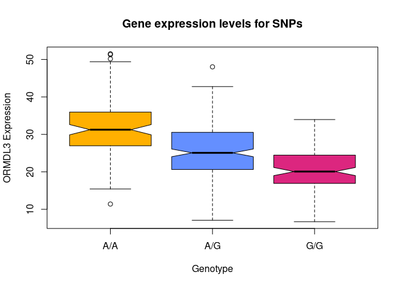

Introduction to Genome Informatics
================
Jack Reddan (PID: A59010543)

# Questions

#### Q13: Read this file into R and determine the sample size for each genotype and their corresponding median expression levels for each of these genotypes.

#### Q14: Generate a boxplot with a box per genotype, what could you infer from the relative expression value between A/A and G/G displayed in this plot? Does the SNP effect the expression of ORMDL3?

# Answers

## Upload the Data

``` r
res <- read.table("expression_genotype_results")
res$geno <- as.factor(res$geno)
```

## Explore the Data

``` r
geno_distro <- boxplot(exp ~ geno,
        data = res,
        xlab = "Genotype",
        ylab = "ORMDL3 Expression",
        notch = TRUE,
        col = c("#FFB000", "#648FFF", "#DC267F"),
        main = "Gene expression levels for SNPs")
```

<!-- -->

Median values for genotypes A/A, A/G, G/G are 31.248475, 25.06486,
20.07363, respectively. The population sizes are 108, 233, 121.

Based off the boxplot, it appears that ORMDL3 gene expression is highest
when homozygous for the A SNP (A/A), and lowest when homozygous for the
G SNP (G/G). Additionally, it appears to be dose dependent since gene
expression levels are intermediate for the heterozygote (A/G).
Therefore, the SNP does seem to affect ORMDL3 gene expression, where the
more copies of the A SNP present leads to higher ORMDL3 expression.
