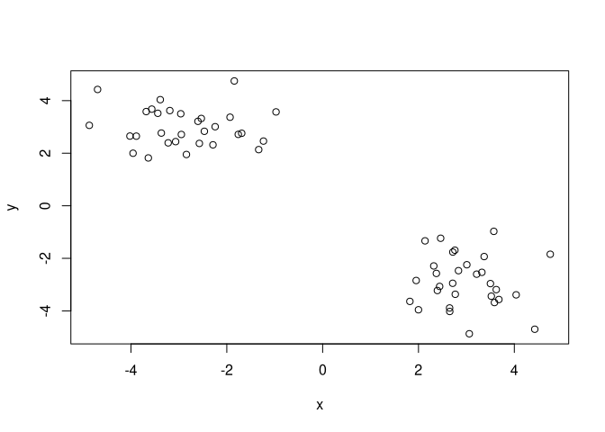

K-Means Problem
================
Jack Reddan
10/21/2021

# Try K-Means clustering

Generate fake data and explore how the method works.

## Generate example data

``` r
tmp <- c(rnorm(30,-3), rnorm(30,3))
hist(tmp)
```

<!-- -->

## Generate multidimensional example data

``` r
x <- cbind(x = tmp, y = rev(tmp))

plot(x)
```

<!-- -->

## Use the kmeans() function to explore the fake data

Use it while specifying 2 expected clusters and iterating 20 times.

``` r
clusters <- kmeans(x, centers = 2, nstart = 20)

clusters
```

    ## K-means clustering with 2 clusters of sizes 30, 30
    ## 
    ## Cluster means:
    ##           x         y
    ## 1 -2.619361  2.562192
    ## 2  2.562192 -2.619361
    ## 
    ## Clustering vector:
    ##  [1] 1 1 1 1 1 1 1 1 1 1 1 1 1 1 1 1 1 1 1 1 1 1 1 1 1 1 1 1 1 1 2 2 2 2 2 2 2 2
    ## [39] 2 2 2 2 2 2 2 2 2 2 2 2 2 2 2 2 2 2 2 2 2 2
    ## 
    ## Within cluster sum of squares by cluster:
    ## [1] 66.41997 66.41997
    ##  (between_SS / total_SS =  85.8 %)
    ## 
    ## Available components:
    ## 
    ## [1] "cluster"      "centers"      "totss"        "withinss"     "tot.withinss"
    ## [6] "betweenss"    "size"         "iter"         "ifault"

> \[Q\] How many points are in each cluster?

There are 30 points in each cluster.

``` r
clusters$size
```

    ## [1] 30 30

> \[Q\] What component of your results object dteails:

> > Cluster size

``` r
clusters$size
```

    ## [1] 30 30

> > Cluster assignment

``` r
clusters$cluster
```

    ##  [1] 1 1 1 1 1 1 1 1 1 1 1 1 1 1 1 1 1 1 1 1 1 1 1 1 1 1 1 1 1 1 2 2 2 2 2 2 2 2
    ## [39] 2 2 2 2 2 2 2 2 2 2 2 2 2 2 2 2 2 2 2 2 2 2

> > Cluster center

``` r
clusters$centers
```

    ##           x         y
    ## 1 -2.619361  2.562192
    ## 2  2.562192 -2.619361

### Plot x colored by the kmeans cluster centers as blue points

Load ggplot2

``` r
library(ggplot2)
```

Convert matrices to be used in ggplot to data frames.

``` r
df <- data.frame(x)
centroids <- data.frame(clusters$centers)
```

Plot the original data colored by kmenas clusters and add blue
centroids. IBM’s colorblind palette is used.

``` r
ggplot(data = df) +
  aes(x = x, y = y, color = factor(clusters$cluster)) +
  geom_point() +
  scale_color_manual(values = c("#785EF0", "#FE6100"), name = "Cluster") +
  geom_point(data = centroids, aes(x = x, y = y), color = "#648FFF", shape = 8)
```

<!-- -->
