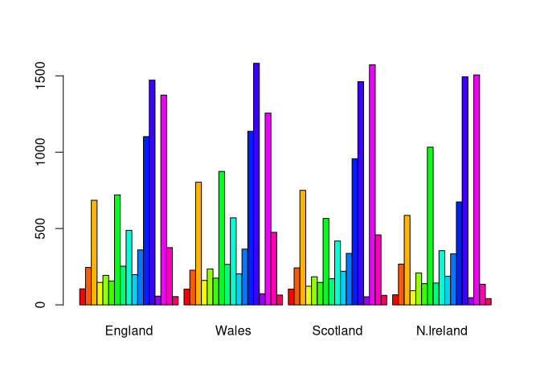
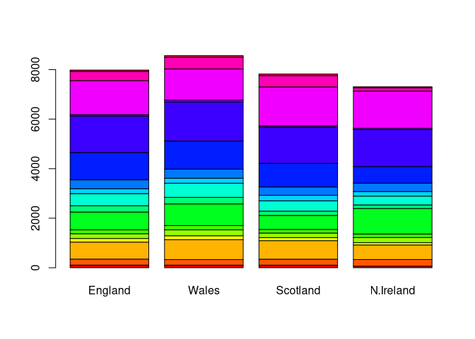

Lab 08
================
Jack Reddan
10/22/2021

## Import the Data

``` r
url <- "https://tinyurl.com/UK-foods"
uk_foods <- read.csv(url, row.names = 1)
```

## Explore Imported Data

> Question 1: How many rows and columns are in your new data frame named
> x? What R functions could you use to answer this questions?

``` r
dim(uk_foods)
```

    ## [1] 17  4

## Checking the Data

``` r
head(uk_foods)
```

    ##                England Wales Scotland N.Ireland
    ## Cheese             105   103      103        66
    ## Carcass_meat       245   227      242       267
    ## Other_meat         685   803      750       586
    ## Fish               147   160      122        93
    ## Fats_and_oils      193   235      184       209
    ## Sugars             156   175      147       139

> Question 2: Which approach to solving the ‘row-names problem’
> mentioned above do you prefer and why? Is one approach more robust
> than another under certain circumstances?

I prefer to read in the row-names when I read in the csv data (in
*read.csv*). This is less dangerous since it does not mutate our data to
in the body of the code, and instead restricts it to data initiation.

# Looking for differences

``` r
barplot(as.matrix(uk_foods), beside = T, col = rainbow(nrow(uk_foods)))
```

<!-- -->
\>Question 3: Changing what optional argument in the above barplot()
function results in the following plot?

<!-- -->
Changing the `beside` argument from `TRUE` to `FALSE`
