Lab 08
================
Jack Reddan
10/22/2021

## Import the Data

``` r
url <- "https://tinyurl.com/UK-foods"
uk_foods <- read.csv(url, row.names = 1)
```

## Explore Imported Data

> Question 1: How many rows and columns are in your new data frame named
> x? What R functions could you use to answer this questions?

``` r
dim(uk_foods)
```

    ## [1] 17  4

17 rows and 4 columns (*17 food categories and 4 countries*)

## Checking the Data

``` r
head(uk_foods)
```

    ##                England Wales Scotland N.Ireland
    ## Cheese             105   103      103        66
    ## Carcass_meat       245   227      242       267
    ## Other_meat         685   803      750       586
    ## Fish               147   160      122        93
    ## Fats_and_oils      193   235      184       209
    ## Sugars             156   175      147       139

> Question 2: Which approach to solving the ‘row-names problem’
> mentioned above do you prefer and why? Is one approach more robust
> than another under certain circumstances?

I prefer to read in the row-names when I read in the csv data (in
*read.csv*). This is less dangerous since it does not mutate our data in
the body of the code, and instead restricts it to when the data is read
in.

# Looking for differences and trends

``` r
barplot(as.matrix(uk_foods), beside = T, col = rainbow(nrow(uk_foods)))
```

<!-- -->

> Question 3: Changing what optional argument in the above barplot()
> function results in the following plot?

<!-- -->

Changing the `beside` argument from `TRUE` to `FALSE`

> Question 5: Generating all pairwise plots may help somewhat. Can you
> make sense of the following code and resulting figure? What does it
> mean if a given point lies on the diagonal for a given plot?

``` r
pairs(uk_foods, col=rainbow(10), pch=16)
```

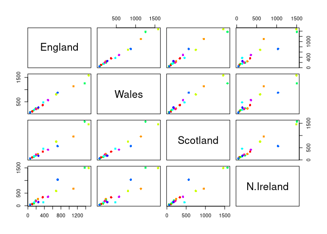<!-- -->

This code plots all pairwise comparisons of row values across the column
groups. If a given point lies on the diagonal, this means that the value
of the corresponding row is the same in both columns which are plotted.
A point above the diagonal would be higher in the column plotted on the
y-axis than in the column plotted on the x-axis. A point below the
diagonal would be higher in the column plotted on the x-axis than in the
column plotted on the y-axis.

> Question 6: What is the main differences between N. Ireland and the
> other countries of the UK in terms of this data-set?

> > Without PCA

This is difficult to do without using a PCA, but a way could be to look
at the maximum differences, pairwise, in log2 fold-changes between
Northern Ireland and the other UK countries.

Identify the log2 fold change and identify the component with the
maximum absolute change

``` r
n_ireland_v_england <- log(uk_foods$N.Ireland, base = 2)/log(uk_foods$England, base = 2)
n_ireland_v_wales <- log(uk_foods$N.Ireland, base = 2)/log(uk_foods$Wales, base = 2)
n_ireland_v_scotland <- log(uk_foods$N.Ireland, base = 2)/log(uk_foods$Scotland, base = 2)

names(n_ireland_v_england) <- row.names(uk_foods)
names(n_ireland_v_wales) <- row.names(uk_foods)
names(n_ireland_v_scotland) <- row.names(uk_foods)

which.max(abs(n_ireland_v_england))
```

    ## Fresh_potatoes  
    ##               7

``` r
which.max(abs(n_ireland_v_wales))
```

    ## Carcass_meat  
    ##             2

``` r
which.max(abs(n_ireland_v_scotland))
```

    ## Fresh_potatoes  
    ##               7

## PCA

### Conduct PCA with the UKFoods data set

``` r
uk_foods_pca <- prcomp(t(uk_foods))
summary(uk_foods_pca)
```

    ## Importance of components:
    ##                             PC1      PC2      PC3       PC4
    ## Standard deviation     324.1502 212.7478 73.87622 3.176e-14
    ## Proportion of Variance   0.6744   0.2905  0.03503 0.000e+00
    ## Cumulative Proportion    0.6744   0.9650  1.00000 1.000e+00

### Inspect PCAs

``` r
plot(uk_foods_pca)
```

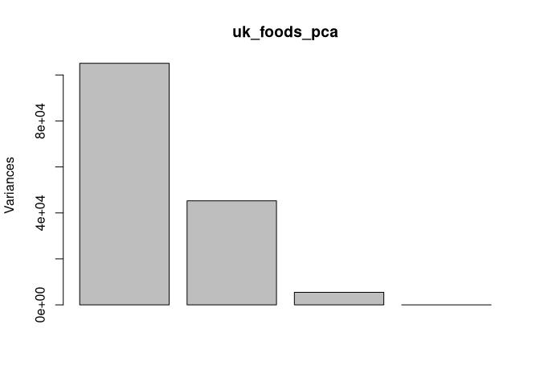<!-- -->

### Plot the data using PCs

Use the two PCs which explain the most variance to plot the UKFoods data
set (PC1 and PC2)

> Question 7:

``` r
plot(uk_foods_pca$x[,1:2])
text(uk_foods_pca$x[,1:2], colnames(uk_foods))
```

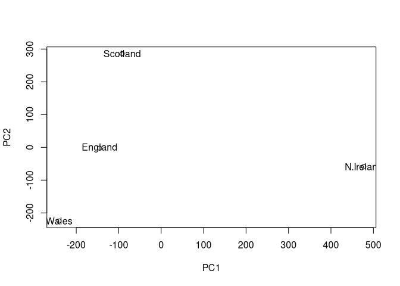<!-- -->

> Question 8: Customize your plot so that the colors of the country
> names match the colors in our UK and Ireland map and table at start of
> this document.

``` r
color_vector <- c("orange", "red", "blue", "green")
plot(uk_foods_pca$x[,1:2], col = "#DDDDDD", xlim = c(-300, 600))
text(uk_foods_pca$x[,1:2], colnames(uk_foods), col = color_vector)
```

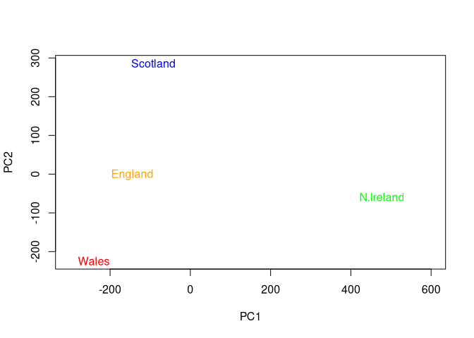<!-- -->

### Plot the proportions of variences explained by each PC

``` r
variance_per <- round(((uk_foods_pca$sdev^2)/sum(uk_foods_pca$sdev^2)) * 100)

barplot(variance_per, xlab="Principal Component", ylab="Percent Variation")
```

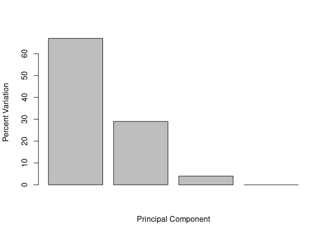<!-- --> ###
Digging Deeper: Variable Loadings

``` r
uk_foods_pca$rotation
```

    ##                              PC1          PC2         PC3          PC4
    ## Cheese              -0.056955380  0.016012850  0.02394295 -0.694538519
    ## Carcass_meat         0.047927628  0.013915823  0.06367111  0.489884628
    ## Other_meat          -0.258916658 -0.015331138 -0.55384854  0.279023718
    ## Fish                -0.084414983 -0.050754947  0.03906481 -0.008483145
    ## Fats_and_oils       -0.005193623 -0.095388656 -0.12522257  0.076097502
    ## Sugars              -0.037620983 -0.043021699 -0.03605745  0.034101334
    ## Fresh_potatoes       0.401402060 -0.715017078 -0.20668248 -0.090972715
    ## Fresh_Veg           -0.151849942 -0.144900268  0.21382237 -0.039901917
    ## Other_Veg           -0.243593729 -0.225450923 -0.05332841  0.016719075
    ## Processed_potatoes  -0.026886233  0.042850761 -0.07364902  0.030125166
    ## Processed_Veg       -0.036488269 -0.045451802  0.05289191 -0.013969507
    ## Fresh_fruit         -0.632640898 -0.177740743  0.40012865  0.184072217
    ## Cereals             -0.047702858 -0.212599678 -0.35884921  0.191926714
    ## Beverages           -0.026187756 -0.030560542 -0.04135860  0.004831876
    ## Soft_drinks          0.232244140  0.555124311 -0.16942648  0.103508492
    ## Alcoholic_drinks    -0.463968168  0.113536523 -0.49858320 -0.316290619
    ## Confectionery       -0.029650201  0.005949921 -0.05232164  0.001847469

Since PC1 accounts for the most variance, the contribution of each
component on the distribution of countries on this PC will be the most
helpful.

``` r
op <- par(mar=c(10,3,0.35,0))
barplot(uk_foods_pca$rotation[,1], las = 2)
```

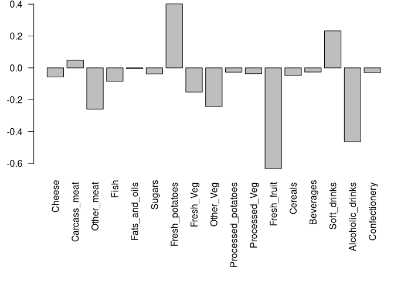<!-- -->

``` r
par(op)
```

> Question 9: Generate a similar ‘loadings plot’ for PC2. What two food
> groups feature prominantely and what does PC2 maninly tell us about?

``` r
op <- par(mar=c(10,3,0.35,0))
barplot(uk_foods_pca$rotation[,2], las = 2)
```

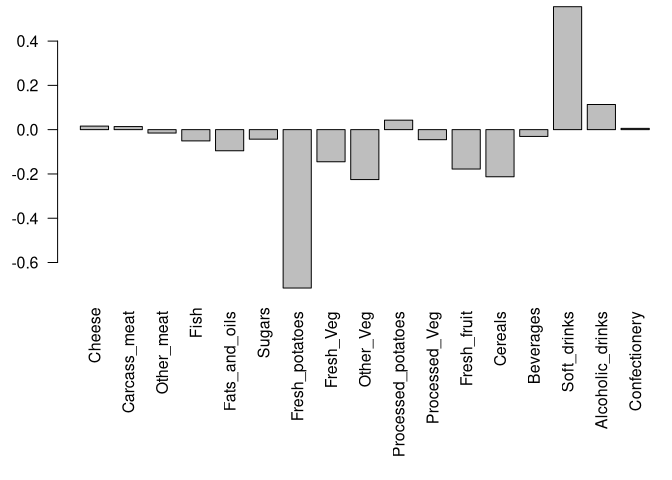<!-- -->

``` r
par(op)
```

The two most prominent features are Fresh potatoes and soft drinks. This
PC is mainly telling us which features most contribute to the
differences between the other three UK countries (England to Scotland to
Wales) since it is on this PC that these countries are differentiated
upon. Therefore, these features (fresh potatoes and soft drinks) are the
components which contribute to the differences among these three
countries.

#PCA of RNA-Seq Data

## Import the Data

``` r
url2 <- "https://tinyurl.com/expression-CSV"
rna_data <- read.csv(url2, row.names=1)
head(rna_data)
```

    ##        wt1 wt2  wt3  wt4 wt5 ko1 ko2 ko3 ko4 ko5
    ## gene1  439 458  408  429 420  90  88  86  90  93
    ## gene2  219 200  204  210 187 427 423 434 433 426
    ## gene3 1006 989 1030 1017 973 252 237 238 226 210
    ## gene4  783 792  829  856 760 849 856 835 885 894
    ## gene5  181 249  204  244 225 277 305 272 270 279
    ## gene6  460 502  491  491 493 612 594 577 618 638

> Question 10: How many genes and samples are in this data set?

``` r
dim(rna_data)
```

    ## [1] 100  10

100 genes and 10 samples in the data set.

## PCA for RNA-Seq Data

``` r
rna_pca <- prcomp(t(rna_data), scale = TRUE)
summary(rna_pca)
```

    ## Importance of components:
    ##                           PC1    PC2     PC3     PC4     PC5     PC6     PC7
    ## Standard deviation     9.6237 1.5198 1.05787 1.05203 0.88062 0.82545 0.80111
    ## Proportion of Variance 0.9262 0.0231 0.01119 0.01107 0.00775 0.00681 0.00642
    ## Cumulative Proportion  0.9262 0.9493 0.96045 0.97152 0.97928 0.98609 0.99251
    ##                            PC8     PC9      PC10
    ## Standard deviation     0.62065 0.60342 3.457e-15
    ## Proportion of Variance 0.00385 0.00364 0.000e+00
    ## Cumulative Proportion  0.99636 1.00000 1.000e+00

Scree plot of the PCs helps to show how much variance is explained by
each PC. Here it is clear that PC1 dominates compared to the others,
explaining \>92% of the total variance.

``` r
plot(rna_pca, main = "Scree plot")
```

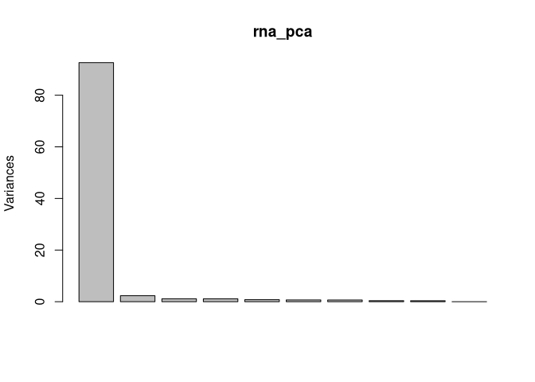<!-- -->

Replicate the Scree plot method for the pca object with base R plotting.

``` r
rna_pca_variance <- rna_pca$sdev^2
rna_pca_varience_percent <- round(rna_pca_variance/sum(rna_pca_variance)*100, 1)

barplot(rna_pca_varience_percent, main="Mimicked Scree Plot", 
        names.arg = paste0("PC", 1:10),
        ylim = c(0, 100),
        xlab="Principal Component", 
        ylab="Percent Variation")
```

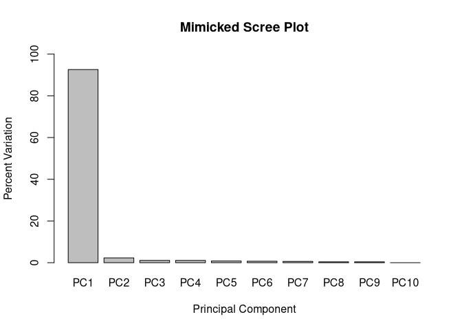<!-- -->

Plot the data using PC1 and PC2

``` r
plot(rna_pca$x[,1], rna_pca$x[,2], xlab = "PC1", ylab = "PC2")
```

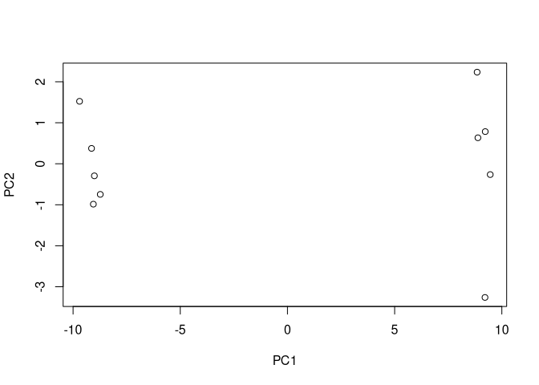<!-- -->

Check if the groupings make sense

``` r
color_vector <- colnames(rna_data)
color_vector[grep("wt", color_vector)] <- "red"
color_vector[grep("ko", color_vector)] <- "blue"

plot(rna_pca$x[,1], rna_pca$x[,2], col=color_vector, pch=16,
     xlab=paste0("PC1 (", rna_pca_varience_percent[1], "%)"),
     ylab=paste0("PC2 (", rna_pca_varience_percent[2], "%)"))

text(rna_pca$x[,1], rna_pca$x[,2], labels = colnames(rna_data), pos=c(rep(4,5), rep(2,5)))
```

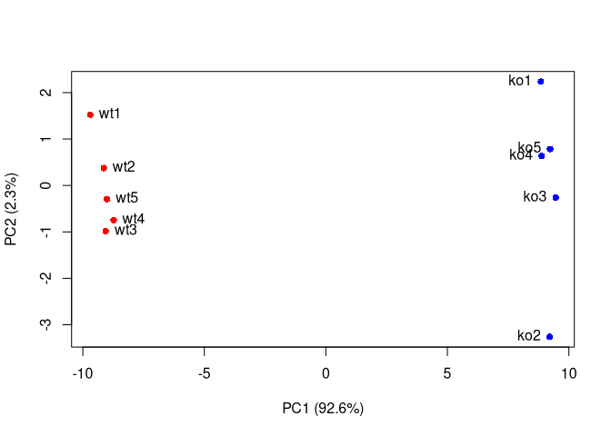<!-- -->

### Plotting PCA using ggplot

``` r
# Load the ggplot2 library
library(ggplot2)

# Convert PCA results to a data frame for ggplot
rna_pca_df <- as.data.frame(rna_pca$x)
```

## Session Info

``` r
sessionInfo()
```

    ## R version 4.1.1 (2021-08-10)
    ## Platform: x86_64-pc-linux-gnu (64-bit)
    ## Running under: Arch Linux
    ## 
    ## Matrix products: default
    ## BLAS:   /usr/lib/libblas.so.3.10.0
    ## LAPACK: /usr/lib/liblapack.so.3.10.0
    ## 
    ## locale:
    ##  [1] LC_CTYPE=en_US.UTF-8       LC_NUMERIC=C              
    ##  [3] LC_TIME=en_US.UTF-8        LC_COLLATE=en_US.UTF-8    
    ##  [5] LC_MONETARY=en_US.UTF-8    LC_MESSAGES=en_US.UTF-8   
    ##  [7] LC_PAPER=en_US.UTF-8       LC_NAME=C                 
    ##  [9] LC_ADDRESS=C               LC_TELEPHONE=C            
    ## [11] LC_MEASUREMENT=en_US.UTF-8 LC_IDENTIFICATION=C       
    ## 
    ## attached base packages:
    ## [1] stats     graphics  grDevices utils     datasets  methods   base     
    ## 
    ## other attached packages:
    ## [1] ggplot2_3.3.5
    ## 
    ## loaded via a namespace (and not attached):
    ##  [1] knitr_1.33        magrittr_2.0.1    tidyselect_1.1.1  munsell_0.5.0    
    ##  [5] colorspace_2.0-2  R6_2.5.0          rlang_0.4.11      fansi_0.5.0      
    ##  [9] dplyr_1.0.7       stringr_1.4.0     highr_0.9         tools_4.1.1      
    ## [13] grid_4.1.1        gtable_0.3.0      xfun_0.24         utf8_1.2.1       
    ## [17] DBI_1.1.1         withr_2.4.2       htmltools_0.5.1.1 ellipsis_0.3.2   
    ## [21] assertthat_0.2.1  yaml_2.2.1        digest_0.6.27     tibble_3.1.2     
    ## [25] lifecycle_1.0.0   crayon_1.4.1      purrr_0.3.4       vctrs_0.3.8      
    ## [29] glue_1.4.2        evaluate_0.14     rmarkdown_2.11    stringi_1.7.2    
    ## [33] compiler_4.1.1    pillar_1.6.1      generics_0.1.0    scales_1.1.1     
    ## [37] pkgconfig_2.0.3
